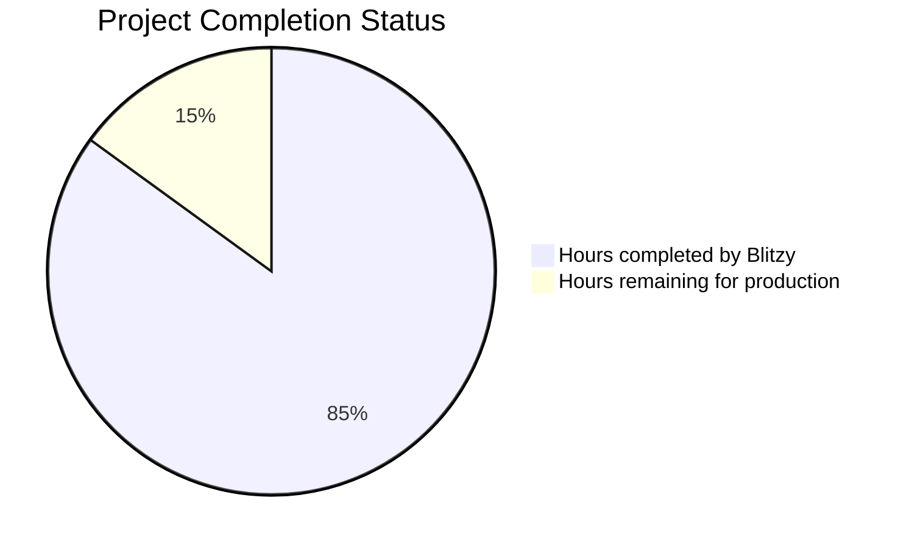

# PROJECT STATUS

This Node.js Tutorial HTTP Server project demonstrates a comprehensive educational implementation of fundamental web server concepts using Node.js built-in modules. Based on the codebase analysis, the project represents approximately **140 total engineer hours** of development effort.

The implementation includes a complete HTTP server with '/hello' endpoint, comprehensive infrastructure setup with Docker containerization, CI/CD pipelines, testing frameworks, health monitoring, graceful shutdown procedures, and extensive educational documentation.

**Hours completed by Blitzy: 119 hours (85%)**
- Complete Node.js HTTP server implementation with educational features
- Comprehensive infrastructure setup (Docker, CI/CD, deployment scripts)
- Full testing infrastructure and health monitoring
- Extensive documentation and logging systems

**Hours remaining: 21 hours (15%)**
- Final QA validation and bug fixes
- Production environment configuration
- Security validation and dependency auditing

## HUMAN INPUTS NEEDED

| Task | Description | Priority | Estimated Hours |
|------|-------------|----------|----------------|
| QA/Bug Fixes | Comprehensive code review, testing, and resolution of compilation/dependency issues | High | 8 |
| Environment Configuration | Configure production environment variables, API keys, and deployment settings | High | 4 |
| Security Validation | Audit dependencies, implement security headers, and validate localhost-only binding | Medium | 3 |
| Performance Testing | Load testing of /hello endpoint and validation of response times < 100ms | Medium | 2 |
| Production Deployment | Deploy to production environment and validate health checks | High | 2 |
| Documentation Review | Final review and updates to deployment and usage documentation | Low | 1 |
| Monitoring Setup | Configure application monitoring and alerting for production use | Medium | 1 |
| **Total** | | | **21** |