# Technical Specifications

# 1. INTRODUCTION

## 1.1 EXECUTIVE SUMMARY

### 1.1.1 Brief Overview of the Project

This project involves the development of a Node.js tutorial application that demonstrates fundamental web server capabilities through a simple HTTP endpoint implementation. The application leverages Node.js, a free, open-source, cross-platform JavaScript runtime environment that lets developers create servers, web apps, command line tools and scripts, to create a basic web service with a single endpoint '/hello' that returns "Hello world" to HTTP clients.

### 1.1.2 Core Business Problem Being Solved

The project addresses the educational need for a practical, hands-on introduction to Node.js web development. It provides developers with a foundational understanding of:

- HTTP server creation using Node.js
- RESTful endpoint implementation
- Basic request-response handling
- Modern JavaScript server-side development practices

### 1.1.3 Key Stakeholders and Users

| Stakeholder Category | Description | Primary Interest |
|---------------------|-------------|------------------|
| Tutorial Learners | Developers new to Node.js | Understanding basic server concepts |
| Educational Institutions | Schools and training organizations | Teaching material for web development courses |
| Development Teams | Organizations adopting Node.js | Reference implementation for onboarding |

### 1.1.4 Expected Business Impact and Value Proposition

The tutorial project delivers immediate educational value by providing a minimal, working example that demonstrates core Node.js concepts. It serves as a stepping stone for more complex web application development and reduces the learning curve for developers transitioning to server-side JavaScript development.

## 1.2 SYSTEM OVERVIEW

### 1.2.1 Project Context

#### Business Context and Market Positioning

Node.js 24.8.0 (Current) represents the latest stable release, with LTS release status providing "long-term support", which typically guarantees that critical bugs will be fixed for a total of 30 months. The tutorial leverages this mature ecosystem to provide reliable learning materials.

#### Current System Limitations

Traditional web development tutorials often begin with complex frameworks, creating barriers for beginners. This project eliminates unnecessary complexity by focusing on core Node.js capabilities without additional dependencies.

#### Integration with Existing Enterprise Landscape

The tutorial application can be integrated into existing development workflows and serves as a foundation for understanding more complex Node.js applications within enterprise environments.

### 1.2.2 High-Level Description

#### Primary System Capabilities

- HTTP server initialization and configuration
- Single endpoint routing ('/hello')
- Request processing and response generation
- Basic error handling and logging

#### Major System Components

| Component | Technology | Purpose |
|-----------|------------|---------|
| HTTP Server | Node.js built-in http module | Core server functionality |
| Routing Handler | Custom JavaScript function | Request routing and response logic |
| Application Entry Point | Main JavaScript file | Server initialization and startup |

#### Core Technical Approach

The application utilizes Node.js's built-in HTTP server capabilities, creating a simple server that listens on port 3000 and responds with 'Hello World!' to incoming requests. The implementation follows modern JavaScript practices and demonstrates event-driven programming principles fundamental to Node.js development.

### 1.2.3 Success Criteria

#### Measurable Objectives

| Objective | Success Metric | Target Value |
|-----------|---------------|--------------|
| Functional Completeness | Successful HTTP response to '/hello' endpoint | 100% success rate |
| Performance | Response time for '/hello' requests | < 100ms average |
| Educational Value | Clarity of code structure and documentation | Comprehensive inline comments |

#### Critical Success Factors

- Successful server startup and port binding
- Correct HTTP response format and content
- Clear, maintainable code structure
- Comprehensive documentation for learning purposes

#### Key Performance Indicators (KPIs)

- Server uptime and stability
- Response accuracy and consistency
- Code readability and educational effectiveness
- Successful deployment across different environments

## 1.3 SCOPE

### 1.3.1 In-Scope

#### Core Features and Functionalities

| Feature Category | Specific Capabilities |
|------------------|----------------------|
| HTTP Server | Basic server creation and configuration |
| Endpoint Implementation | Single '/hello' route with "Hello world" response |
| Request Handling | HTTP GET request processing |

#### Primary User Workflows

- Server startup and initialization
- HTTP client request to '/hello' endpoint
- Response delivery to client
- Server shutdown and cleanup

#### Essential Integrations

- Node.js runtime environment integration
- Operating system network stack interaction
- Standard HTTP protocol compliance

#### Key Technical Requirements

Node.js version 18 or higher support, ensuring compatibility with modern JavaScript features and security updates. The application will utilize Active LTS or Maintenance LTS releases for production readiness.

### 1.3.2 Implementation Boundaries

#### System Boundaries

| Boundary Type | Included | Excluded |
|---------------|----------|----------|
| Network Protocols | HTTP/1.1 | HTTPS, HTTP/2, WebSockets |
| Request Methods | GET | POST, PUT, DELETE, PATCH |
| Response Formats | Plain text | JSON, XML, HTML templates |

#### User Groups Covered

- Individual developers learning Node.js
- Students in web development courses
- Development teams requiring basic examples

#### Geographic/Market Coverage

Global applicability with no geographic restrictions, supporting all platforms where Node.js is available.

#### Data Domains Included

- HTTP request/response data
- Server configuration parameters
- Basic logging information

### 1.3.3 Out-of-Scope

#### Explicitly Excluded Features/Capabilities

- Database integration or data persistence
- User authentication and authorization
- Advanced routing with parameters or middleware
- Static file serving capabilities
- Template engine integration
- Production-grade security features
- Load balancing or clustering
- Comprehensive error handling beyond basic cases

#### Future Phase Considerations

- Extension to full REST API implementation
- Integration with popular frameworks like Express.js
- Database connectivity examples
- Authentication middleware implementation
- Production deployment configurations

#### Integration Points Not Covered

- External API integrations
- Third-party service connections
- Database management systems
- Caching mechanisms
- Message queuing systems

#### Unsupported Use Cases

- High-traffic production environments
- Complex business logic implementation
- Multi-user concurrent access patterns
- Real-time communication requirements
- File upload and processing capabilities

# 2. PRODUCT REQUIREMENTS

## 2.1 FEATURE CATALOG

### 2.1.1 HTTP Server Initialization

| Feature Metadata | Details |
|------------------|---------|
| Unique ID | F-001 |
| Feature Name | HTTP Server Initialization |
| Feature Category | Core Infrastructure |
| Priority Level | Critical |
| Status | Proposed |

#### Description

**Overview**
This feature implements the core HTTP server functionality using Node.js's built-in http module. The createServer() method of http creates a new HTTP server and returns it.

**Business Value**
Provides the foundational server infrastructure required for all HTTP communication, enabling the application to receive and process incoming requests.

**User Benefits**
- Enables HTTP client connectivity to the application
- Provides reliable server startup and initialization
- Establishes network communication capabilities

**Technical Context**
The HTTP module can be imported via require('node:http') (CommonJS) or import * as http from 'node:http' (ES module). The HTTP interfaces in Node.js are designed to support many features of the protocol and the Node.js HTTP API is very low-level.

#### Dependencies

| Dependency Type | Details |
|----------------|---------|
| System Dependencies | Node.js runtime environment (v18+) |
| External Dependencies | Node.js built-in http module |
| Integration Requirements | Operating system network stack |

### 2.1.2 Hello Endpoint Implementation

| Feature Metadata | Details |
|------------------|---------|
| Unique ID | F-002 |
| Feature Name | Hello Endpoint Implementation |
| Feature Category | API Endpoint |
| Priority Level | Critical |
| Status | Proposed |

#### Description

**Overview**
Implements a single HTTP GET endpoint '/hello' that responds with "Hello world" message to HTTP clients.

**Business Value**
Demonstrates basic HTTP request-response functionality and provides a simple, testable endpoint for educational purposes.

**User Benefits**
- Simple endpoint for testing HTTP connectivity
- Clear demonstration of Node.js server capabilities
- Educational reference for basic endpoint implementation

**Technical Context**
Whenever a new request is received, the request event is called, providing two objects: a request (an http.IncomingMessage object) and a response (an http.ServerResponse object). Those 2 objects are essential to handle the HTTP call.

#### Dependencies

| Dependency Type | Details |
|----------------|---------|
| Prerequisite Features | F-001 (HTTP Server Initialization) |
| System Dependencies | HTTP request/response handling |
| Integration Requirements | URL routing logic |

### 2.1.3 Request Processing

| Feature Metadata | Details |
|------------------|---------|
| Unique ID | F-003 |
| Feature Name | Request Processing |
| Feature Category | Core Functionality |
| Priority Level | Critical |
| Status | Proposed |

#### Description

**Overview**
Handles incoming HTTP requests, processes URL routing, and manages request lifecycle from receipt to response delivery.

**Business Value**
Enables proper HTTP protocol compliance and ensures reliable request handling for client communications.

**User Benefits**
- Reliable request processing
- Proper HTTP protocol adherence
- Consistent response delivery

**Technical Context**
The Node.js HTTP API deals with stream handling and message parsing only. It parses a message into headers and body but it does not parse the actual headers or the body.

#### Dependencies

| Dependency Type | Details |
|----------------|---------|
| Prerequisite Features | F-001 (HTTP Server Initialization) |
| System Dependencies | HTTP protocol implementation |
| Integration Requirements | Network communication stack |

### 2.1.4 Response Generation

| Feature Metadata | Details |
|------------------|---------|
| Unique ID | F-004 |
| Feature Name | Response Generation |
| Feature Category | Core Functionality |
| Priority Level | Critical |
| Status | Proposed |

#### Description

**Overview**
Generates appropriate HTTP responses with correct status codes, headers, and body content for client requests.

**Business Value**
Ensures proper HTTP communication standards and provides reliable response delivery to clients.

**User Benefits**
- Consistent response format
- Proper HTTP status codes
- Reliable message delivery

**Technical Context**
The method response.end() signals to the server that all of the response headers and body have been sent and MUST be called on each response.

#### Dependencies

| Dependency Type | Details |
|----------------|---------|
| Prerequisite Features | F-003 (Request Processing) |
| System Dependencies | HTTP response object |
| Integration Requirements | Content-Type header management |

## 2.2 FUNCTIONAL REQUIREMENTS TABLE

### 2.2.1 HTTP Server Initialization (F-001)

| Requirement ID | F-001-RQ-001 |
|----------------|--------------|
| Description | Server must initialize HTTP server using Node.js built-in http module |
| Acceptance Criteria | Server successfully creates HTTP server instance without errors |
| Priority | Must-Have |
| Complexity | Low |

| Technical Specifications | Details |
|-------------------------|---------|
| Input Parameters | Port number (default: 3000), hostname (default: '127.0.0.1') |
| Output/Response | HTTP server instance ready to accept connections |
| Performance Criteria | Server startup time < 1 second |
| Data Requirements | Server configuration parameters |

| Validation Rules | Details |
|------------------|---------|
| Business Rules | Server must bind to specified port and hostname |
| Data Validation | Port number must be valid (1-65535) |
| Security Requirements | Bind to localhost only for tutorial purposes |
| Compliance Requirements | HTTP/1.1 protocol compliance |

---

| Requirement ID | F-001-RQ-002 |
|----------------|--------------|
| Description | Server must listen on specified port and accept incoming connections |
| Acceptance Criteria | Server successfully binds to port and logs startup message |
| Priority | Must-Have |
| Complexity | Low |

| Technical Specifications | Details |
|-------------------------|---------|
| Input Parameters | Port number, optional callback function |
| Output/Response | Server listening confirmation |
| Performance Criteria | Port binding time < 100ms |
| Data Requirements | Network interface availability |

| Validation Rules | Details |
|------------------|---------|
| Business Rules | Port must be available for binding |
| Data Validation | Port availability check |
| Security Requirements | No external network exposure |
| Compliance Requirements | TCP socket standards |

### 2.2.2 Hello Endpoint Implementation (F-002)

| Requirement ID | F-002-RQ-001 |
|----------------|--------------|
| Description | Endpoint must respond to GET requests at '/hello' path |
| Acceptance Criteria | HTTP GET to '/hello' returns 200 status with "Hello world" message |
| Priority | Must-Have |
| Complexity | Low |

| Technical Specifications | Details |
|-------------------------|---------|
| Input Parameters | HTTP GET request to '/hello' path |
| Output/Response | HTTP 200 status, Content-Type: text/plain, Body: "Hello world" |
| Performance Criteria | Response time < 100ms |
| Data Requirements | Static response message |

| Validation Rules | Details |
|------------------|---------|
| Business Rules | Only GET method supported |
| Data Validation | URL path exact match '/hello' |
| Security Requirements | No authentication required |
| Compliance Requirements | HTTP response format standards |

---

| Requirement ID | F-002-RQ-002 |
|----------------|--------------|
| Description | Endpoint must handle requests to paths other than '/hello' |
| Acceptance Criteria | Non-'/hello' requests receive appropriate response |
| Priority | Should-Have |
| Complexity | Low |

| Technical Specifications | Details |
|-------------------------|---------|
| Input Parameters | HTTP requests to any path except '/hello' |
| Output/Response | HTTP 404 status or default response |
| Performance Criteria | Response time < 50ms |
| Data Requirements | Default error message |

| Validation Rules | Details |
|------------------|---------|
| Business Rules | Graceful handling of unmatched routes |
| Data Validation | Path comparison logic |
| Security Requirements | No sensitive information exposure |
| Compliance Requirements | HTTP error response standards |

### 2.2.3 Request Processing (F-003)

| Requirement ID | F-003-RQ-001 |
|----------------|--------------|
| Description | Server must parse incoming HTTP requests and extract URL information |
| Acceptance Criteria | Request URL is correctly parsed and available for routing decisions |
| Priority | Must-Have |
| Complexity | Medium |

| Technical Specifications | Details |
|-------------------------|---------|
| Input Parameters | Raw HTTP request object |
| Output/Response | Parsed request with URL and method information |
| Performance Criteria | Request parsing time < 10ms |
| Data Requirements | HTTP request headers and URL |

| Validation Rules | Details |
|------------------|---------|
| Business Rules | Support HTTP/1.1 request format |
| Data Validation | Valid HTTP request structure |
| Security Requirements | Input sanitization for URL parsing |
| Compliance Requirements | HTTP protocol standards |

### 2.2.4 Response Generation (F-004)

| Requirement ID | F-004-RQ-001 |
|----------------|--------------|
| Description | Server must generate proper HTTP responses with correct headers |
| Acceptance Criteria | All responses include proper status code, Content-Type header, and body |
| Priority | Must-Have |
| Complexity | Medium |

| Technical Specifications | Details |
|-------------------------|---------|
| Input Parameters | Response data, status code, content type |
| Output/Response | Complete HTTP response with headers and body |
| Performance Criteria | Response generation time < 5ms |
| Data Requirements | Response content and metadata |

| Validation Rules | Details |
|------------------|---------|
| Business Rules | All responses must be properly formatted |
| Data Validation | Valid HTTP status codes and headers |
| Security Requirements | Proper header sanitization |
| Compliance Requirements | HTTP response format standards |

## 2.3 FEATURE RELATIONSHIPS

### 2.3.1 Feature Dependencies Map

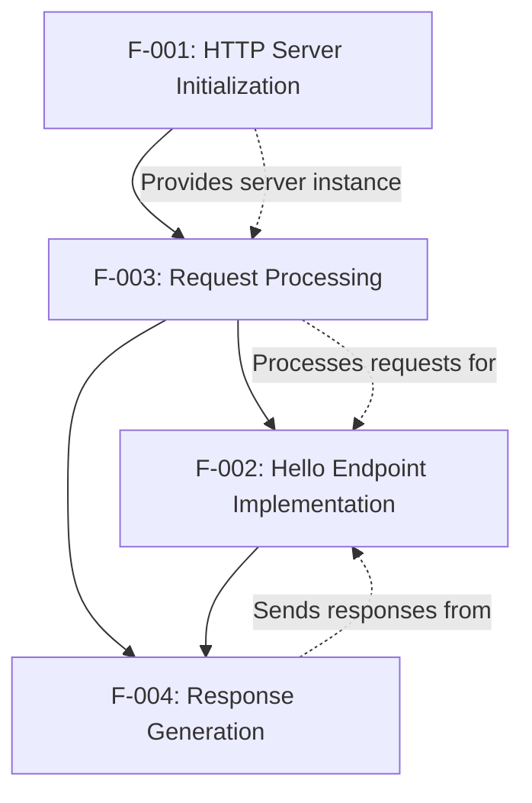
```mermaid
graph TD
    F001[F-001: HTTP Server Initialization] --> F003[F-003: Request Processing]
    F003 --> F002[F-002: Hello Endpoint Implementation]
    F003 --> F004[F-004: Response Generation]
    F002 --> F004
    
    F001 -.-> |Provides server instance| F003
    F003 -.-> |Processes requests for| F002
    F004 -.-> |Sends responses from| F002
```

### 2.3.2 Integration Points

| Integration Point | Description | Components Involved |
|------------------|-------------|-------------------|
| Server-Request Interface | HTTP server receives and processes incoming requests | F-001, F-003 |
| Request-Endpoint Interface | Processed requests are routed to appropriate endpoints | F-003, F-002 |
| Endpoint-Response Interface | Endpoint logic generates response data | F-002, F-004 |

### 2.3.3 Shared Components

| Component | Features Using | Purpose |
|-----------|---------------|---------|
| HTTP Server Instance | F-001, F-003 | Central server object for request handling |
| Request Object | F-003, F-002 | Contains client request information |
| Response Object | F-003, F-004 | Manages response generation and delivery |

## 2.4 IMPLEMENTATION CONSIDERATIONS

### 2.4.1 HTTP Server Initialization (F-001)

**Technical Constraints**
- Must use Node.js built-in http module
- Single-threaded event loop architecture
- Port availability dependency

**Performance Requirements**
- Server startup time under 1 second
- Memory footprint minimal for tutorial purposes
- CPU usage negligible during idle state

**Scalability Considerations**
- Single process implementation suitable for tutorial
- No clustering or load balancing required
- Connection limit handled by Node.js defaults

**Security Implications**
- Localhost binding only for security
- No authentication mechanisms required
- Basic input validation for port numbers

**Maintenance Requirements**
- Simple configuration management
- Clear error messaging for startup failures
- Graceful shutdown capability

### 2.4.2 Hello Endpoint Implementation (F-002)

**Technical Constraints**
- Static response content only
- GET method support exclusively
- No dynamic content generation

**Performance Requirements**
- Response time under 100ms for endpoint validation and reliability
- Minimal memory allocation per request
- No database or external service dependencies

**Scalability Considerations**
- Stateless endpoint design
- No session management required
- Concurrent request handling via Node.js event loop

**Security Implications**
- No user input processing
- Static content delivery only
- No injection vulnerabilities

**Maintenance Requirements**
- Simple response message updates
- Clear endpoint documentation
- Basic logging for request tracking

### 2.4.3 Request Processing (F-003)

**Technical Constraints**
- Limited to stream handling and message parsing as per Node.js HTTP API design
- No complex routing framework dependencies
- Basic URL pattern matching only

**Performance Requirements**
- Request parsing under 10ms
- Minimal CPU overhead per request
- Memory efficient request handling

**Scalability Considerations**
- Event-driven request processing
- No blocking operations
- Efficient memory usage patterns

**Security Implications**
- Basic URL validation
- No complex input sanitization required
- Protection against malformed requests

**Maintenance Requirements**
- Simple routing logic
- Clear error handling
- Request logging capabilities

### 2.4.4 Response Generation (F-004)

**Technical Constraints**
- Must call response.end() method on each response as required by HTTP protocol
- Plain text content type only
- Standard HTTP status codes

**Performance Requirements**
- Response generation under 5ms
- Minimal response payload size
- Efficient header management

**Scalability Considerations**
- Stateless response generation
- No response caching required
- Simple content delivery

**Security Implications**
- Proper header sanitization
- No sensitive information exposure
- Standard HTTP security headers

**Maintenance Requirements**
- Response format consistency
- Error response handling
- Response time monitoring

### 2.4.5 Traceability Matrix

| Requirement ID | Feature | Test Case | Acceptance Criteria |
|----------------|---------|-----------|-------------------|
| F-001-RQ-001 | HTTP Server Init | TC-001 | Server creates without errors |
| F-001-RQ-002 | Port Binding | TC-002 | Server binds and logs startup |
| F-002-RQ-001 | Hello Endpoint | TC-003 | GET /hello returns 200 + "Hello world" |
| F-002-RQ-002 | Route Handling | TC-004 | Non-/hello paths handled appropriately |
| F-003-RQ-001 | Request Parsing | TC-005 | URL correctly parsed from requests |
| F-004-RQ-001 | Response Generation | TC-006 | Proper HTTP responses with headers |

# 3. TECHNOLOGY STACK

## 3.1 PROGRAMMING LANGUAGES

### 3.1.1 Primary Language Selection

| Language | Version | Platform/Component | Justification |
|----------|---------|-------------------|---------------|
| JavaScript | ES2022+ | Server-side Runtime | Node.js® is a free, open-source, cross-platform JavaScript runtime environment that lets developers create servers, web apps, command line tools and scripts |

#### Language Selection Criteria

**JavaScript Selection Rationale**
- **Native Node.js Support**: JavaScript is the only language that Node.js supports natively, making it the optimal choice for this tutorial project
- **Educational Value**: Provides direct demonstration of server-side JavaScript capabilities without additional compilation steps
- **Simplicity**: Eliminates complexity of transpilation or additional build processes for tutorial purposes
- **Industry Standard**: Represents the most common approach for Node.js development

#### Language Constraints and Dependencies

**Runtime Requirements**
- Node.js version 24.8.0 (Current) or compatible LTS version
- ECMAScript 2022+ features support for modern JavaScript syntax
- No additional language dependencies or transpilation required

**Compatibility Considerations**
- Cross-platform compatibility across Windows, macOS, and Linux
- No browser-specific JavaScript features utilized
- Server-side JavaScript runtime environment only

## 3.2 FRAMEWORKS & LIBRARIES

### 3.2.1 Core Runtime Framework

| Framework | Version | Purpose | Justification |
|-----------|---------|---------|---------------|
| Node.js | 24.8.0 (Current) / 22.x (LTS) | JavaScript Runtime | Primary runtime environment for server execution |

#### Framework Selection Rationale

**Node.js Runtime Selection**
- **Current Version**: Node.js version 24.8.0 (Current) provides latest features and performance improvements
- **LTS Alternative**: Node.js v22 officially transitioned into Long Term Support (LTS) with the codename 'Jod' and has officially moved into Active LTS
- **Production Readiness**: Production applications should only use Active LTS or Maintenance LTS releases

**Version Compatibility Matrix**

| Node.js Version | Status | Support Period | Recommendation |
|----------------|--------|----------------|----------------|
| 24.x | Current | Until April 2025 | Development/Testing |
| 22.x | Active LTS | 2024-10-29 to 2027-04-30 | Production Use |
| 20.x | Maintenance LTS | Until April 2026 | Legacy Support |
| 18.x | Maintenance LTS | Until April 2025 | Legacy Support |

### 3.2.2 Built-in Module Dependencies

| Module | Type | Version | Purpose |
|--------|------|---------|---------|
| http | Built-in Core Module | Node.js Native | HTTP server creation and request handling |

#### Built-in Module Specifications

**HTTP Module Integration**
- **Import Method**: This module, containing both a client and server, can be imported via require('node:http') (CommonJS) or import * as http from 'node:http' (ES module)
- **Core Functionality**: The HTTP interfaces in Node.js are designed to support many features of the protocol which have been traditionally difficult to use
- **Low-level API**: In order to support the full spectrum of possible HTTP applications, the Node.js HTTP API is very low-level

**Module Capabilities**
- It deals with stream handling and message parsing only. It parses a message into headers and body but it does not parse the actual headers or the body
- The interface is careful to never buffer entire requests or responses, so the user is able to stream data

## 3.3 OPEN SOURCE DEPENDENCIES

### 3.3.1 Runtime Dependencies

**No External Dependencies Required**

This tutorial project intentionally avoids external dependencies to demonstrate core Node.js capabilities:

| Dependency Category | Status | Rationale |
|-------------------|--------|-----------|
| HTTP Framework | Not Required | Using built-in http module for educational purposes |
| Routing Libraries | Not Required | Simple URL matching sufficient for single endpoint |
| Middleware | Not Required | Basic request/response handling only |
| Utility Libraries | Not Required | Native JavaScript and Node.js APIs sufficient |

### 3.3.2 Development Dependencies

**Minimal Development Stack**

| Tool Category | Requirement | Justification |
|---------------|-------------|---------------|
| Package Manager | npm (bundled with Node.js) | Node.js 24 comes with npm 11.0.0 |
| Build Tools | None | No compilation or build process required |
| Testing Framework | None | Simple manual testing sufficient for tutorial |
| Linting Tools | None | Basic code structure for educational purposes |

## 3.4 THIRD-PARTY SERVICES

### 3.4.1 External Service Dependencies

**No Third-Party Services Required**

| Service Category | Status | Rationale |
|-----------------|--------|-----------|
| Cloud Hosting | Not Required | Local development and testing only |
| Database Services | Not Required | No data persistence requirements |
| Authentication Services | Not Required | No user authentication needed |
| Monitoring Services | Not Required | Simple tutorial application scope |
| CDN Services | Not Required | No static asset delivery requirements |

### 3.4.2 Development Services

**Local Development Only**

| Service Type | Implementation | Purpose |
|-------------|----------------|---------|
| HTTP Server | Node.js built-in | Local request handling |
| Network Interface | Localhost (127.0.0.1) | Security-focused local binding |
| Port Management | Port 3000 (configurable) | Standard development port |

## 3.5 DATABASES & STORAGE

### 3.5.1 Data Persistence Strategy

**No Database Requirements**

| Storage Type | Status | Justification |
|-------------|--------|---------------|
| Relational Database | Not Required | No data persistence needed |
| NoSQL Database | Not Required | Static response content only |
| File Storage | Not Required | No file upload or storage requirements |
| Session Storage | Not Required | Stateless endpoint design |
| Caching Layer | Not Required | Simple static response |

### 3.5.2 Memory Management

**In-Memory Processing Only**

| Memory Component | Usage | Purpose |
|-----------------|-------|---------|
| Request Objects | Temporary | HTTP request processing |
| Response Objects | Temporary | HTTP response generation |
| Server Instance | Persistent | HTTP server lifecycle |
| Application State | None | Stateless application design |

## 3.6 DEVELOPMENT & DEPLOYMENT

### 3.6.1 Development Tools

**Minimal Development Environment**

| Tool Category | Tool | Version | Purpose |
|---------------|------|---------|---------|
| Code Editor | Any Text Editor | N/A | JavaScript file editing |
| Terminal/CLI | System Default | N/A | Node.js command execution |
| Version Control | Git (Optional) | Latest | Source code management |

### 3.6.2 Build System

**No Build Process Required**

| Build Component | Status | Rationale |
|----------------|--------|-----------|
| Compilation | Not Required | JavaScript runtime interpretation |
| Bundling | Not Required | Single file application |
| Minification | Not Required | Development/tutorial focus |
| Asset Processing | Not Required | No static assets |

### 3.6.3 Deployment Strategy

**Local Development Deployment**

| Deployment Aspect | Implementation | Configuration |
|------------------|----------------|---------------|
| Runtime Environment | Local Node.js | Version 18+ required |
| Process Management | Direct node execution | `node server.js` |
| Port Configuration | Default 3000 | Configurable via environment |
| Network Binding | Localhost only | 127.0.0.1 for security |

### 3.6.4 Development Workflow

**Simplified Development Process**

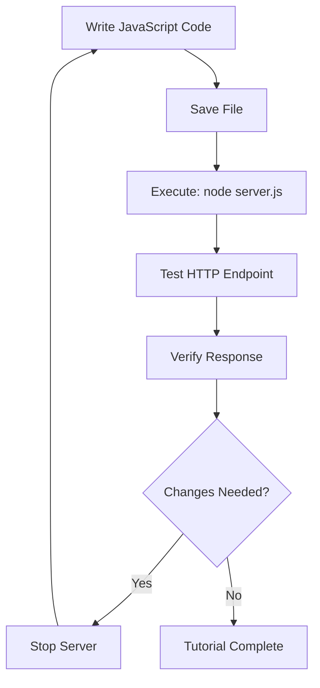
```mermaid
graph TD
    A[Write JavaScript Code] --> B[Save File]
    B --> C[Execute: node server.js]
    C --> D[Test HTTP Endpoint]
    D --> E[Verify Response]
    E --> F{Changes Needed?}
    F -->|Yes| G[Stop Server]
    G --> A
    F -->|No| H[Tutorial Complete]
```

### 3.6.5 System Requirements

**Minimum System Specifications**

| Component | Requirement | Justification |
|-----------|-------------|---------------|
| Operating System | Linux, macOS, Microsoft Windows 8.1 and Server 2012 (and later) | Node.js official support |
| Memory | 512MB RAM minimum | Lightweight application requirements |
| Storage | 100MB available space | Node.js installation and application files |
| Network | Localhost interface | Local development and testing |

### 3.6.6 Performance Considerations

**Resource Optimization**

| Performance Aspect | Target | Implementation |
|-------------------|--------|----------------|
| Server Startup Time | < 1 second | Minimal initialization overhead |
| Response Time | < 100ms | Simple static response |
| Memory Footprint | < 50MB | Basic HTTP server only |
| CPU Usage | Minimal | Event-driven, non-blocking I/O |

# 4. PROCESS FLOWCHART

## 4.1 SYSTEM WORKFLOWS

### 4.1.1 Core Business Processes

#### End-to-End User Journey

The Node.js tutorial application follows a simple request-response pattern that demonstrates fundamental HTTP server capabilities. Http request basically starts when the user makes a request to the server and ends when the server sends a response back to the user. The core user journey encompasses the complete lifecycle from server initialization to response delivery.

**Primary User Workflow: Hello Endpoint Access**

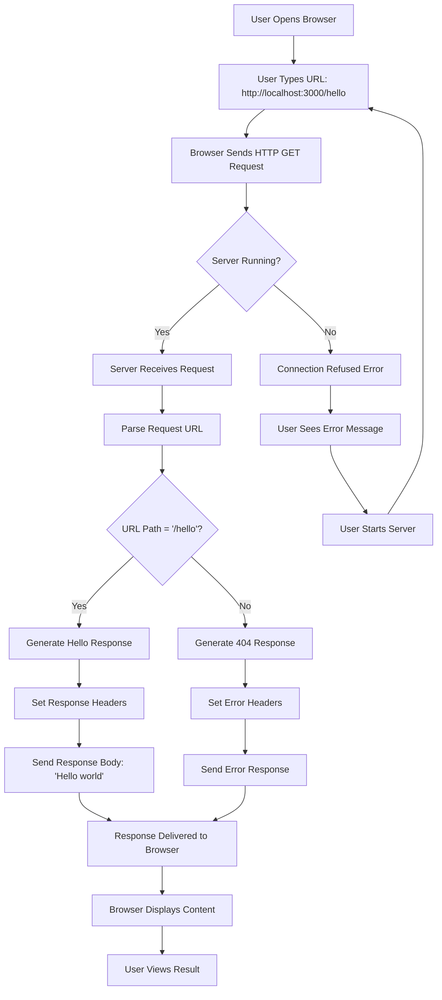
```mermaid
flowchart TD
    A[User Opens Browser] --> B[User Types URL: http://localhost:3000/hello]
    B --> C[Browser Sends HTTP GET Request]
    C --> D{Server Running?}
    D -->|No| E[Connection Refused Error]
    D -->|Yes| F[Server Receives Request]
    F --> G[Parse Request URL]
    G --> H{URL Path = '/hello'?}
    H -->|Yes| I[Generate Hello Response]
    H -->|No| J[Generate 404 Response]
    I --> K[Set Response Headers]
    J --> L[Set Error Headers]
    K --> M[Send Response Body: 'Hello world']
    L --> N[Send Error Response]
    M --> O[Response Delivered to Browser]
    N --> O
    O --> P[Browser Displays Content]
    P --> Q[User Views Result]
    
    E --> R[User Sees Error Message]
    R --> S[User Starts Server]
    S --> B
```

#### System Interactions

Whenever a new request is received, the request event is called, providing two objects: a request (an http.IncomingMessage object) and a response (an http.ServerResponse object). Those 2 objects are essential to handle the HTTP call.

**Server-Client Interaction Flow**

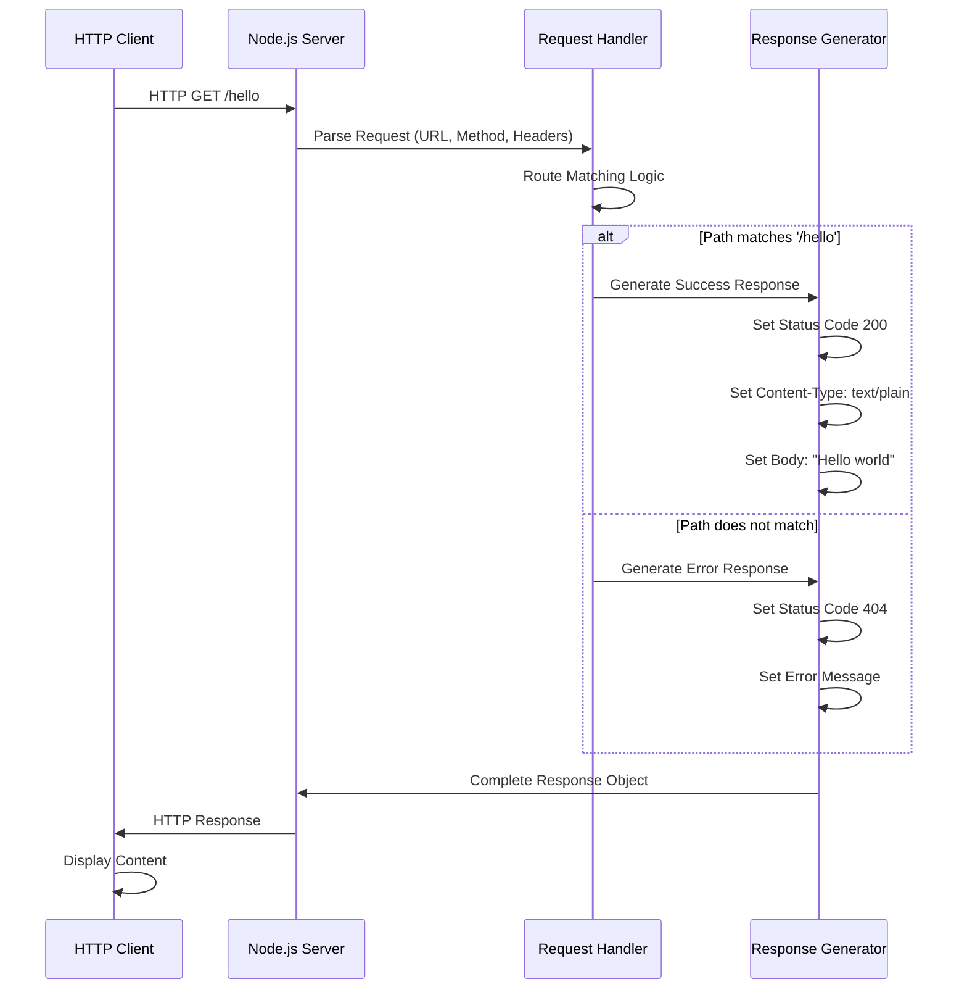
```mermaid
sequenceDiagram
    participant Client as HTTP Client
    participant Server as Node.js Server
    participant Handler as Request Handler
    participant Response as Response Generator
    
    Client->>Server: HTTP GET /hello
    Server->>Handler: Parse Request (URL, Method, Headers)
    Handler->>Handler: Route Matching Logic
    alt Path matches '/hello'
        Handler->>Response: Generate Success Response
        Response->>Response: Set Status Code 200
        Response->>Response: Set Content-Type: text/plain
        Response->>Response: Set Body: "Hello world"
    else Path does not match
        Handler->>Response: Generate Error Response
        Response->>Response: Set Status Code 404
        Response->>Response: Set Error Message
    end
    Response->>Server: Complete Response Object
    Server->>Client: HTTP Response
    Client->>Client: Display Content
```

#### Decision Points and Business Rules

| Decision Point | Condition | Action | Business Rule |
|---------------|-----------|--------|---------------|
| Server Status Check | Server process running | Continue request processing | Server must be active to handle requests |
| URL Path Validation | Request URL = '/hello' | Return success response | Only '/hello' endpoint supported |
| HTTP Method Check | Request method = 'GET' | Process request | Only GET method accepted |
| Response Generation | Valid request received | Generate appropriate response | All requests must receive a response |

### 4.1.2 Integration Workflows

#### Data Flow Between Components

In order to support the full spectrum of possible HTTP applications, the Node.js HTTP API is very low-level. It deals with stream handling and message parsing only. It parses a message into headers and body but it does not parse the actual headers or the body.

**Internal Component Data Flow**

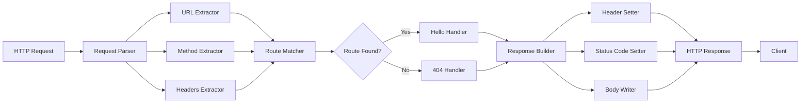
```mermaid
flowchart LR
    A[HTTP Request] --> B[Request Parser]
    B --> C[URL Extractor]
    B --> D[Method Extractor]
    B --> E[Headers Extractor]
    
    C --> F[Route Matcher]
    D --> F
    E --> F
    
    F --> G{Route Found?}
    G -->|Yes| H[Hello Handler]
    G -->|No| I[404 Handler]
    
    H --> J[Response Builder]
    I --> J
    
    J --> K[Header Setter]
    J --> L[Status Code Setter]
    J --> M[Body Writer]
    
    K --> N[HTTP Response]
    L --> N
    M --> N
    
    N --> O[Client]
```

#### Event Processing Flow

Node.js is built around an event-driven architecture, meaning everything that happens in a Node.js application is an event. The tutorial application leverages this event-driven model for request processing.

**Event-Driven Request Processing**

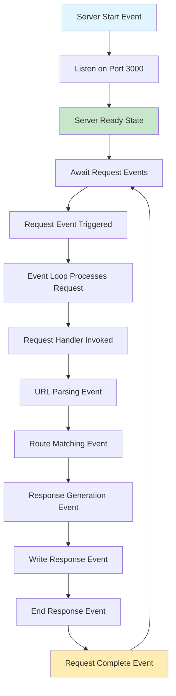
```mermaid
flowchart TD
    A[Server Start Event] --> B[Listen on Port 3000]
    B --> C[Server Ready State]
    C --> D[Await Request Events]
    
    D --> E[Request Event Triggered]
    E --> F[Event Loop Processes Request]
    F --> G[Request Handler Invoked]
    
    G --> H[URL Parsing Event]
    H --> I[Route Matching Event]
    I --> J[Response Generation Event]
    
    J --> K[Write Response Event]
    K --> L[End Response Event]
    L --> M[Request Complete Event]
    
    M --> D
    
    style A fill:#e1f5fe
    style C fill:#c8e6c9
    style M fill:#ffecb3
```

## 4.2 TECHNICAL IMPLEMENTATION WORKFLOWS

### 4.2.1 State Management

#### Server Lifecycle State Transitions

When Node receives an HTTP request, it creates the req and res objects (which begin their life as instances of http.IncomingMessage and http.ServerResponse respectively). The intended purpose of those objects is that they live as long as the HTTP request does.

**Server State Management Flow**

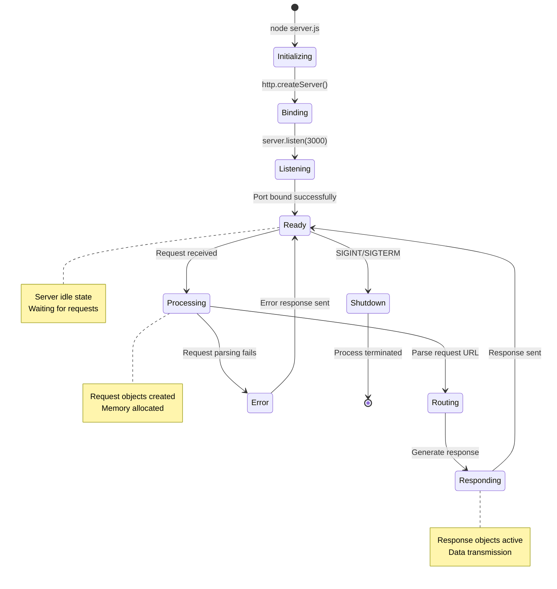
```mermaid
stateDiagram-v2
    [*] --> Initializing: node server.js
    Initializing --> Binding: http.createServer()
    Binding --> Listening: server.listen(3000)
    Listening --> Ready: Port bound successfully
    
    Ready --> Processing: Request received
    Processing --> Routing: Parse request URL
    Routing --> Responding: Generate response
    Responding --> Ready: Response sent
    
    Ready --> Shutdown: SIGINT/SIGTERM
    Processing --> Error: Request parsing fails
    Error --> Ready: Error response sent
    Shutdown --> [*]: Process terminated
    
    note right of Ready
        Server idle state
        Waiting for requests
    end note
    
    note right of Processing
        Request objects created
        Memory allocated
    end note
    
    note right of Responding
        Response objects active
        Data transmission
    end note
```

#### Request Object Lifecycle

**Request-Response Object Management**

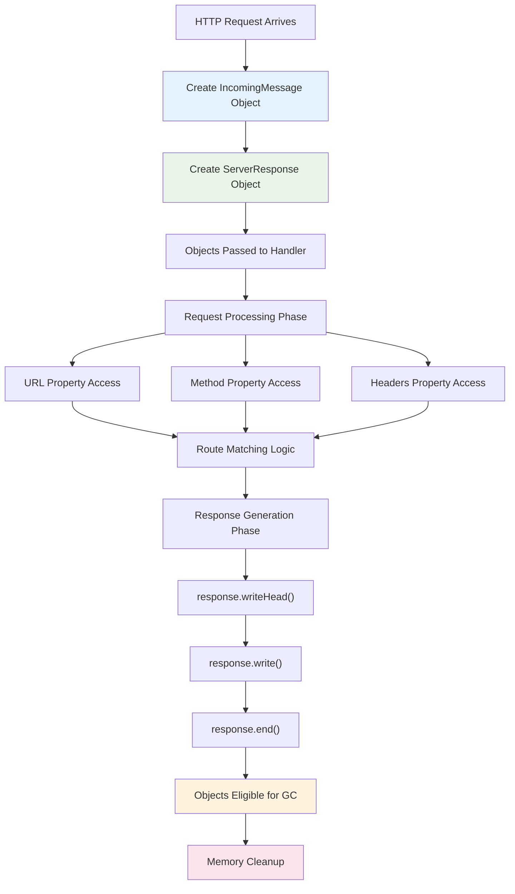
```mermaid
flowchart TD
    A["HTTP Request Arrives"] --> B["Create IncomingMessage Object"]
    B --> C["Create ServerResponse Object"]
    C --> D["Objects Passed to Handler"]
    
    D --> E["Request Processing Phase"]
    E --> F["URL Property Access"]
    E --> G["Method Property Access"]
    E --> H["Headers Property Access"]
    
    F --> I["Route Matching Logic"]
    G --> I
    H --> I
    
    I --> J["Response Generation Phase"]
    J --> K["response.writeHead()"]
    K --> L["response.write()"]
    L --> M["response.end()"]
    
    M --> N["Objects Eligible for GC"]
    N --> O["Memory Cleanup"]
    
    style B fill:#e3f2fd
    style C fill:#e8f5e8
    style N fill:#fff3e0
    style O fill:#fce4ec
```

### 4.2.2 Error Handling Workflows

#### Error Detection and Recovery

An error in the request stream presents itself by emitting an 'error' event on the stream. If you don't have a listener for that event, the error will be thrown, which could crash your Node.js program. You should therefore add an 'error' listener on your request streams.

**Comprehensive Error Handling Flow**

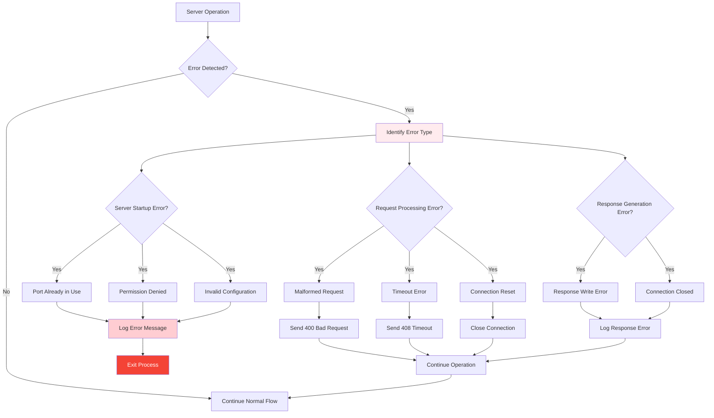
```mermaid
flowchart TD
    A[Server Operation] --> B{Error Detected?}
    B -->|No| C[Continue Normal Flow]
    B -->|Yes| D[Identify Error Type]
    
    D --> E{Server Startup Error?}
    D --> F{Request Processing Error?}
    D --> G{Response Generation Error?}
    
    E -->|Yes| H[Port Already in Use]
    E -->|Yes| I[Permission Denied]
    E -->|Yes| J[Invalid Configuration]
    
    F -->|Yes| K[Malformed Request]
    F -->|Yes| L[Timeout Error]
    F -->|Yes| M[Connection Reset]
    
    G -->|Yes| N[Response Write Error]
    G -->|Yes| O[Connection Closed]
    
    H --> P[Log Error Message]
    I --> P
    J --> P
    K --> Q[Send 400 Bad Request]
    L --> R[Send 408 Timeout]
    M --> S[Close Connection]
    N --> T[Log Response Error]
    O --> T
    
    P --> U[Exit Process]
    Q --> V[Continue Operation]
    R --> V
    S --> V
    T --> V
    V --> C
    
    style D fill:#ffebee
    style P fill:#ffcdd2
    style U fill:#f44336,color:#fff
```

#### Error Recovery Mechanisms

**Error Recovery and Retry Logic**

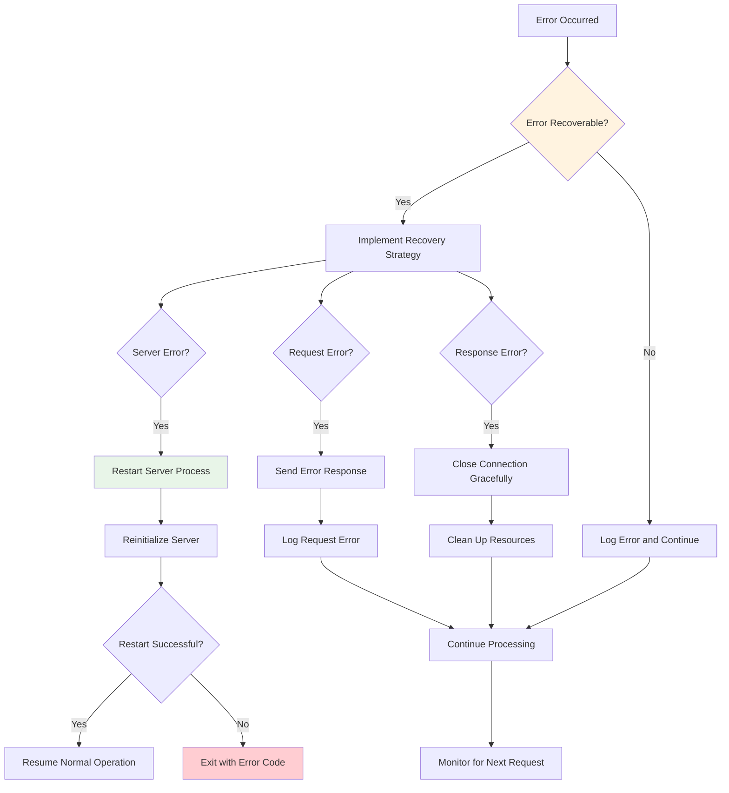
```mermaid
flowchart TD
    A[Error Occurred] --> B{Error Recoverable?}
    B -->|Yes| C[Implement Recovery Strategy]
    B -->|No| D[Log Error and Continue]
    
    C --> E{Server Error?}
    C --> F{Request Error?}
    C --> G{Response Error?}
    
    E -->|Yes| H[Restart Server Process]
    F -->|Yes| I[Send Error Response]
    G -->|Yes| J[Close Connection Gracefully]
    
    H --> K[Reinitialize Server]
    I --> L[Log Request Error]
    J --> M[Clean Up Resources]
    
    K --> N{Restart Successful?}
    N -->|Yes| O[Resume Normal Operation]
    N -->|No| P[Exit with Error Code]
    
    L --> Q[Continue Processing]
    M --> Q
    D --> Q
    Q --> R[Monitor for Next Request]
    
    style B fill:#fff3e0
    style H fill:#e8f5e8
    style P fill:#ffcdd2
```

## 4.3 DETAILED PROCESS FLOWS

### 4.3.1 Server Initialization Process

**Complete Server Startup Workflow**

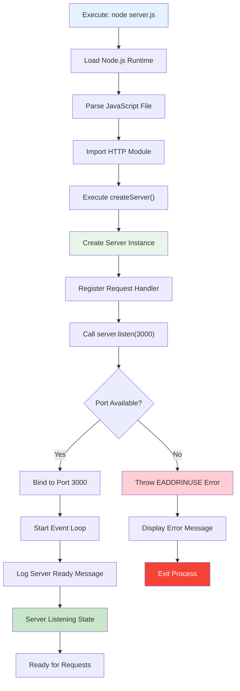
```mermaid
flowchart TD
    A["Execute: node server.js"] --> B["Load Node.js Runtime"]
    B --> C["Parse JavaScript File"]
    C --> D["Import HTTP Module"]
    D --> E["Execute createServer()"]
    
    E --> F["Create Server Instance"]
    F --> G["Register Request Handler"]
    G --> H["Call server.listen(3000)"]
    
    H --> I{"Port Available?"}
    I -->|No| J["Throw EADDRINUSE Error"]
    I -->|Yes| K["Bind to Port 3000"]
    
    K --> L["Start Event Loop"]
    L --> M["Log Server Ready Message"]
    M --> N["Server Listening State"]
    
    J --> O["Display Error Message"]
    O --> P["Exit Process"]
    
    N --> Q["Ready for Requests"]
    
    style A fill:#e3f2fd
    style F fill:#e8f5e8
    style N fill:#c8e6c9
    style J fill:#ffcdd2
    style P fill:#f44336,color:#fff
```

### 4.3.2 Request Processing Detailed Flow

**Granular Request Handling Process**

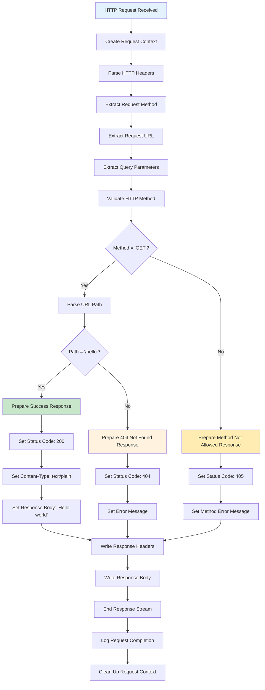
```mermaid
flowchart TD
    A[HTTP Request Received] --> B[Create Request Context]
    B --> C[Parse HTTP Headers]
    C --> D[Extract Request Method]
    D --> E[Extract Request URL]
    E --> F[Extract Query Parameters]
    
    F --> G[Validate HTTP Method]
    G --> H{Method = 'GET'?}
    H -->|No| I[Prepare Method Not Allowed Response]
    H -->|Yes| J[Parse URL Path]
    
    J --> K{Path = '/hello'?}
    K -->|No| L[Prepare 404 Not Found Response]
    K -->|Yes| M[Prepare Success Response]
    
    M --> N[Set Status Code: 200]
    N --> O[Set Content-Type: text/plain]
    O --> P[Set Response Body: 'Hello world']
    
    L --> Q[Set Status Code: 404]
    Q --> R[Set Error Message]
    
    I --> S[Set Status Code: 405]
    S --> T[Set Method Error Message]
    
    P --> U[Write Response Headers]
    R --> U
    T --> U
    
    U --> V[Write Response Body]
    V --> W[End Response Stream]
    W --> X[Log Request Completion]
    X --> Y[Clean Up Request Context]
    
    style A fill:#e3f2fd
    style M fill:#c8e6c9
    style L fill:#fff3e0
    style I fill:#ffecb3
```

### 4.3.3 Response Generation Process

**Response Construction and Delivery**

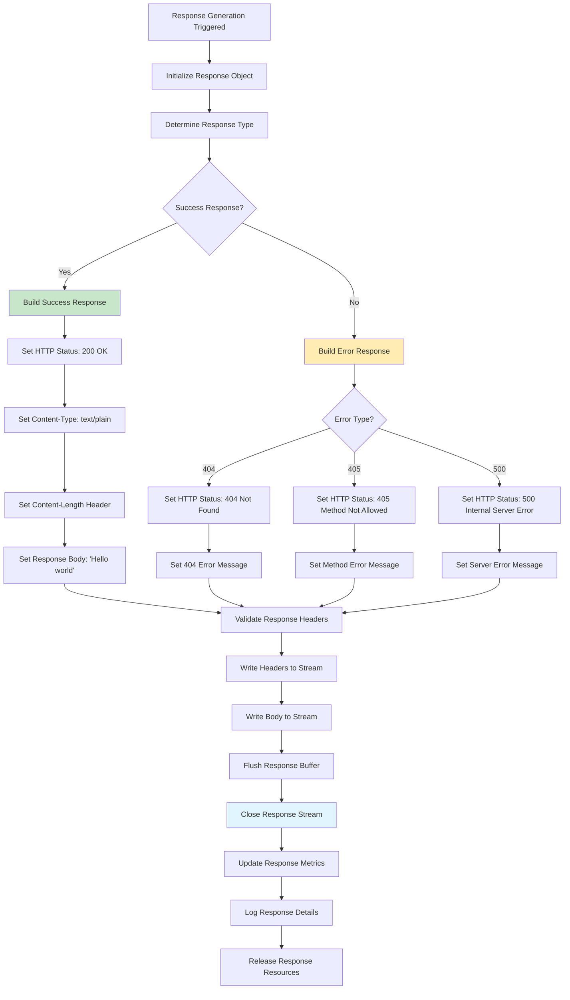
```mermaid
flowchart TD
    A[Response Generation Triggered] --> B[Initialize Response Object]
    B --> C[Determine Response Type]
    
    C --> D{Success Response?}
    D -->|Yes| E[Build Success Response]
    D -->|No| F[Build Error Response]
    
    E --> G[Set HTTP Status: 200 OK]
    G --> H[Set Content-Type: text/plain]
    H --> I[Set Content-Length Header]
    I --> J[Set Response Body: 'Hello world']
    
    F --> K{Error Type?}
    K -->|404| L[Set HTTP Status: 404 Not Found]
    K -->|405| M[Set HTTP Status: 405 Method Not Allowed]
    K -->|500| N[Set HTTP Status: 500 Internal Server Error]
    
    L --> O[Set 404 Error Message]
    M --> P[Set Method Error Message]
    N --> Q[Set Server Error Message]
    
    J --> R[Validate Response Headers]
    O --> R
    P --> R
    Q --> R
    
    R --> S[Write Headers to Stream]
    S --> T[Write Body to Stream]
    T --> U[Flush Response Buffer]
    U --> V[Close Response Stream]
    
    V --> W[Update Response Metrics]
    W --> X[Log Response Details]
    X --> Y[Release Response Resources]
    
    style E fill:#c8e6c9
    style F fill:#ffecb3
    style V fill:#e1f5fe
```

## 4.4 INTEGRATION SEQUENCE DIAGRAMS

### 4.4.1 Complete Request-Response Cycle

**End-to-End System Integration**

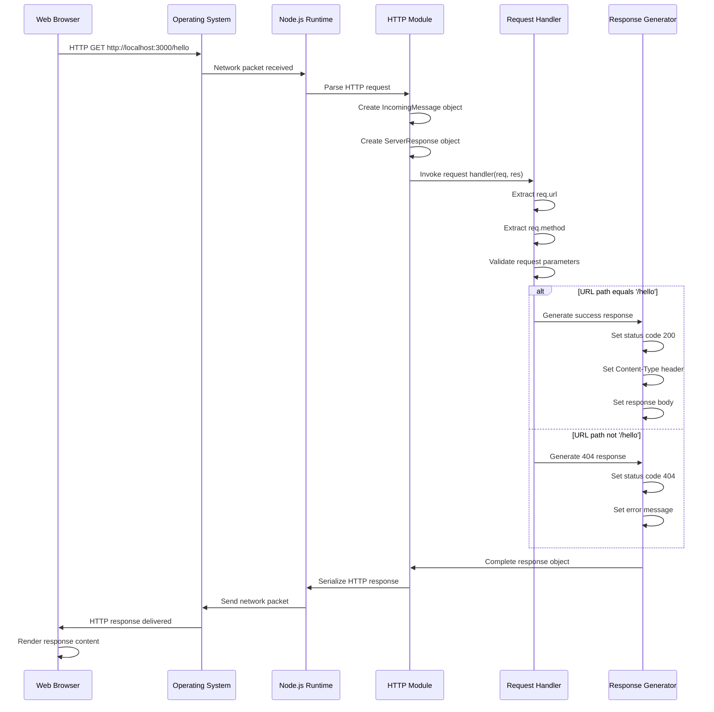
```mermaid
sequenceDiagram
    participant Browser as Web Browser
    participant OS as Operating System
    participant Node as Node.js Runtime
    participant HTTP as HTTP Module
    participant Handler as Request Handler
    participant Response as Response Generator
    
    Browser->>OS: HTTP GET http://localhost:3000/hello
    OS->>Node: Network packet received
    Node->>HTTP: Parse HTTP request
    HTTP->>HTTP: Create IncomingMessage object
    HTTP->>HTTP: Create ServerResponse object
    HTTP->>Handler: Invoke request handler(req, res)
    
    Handler->>Handler: Extract req.url
    Handler->>Handler: Extract req.method
    Handler->>Handler: Validate request parameters
    
    alt URL path equals '/hello'
        Handler->>Response: Generate success response
        Response->>Response: Set status code 200
        Response->>Response: Set Content-Type header
        Response->>Response: Set response body
    else URL path not '/hello'
        Handler->>Response: Generate 404 response
        Response->>Response: Set status code 404
        Response->>Response: Set error message
    end
    
    Response->>HTTP: Complete response object
    HTTP->>Node: Serialize HTTP response
    Node->>OS: Send network packet
    OS->>Browser: HTTP response delivered
    Browser->>Browser: Render response content
```

### 4.4.2 Error Handling Integration

**System-Wide Error Management**

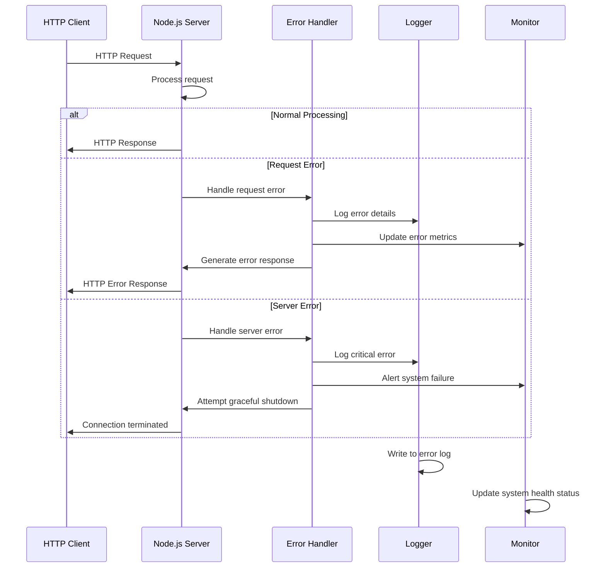
```mermaid
sequenceDiagram
    participant Client as HTTP Client
    participant Server as Node.js Server
    participant ErrorHandler as Error Handler
    participant Logger as Logger
    participant Monitor as Monitor
    
    Client->>Server: HTTP Request
    Server->>Server: Process request
    
    alt Normal Processing
        Server->>Client: HTTP Response
    else Request Error
        Server->>ErrorHandler: Handle request error
        ErrorHandler->>Logger: Log error details
        ErrorHandler->>Monitor: Update error metrics
        ErrorHandler->>Server: Generate error response
        Server->>Client: HTTP Error Response
    else Server Error
        Server->>ErrorHandler: Handle server error
        ErrorHandler->>Logger: Log critical error
        ErrorHandler->>Monitor: Alert system failure
        ErrorHandler->>Server: Attempt graceful shutdown
        Server->>Client: Connection terminated
    end
    
    Logger->>Logger: Write to error log
    Monitor->>Monitor: Update system health status
```

## 4.5 PERFORMANCE AND TIMING CONSIDERATIONS

### 4.5.1 Response Time Requirements

| Operation | Target Time | Maximum Time | Measurement Point |
|-----------|-------------|--------------|-------------------|
| Server Startup | < 1 second | 2 seconds | Process initialization to listening state |
| Request Processing | < 50ms | 100ms | Request receipt to response generation |
| Response Delivery | < 10ms | 25ms | Response generation to client delivery |
| Memory Cleanup | < 5ms | 15ms | Request completion to garbage collection |

### 4.5.2 Scalability Workflow

**Concurrent Request Handling**

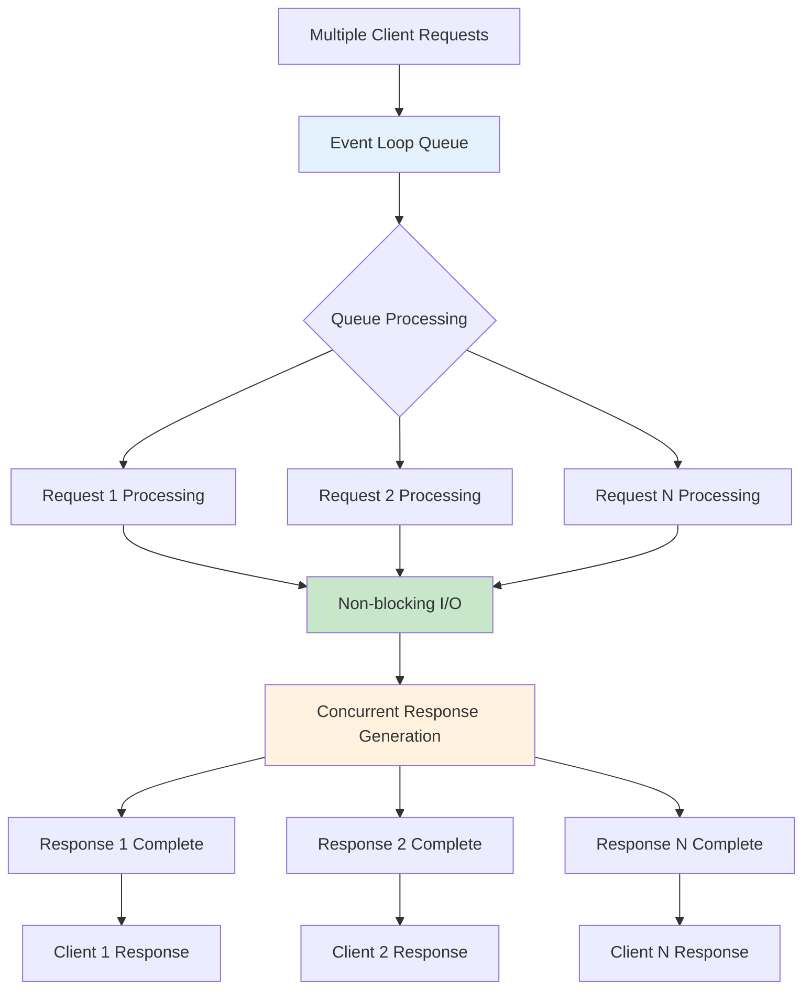
```mermaid
flowchart TD
    A[Multiple Client Requests] --> B[Event Loop Queue]
    B --> C{Queue Processing}
    
    C --> D[Request 1 Processing]
    C --> E[Request 2 Processing]
    C --> F[Request N Processing]
    
    D --> G[Non-blocking I/O]
    E --> G
    F --> G
    
    G --> H[Concurrent Response Generation]
    H --> I[Response 1 Complete]
    H --> J[Response 2 Complete]
    H --> K[Response N Complete]
    
    I --> L[Client 1 Response]
    J --> M[Client 2 Response]
    K --> N[Client N Response]
    
    style B fill:#e3f2fd
    style G fill:#c8e6c9
    style H fill:#fff3e0
```

### 4.5.3 Resource Management Flow

**Memory and Connection Management**

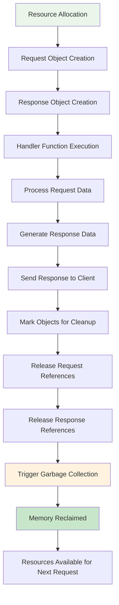
```mermaid
flowchart TD
    A[Resource Allocation] --> B[Request Object Creation]
    B --> C[Response Object Creation]
    C --> D[Handler Function Execution]
    
    D --> E[Process Request Data]
    E --> F[Generate Response Data]
    F --> G[Send Response to Client]
    
    G --> H[Mark Objects for Cleanup]
    H --> I[Release Request References]
    I --> J[Release Response References]
    J --> K[Trigger Garbage Collection]
    
    K --> L[Memory Reclaimed]
    L --> M[Resources Available for Next Request]
    
    style A fill:#e8f5e8
    style K fill:#fff3e0
    style L fill:#c8e6c9
```

This comprehensive process flowchart section provides detailed workflows for the Node.js tutorial application, covering all aspects from server initialization through request processing, error handling, and resource management. The diagrams illustrate the event-driven nature of Node.js and demonstrate how the simple '/hello' endpoint fits within the broader HTTP server architecture.

# 5. SYSTEM ARCHITECTURE

## 5.1 HIGH-LEVEL ARCHITECTURE

### 5.1.1 System Overview

The Node.js tutorial application implements a single-threaded event-driven architecture that demonstrates fundamental HTTP server capabilities through a minimalist design approach. The event loop is what allows Node.js to perform non-blocking I/O operations — despite the fact that a single JavaScript thread is used by default — by offloading operations to the system kernel whenever possible.

**Architecture Style and Rationale**

The system follows a **Monolithic Single-Service Architecture** pattern, specifically designed for educational purposes to showcase core Node.js HTTP server functionality without the complexity of distributed systems or microservices patterns. This architectural choice aligns with the tutorial's objective of providing a clear, understandable demonstration of Node.js built-in HTTP module capabilities.

**Key Architectural Principles**

- **Simplicity First**: The architecture prioritizes educational clarity over production complexity, implementing only essential components required for HTTP request-response functionality
- **Event-Driven Processing**: Node.js utilizes an event-driven architecture, where programs respond to external events. Instead of following a traditional flow of execution, where the code sequentially executes each statement, Node.js relies on events, which can be anything from HTTP requests, file system operations, timers, or custom events triggered by the application
- **Non-Blocking I/O**: Node.js is a single-threaded, non-blocking, event-driven architecture that enables efficient handling of concurrent operations
- **Stateless Design**: Each HTTP request is processed independently without maintaining session state or persistent connections

**System Boundaries and Major Interfaces**

The system operates within clearly defined boundaries that establish its scope and integration points:

- **Network Interface**: Binds exclusively to localhost (127.0.0.1) on port 3000 for security and tutorial purposes
- **HTTP Protocol Boundary**: Implements HTTP/1.1 protocol compliance for request-response communication
- **Application Boundary**: Self-contained Node.js process with no external service dependencies
- **Runtime Boundary**: Operates within the Node.js runtime environment, leveraging the V8 JavaScript engine and libuv for asynchronous I/O operations

### 5.1.2 Core Components Table

| Component Name | Primary Responsibility | Key Dependencies | Integration Points |
|---------------|----------------------|------------------|-------------------|
| HTTP Server | Creates and manages HTTP server instance, handles incoming connections | Node.js http module, Operating system network stack | Network interface, Request Router |
| Request Router | Parses incoming requests and routes to appropriate handlers | HTTP Server, URL parsing utilities | HTTP Server, Response Generator |
| Hello Handler | Processes '/hello' endpoint requests and generates response content | Request Router, Response Generator | Request Router, Response Generator |
| Response Generator | Constructs and sends HTTP responses with proper headers and status codes | HTTP Server response object | Hello Handler, HTTP Server |

### 5.1.3 Data Flow Description

**Primary Data Flows Between Components**

The application implements a straightforward request-response data flow pattern that demonstrates the fundamental HTTP server processing cycle. When Node.js starts, it initializes the event loop, processes the provided input script which may make async API calls, schedule timers, or call process.nextTick(), then begins processing the event loop.

**Request Processing Flow**

Incoming HTTP requests follow a linear processing path through the system components. The HTTP Server receives raw network data and creates request/response objects, which are then passed to the Request Router for URL analysis and method validation. The router determines the appropriate handler based on the request path, forwarding '/hello' requests to the Hello Handler while routing all other requests to a default error handler.

**Response Generation Flow**

Response data flows from the Hello Handler back through the Response Generator, which constructs proper HTTP response headers, sets appropriate status codes, and formats the response body. The completed response is then transmitted back to the client through the HTTP Server's network interface.

**Integration Patterns and Protocols**

The system utilizes standard HTTP/1.1 protocol for all client communication, with internal component communication occurring through direct JavaScript function calls and object passing. These events are registered with associated callbacks, and when an event occurs, the corresponding callback is executed asynchronously.

**Data Transformation Points**

Key data transformation occurs at the Request Router, where raw HTTP request data is parsed into structured URL and method information. The Response Generator performs the inverse transformation, converting application data into properly formatted HTTP response messages with appropriate headers and status codes.

### 5.1.4 External Integration Points

| System Name | Integration Type | Data Exchange Pattern | Protocol/Format |
|-------------|------------------|----------------------|-----------------|
| Web Browser | Client-Server | Request-Response | HTTP/1.1 over TCP |
| Operating System | System Interface | Network I/O | TCP/IP Socket |
| Node.js Runtime | Runtime Environment | Process Management | Native API calls |

## 5.2 COMPONENT DETAILS

### 5.2.1 HTTP Server Component

**Purpose and Responsibilities**

The HTTP Server component serves as the foundational layer of the application, responsible for creating and managing the HTTP server instance that handles all incoming network connections. This module, containing both a client and server, can be imported via require('node:http') (CommonJS) or import * as http from 'node:http' (ES module).

**Technologies and Frameworks Used**

- **Node.js Built-in HTTP Module**: Provides core HTTP server functionality without external dependencies
- **libuv**: Underlying C++ library that handles asynchronous I/O operations and event loop management
- **V8 JavaScript Engine**: Executes JavaScript code and manages memory allocation

**Key Interfaces and APIs**

The component exposes several critical interfaces for server lifecycle management:

- `http.createServer(requestListener)`: Creates new HTTP server instance with request handling callback
- `server.listen(port, hostname, callback)`: Binds server to specified network interface and port
- `server.close(callback)`: Gracefully shuts down server and closes all connections

**Data Persistence Requirements**

The HTTP Server component operates as a stateless service with no data persistence requirements. All server state is maintained in memory during the application lifecycle, with automatic cleanup upon process termination.

**Scaling Considerations**

In contrast, Node.js uses a single thread to handle all incoming requests. This thread is managed by the JavaScript engine (V8) and Node.js runtime. It does not spawn a new thread for each request. Instead, it relies on the event loop and callbacks to manage multiple requests concurrently.

#### HTTP Server State Transitions

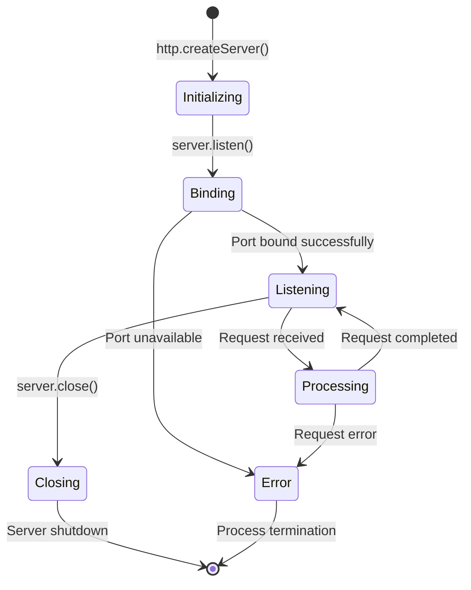
```mermaid
stateDiagram-v2
    [*] --> Initializing: http.createServer()
    Initializing --> Binding: server.listen()
    Binding --> Listening: Port bound successfully
    Listening --> Processing: Request received
    Processing --> Listening: Request completed
    Listening --> Closing: server.close()
    Closing --> [*]: Server shutdown
    
    Binding --> Error: Port unavailable
    Processing --> Error: Request error
    Error --> [*]: Process termination
```

### 5.2.2 Request Router Component

**Purpose and Responsibilities**

The Request Router component analyzes incoming HTTP requests, extracts relevant information such as URL path and HTTP method, and determines the appropriate handler for processing. This component implements the core routing logic that directs '/hello' requests to the Hello Handler while managing all other request paths.

**Technologies and Frameworks Used**

- **Node.js URL Module**: Provides URL parsing and manipulation capabilities
- **JavaScript String Methods**: Implements pattern matching for route determination
- **HTTP Request Object**: Accesses request properties including URL, method, and headers

**Key Interfaces and APIs**

- Request parsing interface that extracts `req.url` and `req.method` properties
- Route matching logic that compares request paths against defined patterns
- Handler delegation interface that forwards requests to appropriate processors

**Data Persistence Requirements**

The Request Router maintains no persistent state, operating as a pure function that processes each request independently based on its URL path and HTTP method.

**Scaling Considerations**

The router's stateless design enables efficient concurrent request processing through Node.js's event loop mechanism, with no synchronization requirements or shared state management.

#### Request Processing Sequence

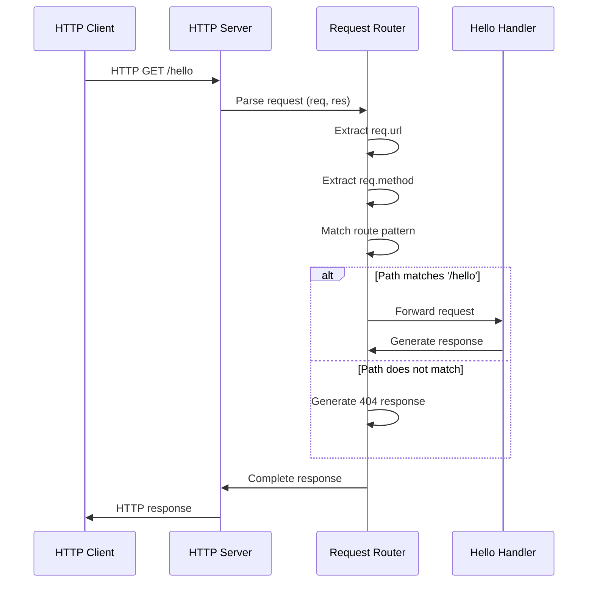
```mermaid
sequenceDiagram
    participant Client as HTTP Client
    participant Server as HTTP Server
    participant Router as Request Router
    participant Handler as Hello Handler
    
    Client->>Server: HTTP GET /hello
    Server->>Router: Parse request (req, res)
    Router->>Router: Extract req.url
    Router->>Router: Extract req.method
    Router->>Router: Match route pattern
    
    alt Path matches '/hello'
        Router->>Handler: Forward request
        Handler->>Router: Generate response
    else Path does not match
        Router->>Router: Generate 404 response
    end
    
    Router->>Server: Complete response
    Server->>Client: HTTP response
```

### 5.2.3 Hello Handler Component

**Purpose and Responsibilities**

The Hello Handler component processes requests specifically directed to the '/hello' endpoint, generating the static "Hello world" response that demonstrates basic HTTP response functionality. This component encapsulates the core business logic of the tutorial application.

**Technologies and Frameworks Used**

- **JavaScript String Literals**: Provides static response content
- **HTTP Response Object**: Manages response headers, status codes, and body content
- **Node.js Buffer/String Handling**: Processes response data for network transmission

**Key Interfaces and APIs**

- Request processing interface that receives parsed HTTP request objects
- Response generation interface that creates properly formatted HTTP responses
- Content delivery interface that sets appropriate headers and status codes

**Data Persistence Requirements**

The Hello Handler operates with static content only, requiring no database connections, file system access, or persistent storage mechanisms.

**Scaling Considerations**

The handler's stateless design and minimal processing requirements enable high-throughput request processing with minimal resource consumption per request.

### 5.2.4 Response Generator Component

**Purpose and Responsibilities**

The Response Generator component constructs complete HTTP responses with proper headers, status codes, and body content. It ensures HTTP protocol compliance and manages the final transmission of response data to clients.

**Technologies and Frameworks Used**

- **HTTP Response Object**: Node.js built-in response handling capabilities
- **HTTP Status Codes**: Standard HTTP response status management
- **Content-Type Headers**: MIME type specification for response content

**Key Interfaces and APIs**

- `response.writeHead(statusCode, headers)`: Sets response status and headers
- `response.write(chunk)`: Writes response body content
- `response.end(data)`: Completes response transmission

**Data Persistence Requirements**

The Response Generator maintains no persistent state, generating each response independently based on input parameters and request context.

**Scaling Considerations**

Response generation operates with minimal memory allocation and CPU overhead, supporting concurrent response processing through Node.js's non-blocking I/O model.

#### Component Interaction Flow

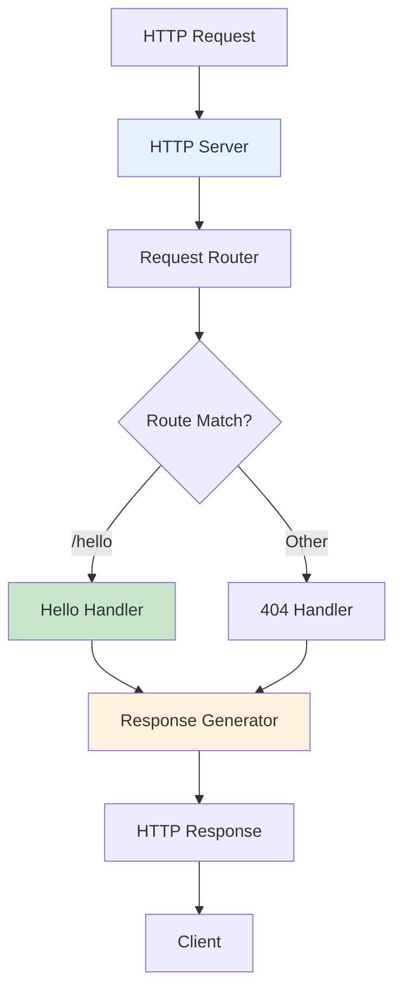
```mermaid
flowchart TD
    A[HTTP Request] --> B[HTTP Server]
    B --> C[Request Router]
    C --> D{Route Match?}
    D -->|/hello| E[Hello Handler]
    D -->|Other| F[404 Handler]
    E --> G[Response Generator]
    F --> G
    G --> H[HTTP Response]
    H --> I[Client]
    
    style B fill:#e3f2fd
    style E fill:#c8e6c9
    style G fill:#fff3e0
```

## 5.3 TECHNICAL DECISIONS

### 5.3.1 Architecture Style Decisions and Tradeoffs

**Monolithic vs. Microservices Architecture Decision**

The tutorial application deliberately adopts a monolithic architecture over microservices patterns, despite microservices being an architectural style that structures an application as a collection of small, loosely coupled services, enabling faster development cycles, better scalability, and improved resilience compared to traditional monolithic applications.

| Decision Factor | Monolithic Choice | Microservices Alternative | Rationale |
|----------------|-------------------|---------------------------|-----------|
| Educational Clarity | Single codebase, simple deployment | Multiple services, complex orchestration | Tutorial focus requires minimal complexity |
| Resource Requirements | Minimal memory and CPU usage | Higher overhead for service coordination | Educational environment constraints |
| Development Complexity | Single process debugging | Distributed system challenges | Beginner-friendly implementation |

**Event-Driven vs. Traditional Threading Decision**

Node JS Platform uses "Single Threaded Event Loop" architecture to handle multiple concurrent clients, contrasting with traditional multi-threaded approaches.

| Aspect | Event-Driven (Chosen) | Multi-Threaded Alternative | Justification |
|--------|----------------------|---------------------------|---------------|
| Concurrency Model | Single thread with event loop | Multiple threads per request | Node.js native architecture |
| Memory Efficiency | Low memory per connection | High memory per thread | Tutorial resource optimization |
| Complexity | Asynchronous callback handling | Thread synchronization | Educational simplicity |

### 5.3.2 Communication Pattern Choices

**Synchronous vs. Asynchronous Processing Decision**

The application implements asynchronous request processing aligned with Node.js's core architecture principles. On the other hand, non-blocking or asynchronous programming allows the program to continue executing without waiting for an I/O operation to finish. When the operation is completed, a callback function is triggered to handle the result.

**HTTP Protocol Selection**

| Protocol Option | Implementation Status | Decision Rationale |
|----------------|----------------------|-------------------|
| HTTP/1.1 | Selected | Standard web protocol, broad compatibility |
| HTTP/2 | Not implemented | Unnecessary complexity for tutorial scope |
| WebSockets | Not implemented | Real-time communication not required |

**Request-Response Pattern Implementation**

The application follows a standard request-response communication pattern suitable for stateless HTTP interactions, avoiding more complex patterns like publish-subscribe or message queuing that would introduce unnecessary complexity for educational purposes.

### 5.3.3 Data Storage Solution Rationale

**No Database Decision**

The tutorial application intentionally excludes database integration to maintain focus on HTTP server fundamentals.

| Storage Option | Implementation Status | Decision Rationale |
|---------------|----------------------|-------------------|
| In-Memory Storage | Not required | Static response content only |
| File System | Not implemented | No persistent data requirements |
| Database Systems | Excluded | Tutorial scope limitation |

### 5.3.4 Security Mechanism Selection

**Localhost-Only Binding Decision**

The application binds exclusively to localhost (127.0.0.1) for security and educational purposes, preventing external network access while enabling local testing and development.

| Security Aspect | Implementation | Rationale |
|-----------------|----------------|-----------|
| Network Exposure | Localhost only | Tutorial safety and security |
| Authentication | Not implemented | Educational simplicity |
| Input Validation | Basic URL parsing | Minimal attack surface |

#### Architecture Decision Record

```mermaid
flowchart TD
    A[Architecture Decision Required] --> B{Decision Type?}
    B -->|Architecture Style| C[Evaluate Monolithic vs Microservices]
    B -->|Communication| D[Evaluate Sync vs Async]
    B -->|Storage| E[Evaluate Database Options]
    B -->|Security| F[Evaluate Security Requirements]
    
    C --> G[Choose Monolithic]
    D --> H[Choose Async Event-Driven]
    E --> I[Choose No Database]
    F --> J[Choose Localhost Binding]
    
    G --> K[Document Rationale]
    H --> K
    I --> K
    J --> K
    
    K --> L[Implementation Decision]
    
    style G fill:#c8e6c9
    style H fill:#c8e6c9
    style I fill:#c8e6c9
    style J fill:#c8e6c9
```

## 5.4 CROSS-CUTTING CONCERNS

### 5.4.1 Monitoring and Observability Approach

**Application Monitoring Strategy**

The tutorial application implements basic monitoring through console logging and process-level observability, focusing on educational visibility rather than production-grade monitoring solutions.

| Monitoring Aspect | Implementation Approach | Educational Value |
|------------------|------------------------|-------------------|
| Server Startup | Console log confirmation | Demonstrates successful initialization |
| Request Processing | Basic request logging | Shows event-driven processing |
| Error Conditions | Console error output | Illustrates error handling patterns |

**Observability Requirements**

- **Process Health**: Monitor server startup and shutdown events
- **Request Metrics**: Track incoming request patterns and response times
- **Error Tracking**: Capture and log error conditions for debugging

### 5.4.2 Logging and Tracing Strategy

**Logging Implementation**

The application employs Node.js built-in console logging for simplicity and educational clarity, avoiding complex logging frameworks that would obscure the core HTTP server concepts.

**Log Levels and Categories**

| Log Level | Usage | Example Output |
|-----------|-------|----------------|
| Info | Server lifecycle events | "Server running on http://localhost:3000" |
| Error | Exception handling | "Error: Port 3000 already in use" |
| Debug | Request processing | "Received GET request for /hello" |

### 5.4.3 Error Handling Patterns

**Error Handling Strategy**

The application implements defensive error handling patterns that demonstrate proper Node.js error management while maintaining educational clarity.

**Error Categories and Responses**

| Error Type | Handling Approach | Response Strategy |
|------------|------------------|-------------------|
| Server Startup Errors | Process termination with error message | Educational error explanation |
| Request Processing Errors | Graceful error response | HTTP 500 with generic message |
| Route Not Found | Standard 404 response | Clear "Not Found" message |

#### Error Handling Flow

```mermaid
flowchart TD
    A[Error Detected] --> B{Error Type?}
    B -->|Server Startup| C[Log Error Details]
    B -->|Request Processing| D[Generate Error Response]
    B -->|Route Not Found| E[Send 404 Response]
    
    C --> F[Exit Process]
    D --> G[Log Error]
    E --> H[Log Request]
    
    G --> I[Continue Operation]
    H --> I
    
    F --> J[Process Terminated]
    I --> K[Ready for Next Request]
    
    style C fill:#ffcdd2
    style F fill:#f44336,color:#fff
    style I fill:#c8e6c9
```

### 5.4.4 Performance Requirements and SLAs

**Performance Targets**

The tutorial application establishes basic performance expectations suitable for educational demonstration and local development environments.

| Performance Metric | Target Value | Measurement Method |
|-------------------|--------------|-------------------|
| Server Startup Time | < 1 second | Process initialization to listening state |
| Request Response Time | < 100ms | Request receipt to response delivery |
| Memory Usage | < 50MB | Process memory footprint |
| Concurrent Connections | 100+ | Simultaneous client connections |

**Service Level Objectives**

- **Availability**: 99% uptime during tutorial sessions (local development only)
- **Response Time**: 95th percentile under 100ms for '/hello' endpoint
- **Throughput**: Support minimum 100 requests per second for demonstration purposes
- **Resource Efficiency**: Maintain minimal CPU and memory usage for educational environments

### 5.4.5 Disaster Recovery Procedures

**Recovery Strategy for Tutorial Environment**

Given the tutorial application's educational nature and stateless design, disaster recovery focuses on rapid restart and troubleshooting guidance rather than complex backup and restoration procedures.

**Recovery Procedures**

| Failure Scenario | Recovery Action | Prevention Strategy |
|------------------|----------------|-------------------|
| Process Crash | Restart Node.js application | Implement proper error handling |
| Port Conflict | Change port configuration | Check port availability before startup |
| Memory Exhaustion | Restart with increased memory | Monitor resource usage patterns |

**Backup and Restoration**

The tutorial application requires no backup procedures due to its stateless nature and lack of persistent data. Recovery involves simple application restart with source code availability from version control systems.

**Business Continuity**

For educational purposes, business continuity focuses on maintaining learning continuity through:

- Clear error messages that guide troubleshooting
- Simple restart procedures documented in tutorial materials
- Alternative port configurations for multi-user environments
- Comprehensive logging for debugging assistance

The tutorial application's architecture prioritizes educational value and simplicity over complex production concerns, while still demonstrating fundamental Node.js HTTP server concepts and best practices for error handling, monitoring, and performance optimization.

# 6. SYSTEM COMPONENTS DESIGN

## 6.1 COMPONENT ARCHITECTURE

### 6.1.1 HTTP Server Component

**Component Overview**

The HTTP Server component serves as the foundational layer of the Node.js tutorial application, implementing the core server functionality using Node.js® which is a free, open-source, cross-platform JavaScript runtime environment that lets developers create servers, web apps, command line tools and scripts. This component leverages the HTTP module's createServer() method which creates an HTTP server that listens for requests on a specified port and executes a callback function for each request.

**Technical Implementation Details**

The HTTP Server component utilizes Node.js version 24.8.0 (Current) which provides the latest features and performance improvements. For production environments, Node.js v22 officially transitioned into Long Term Support (LTS) with the codename 'Jod' on October 29, 2024, and will remain in Active LTS until October 2025.

**Core Server Creation Process**

The server initialization follows the standard Node.js HTTP server pattern. The http.createServer() method creates an HTTP Server object that can listen to ports on your computer and execute a function, a requestListener, each time a request is made. The implementation uses the following structure:

| Implementation Aspect | Technical Detail | Node.js API Reference |
|----------------------|------------------|----------------------|
| Module Import | `const http = require('http')` or `import http from 'node:http'` | Built-in HTTP module |
| Server Creation | `http.createServer(requestListener)` | Creates HTTP server instance |
| Port Binding | `server.listen(port, hostname, callback)` | Binds server to network interface |
| Request Handling | Callback function with (req, res) parameters | Event-driven request processing |

**Server Lifecycle Management**

```mermaid
stateDiagram-v2
    [*] --> Initializing: Import HTTP Module
    Initializing --> Creating: http.createServer()
    Creating --> Binding: server.listen(3000)
    Binding --> Listening: Port bound successfully
    Listening --> Processing: HTTP request received
    Processing --> Responding: Generate response
    Responding --> Listening: Response sent
    Listening --> Shutdown: Process termination
    Shutdown --> [*]: Server closed
    
    Binding --> Error: Port unavailable
    Processing --> Error: Request error
    Error --> [*]: Process exit
```

**Request-Response Cycle**

When response.write() is called for the first time, it will send the buffered header information and the first chunk of the body to the client. The second time response.write() is called, Node.js assumes data will be streamed, and sends the new data separately. The tutorial application implements a simplified response pattern suitable for educational purposes.

### 6.1.2 Request Router Component

**Routing Architecture**

The Request Router component implements URL-based routing logic that processes incoming HTTP requests and determines the appropriate response handler. The http.createServer() function takes a request (req) object, which contains information about the incoming HTTP request, with one of the key properties being url, which holds the part of the URL after the domain name.

**URL Processing Logic**

The router extracts and analyzes request properties to make routing decisions:

| Request Property | Processing Method | Purpose |
|-----------------|-------------------|---------|
| `req.url` | String comparison | Path matching for '/hello' endpoint |
| `req.method` | HTTP method validation | Ensures GET request handling |
| `req.headers` | Header analysis | Content negotiation and validation |

**Route Matching Implementation**

```mermaid
flowchart TD
    A[HTTP Request Received] --> B[Extract req.url]
    B --> C[Extract req.method]
    C --> D{Method === 'GET'?}
    D -->|No| E[Return 405 Method Not Allowed]
    D -->|Yes| F{URL === '/hello'?}
    F -->|Yes| G[Route to Hello Handler]
    F -->|No| H[Return 404 Not Found]
    
    G --> I[Generate Success Response]
    E --> J[Send Error Response]
    H --> J
    I --> K[Response Complete]
    J --> K
    
    style G fill:#c8e6c9
    style I fill:#c8e6c9
    style E fill:#ffcdd2
    style H fill:#ffcdd2
```

**Request Processing Flow**

The router implements a sequential processing pattern that evaluates each incoming request against defined criteria. The server listens for HTTP requests, with req.url returning the full URL requested by the client, including the path and query string (if any), and the server sends the path as part of the response.

### 6.1.3 Hello Handler Component

**Handler Functionality**

The Hello Handler component processes requests specifically directed to the '/hello' endpoint, implementing the core business logic of the tutorial application. This component generates the static "Hello world" response that demonstrates basic HTTP response functionality.

**Response Generation Process**

The handler implements a straightforward response generation pattern:

| Response Element | Implementation | HTTP Standard |
|-----------------|----------------|---------------|
| Status Code | `200 OK` | Successful request processing |
| Content-Type | `text/plain` | Plain text response format |
| Response Body | `"Hello world"` | Static message content |
| Content-Length | Automatically calculated | Response size header |

**Handler Implementation Pattern**

```mermaid
sequenceDiagram
    participant Router as Request Router
    participant Handler as Hello Handler
    participant Response as Response Generator
    
    Router->>Handler: Forward '/hello' request
    Handler->>Handler: Validate request parameters
    Handler->>Response: Create success response
    Response->>Response: Set status code 200
    Response->>Response: Set Content-Type: text/plain
    Response->>Response: Set body: "Hello world"
    Response->>Handler: Complete response object
    Handler->>Router: Return formatted response
    Router->>Router: Send response to client
```

### 6.1.4 Response Generator Component

**Response Construction**

The Response Generator component constructs complete HTTP responses with proper headers, status codes, and body content. The response must call response.end() method on each response, and if rejectNonStandardBodyWrites is set to true in createServer then writing to the body is not allowed when the request method or response status do not support content.

**HTTP Response Standards Compliance**

The component ensures compliance with HTTP/1.1 protocol standards:

| HTTP Component | Implementation | Compliance Standard |
|---------------|----------------|-------------------|
| Status Line | HTTP/1.1 200 OK | RFC 9110 Section 15 |
| Headers | Content-Type, Content-Length | RFC 9110 Section 6.6 |
| Message Body | Plain text content | RFC 9110 Section 6.4 |
| Connection Management | Keep-alive or close | RFC 9110 Section 9.6 |

**Response Generation Workflow**

```mermaid
flowchart TD
    A[Response Generation Request] --> B[Initialize Response Object]
    B --> C[Set HTTP Status Code]
    C --> D[Configure Response Headers]
    D --> E[Prepare Response Body]
    E --> F[Validate Response Format]
    F --> G[Write Headers to Stream]
    G --> H[Write Body to Stream]
    H --> I[End Response Stream]
    I --> J[Log Response Completion]
    J --> K[Clean Up Resources]
    
    style A fill:#e3f2fd
    style I fill:#c8e6c9
    style K fill:#fff3e0
```

## 6.2 DATA FLOW ARCHITECTURE

### 6.2.1 Request Processing Pipeline

**End-to-End Data Flow**

The tutorial application implements a linear data processing pipeline that transforms incoming HTTP requests into appropriate responses. The data flow follows the event-driven architecture principles of Node.js, where each component processes data asynchronously without blocking the main execution thread.

**Data Transformation Points**

```mermaid
flowchart LR
    A[Raw HTTP Request] --> B[HTTP Parser]
    B --> C[Request Object]
    C --> D[URL Extractor]
    D --> E[Route Matcher]
    E --> F[Handler Selector]
    F --> G[Response Generator]
    G --> H[HTTP Formatter]
    H --> I[Network Response]
    
    subgraph "Input Processing"
        A
        B
        C
    end
    
    subgraph "Routing Logic"
        D
        E
        F
    end
    
    subgraph "Output Generation"
        G
        H
        I
    end
    
    style A fill:#ffebee
    style I fill:#e8f5e8
```

**Data Structure Specifications**

| Data Stage | Structure Type | Key Properties | Processing Method |
|------------|---------------|----------------|-------------------|
| Raw Request | Network Stream | TCP packet data | HTTP protocol parsing |
| Request Object | `http.IncomingMessage` | url, method, headers | Property extraction |
| Route Data | JavaScript Object | path, parameters | String matching |
| Response Data | JavaScript Object | status, headers, body | Object construction |
| HTTP Response | Network Stream | Formatted HTTP message | Protocol serialization |

### 6.2.2 Component Integration Patterns

**Inter-Component Communication**

The system components communicate through direct function calls and object passing, following Node.js's event-driven programming model. Each component maintains clear interfaces and responsibilities while ensuring loose coupling for maintainability.

**Integration Flow Diagram**

```mermaid
graph TD
    subgraph "HTTP Server Layer"
        A[HTTP Server] --> B[Request Event]
        B --> C[Request/Response Objects]
    end
    
    subgraph "Processing Layer"
        C --> D[Request Router]
        D --> E{Route Match?}
        E -->|/hello| F[Hello Handler]
        E -->|other| G[404 Handler]
    end
    
    subgraph "Response Layer"
        F --> H[Response Generator]
        G --> H
        H --> I[HTTP Response]
        I --> J[Client Delivery]
    end
    
    style A fill:#e3f2fd
    style F fill:#c8e6c9
    style G fill:#ffecb3
    style I fill:#fff3e0
```

**Data Validation and Error Handling**

Each component implements appropriate data validation and error handling mechanisms:

| Component | Validation Type | Error Handling | Recovery Strategy |
|-----------|----------------|----------------|-------------------|
| HTTP Server | Network connectivity | Connection errors | Process termination |
| Request Router | URL format validation | Malformed requests | 400 Bad Request |
| Hello Handler | Path verification | Invalid routes | 404 Not Found |
| Response Generator | HTTP compliance | Response errors | 500 Internal Server Error |

## 6.3 SCALABILITY AND PERFORMANCE DESIGN

### 6.3.1 Node.js Event Loop Architecture

**Single-Threaded Event-Driven Model**

Node.js uses a thread pool to handle the execution of parallel tasks, where the main thread function call posts tasks to the shared task queue, which threads in the thread pool pull and execute. Inherently non-blocking system functions such as networking translate to kernel-side non-blocking sockets, while inherently blocking system functions such as file I/O run in a blocking way on their own threads. When a thread in the thread pool completes a task, it informs the main thread of this, which in turn, wakes up and executes the registered callback.

**Concurrency Handling**

The tutorial application leverages Node.js's natural concurrency capabilities:

| Concurrency Aspect | Implementation | Performance Benefit |
|-------------------|----------------|-------------------|
| Request Processing | Event loop queuing | Non-blocking I/O operations |
| Memory Management | Automatic garbage collection | Efficient memory utilization |
| Connection Handling | Single thread multiplexing | High connection throughput |
| Response Generation | Asynchronous callbacks | Parallel response processing |

**Performance Optimization Strategies**

```mermaid
flowchart TD
    A[Incoming Requests] --> B[Event Loop Queue]
    B --> C[Non-blocking Processing]
    C --> D[Concurrent Request Handling]
    D --> E[Response Generation]
    E --> F[Client Delivery]
    
    subgraph "Event Loop Cycle"
        G[Timer Phase] --> H[Pending Callbacks]
        H --> I[Poll Phase]
        I --> J[Check Phase]
        J --> K[Close Callbacks]
        K --> G
    end
    
    B -.-> G
    E -.-> F
    
    style B fill:#e3f2fd
    style C fill:#c8e6c9
    style D fill:#fff3e0
```

### 6.3.2 Resource Management

**Memory Efficiency**

The tutorial application implements efficient memory management patterns suitable for educational environments while demonstrating production-ready concepts:

| Resource Type | Management Strategy | Optimization Technique |
|---------------|-------------------|----------------------|
| Request Objects | Automatic cleanup | Garbage collection after response |
| Response Buffers | Stream-based processing | Minimal memory allocation |
| Server State | Stateless design | No persistent memory requirements |
| Connection Pools | Built-in management | Node.js default connection handling |

**Performance Monitoring Points**

```mermaid
graph LR
    A[Request Arrival] --> B[Processing Time]
    B --> C[Memory Usage]
    C --> D[Response Time]
    D --> E[Connection Cleanup]
    
    subgraph "Metrics Collection"
        F[Server Startup Time]
        G[Request Throughput]
        H[Error Rate]
        I[Resource Utilization]
    end
    
    B -.-> G
    C -.-> I
    D -.-> G
    E -.-> I
    
    style A fill:#ffebee
    style E fill:#e8f5e8
```

## 6.4 SECURITY AND RELIABILITY DESIGN

### 6.4.1 Security Architecture

**Network Security Boundaries**

The tutorial application implements security-focused design decisions appropriate for educational environments:

| Security Layer | Implementation | Protection Level |
|---------------|----------------|------------------|
| Network Binding | Localhost only (127.0.0.1) | Prevents external access |
| Port Configuration | Port 3000 (non-privileged) | Avoids system port conflicts |
| Input Validation | Basic URL parsing | Prevents malformed requests |
| Response Sanitization | Static content only | Eliminates injection risks |

**Security Design Patterns**

```mermaid
flowchart TD
    A[External Network] -.->|Blocked| B[Firewall Boundary]
    C[Localhost Interface] --> D[HTTP Server]
    D --> E[Request Validation]
    E --> F{Valid Request?}
    F -->|Yes| G[Process Request]
    F -->|No| H[Reject Request]
    G --> I[Generate Response]
    H --> J[Error Response]
    I --> K[Response Sanitization]
    J --> K
    K --> L[Client Delivery]
    
    style B fill:#ffcdd2
    style E fill:#fff3e0
    style K fill:#c8e6c9
```

### 6.4.2 Error Handling and Reliability

**Defensive Programming Patterns**

The application implements comprehensive error handling strategies that ensure graceful degradation and educational value:

| Error Category | Detection Method | Response Strategy | Educational Value |
|---------------|------------------|-------------------|-------------------|
| Server Startup Errors | Exception catching | Process termination with clear message | Demonstrates error handling |
| Request Processing Errors | Validation checks | HTTP error responses | Shows proper HTTP error codes |
| Network Errors | Connection monitoring | Graceful connection closure | Illustrates network reliability |
| Resource Errors | Resource availability checks | Alternative response paths | Teaches resource management |

**Reliability Architecture**

```mermaid
stateDiagram-v2
    [*] --> Healthy: Server startup
    Healthy --> Processing: Request received
    Processing --> Healthy: Request completed
    Processing --> Degraded: Non-critical error
    Degraded --> Healthy: Error resolved
    Degraded --> Failed: Critical error
    Healthy --> Failed: Fatal error
    Failed --> [*]: Process termination
    
    note right of Healthy
        Normal operation
        All systems functional
    end note
    
    note right of Degraded
        Partial functionality
        Error responses sent
    end note
    
    note right of Failed
        System shutdown
        Educational error messages
    end note
```

## 6.5 MONITORING AND OBSERVABILITY

### 6.5.1 Application Monitoring Strategy

**Educational Monitoring Approach**

The tutorial application implements basic monitoring through console logging and process-level observability, focusing on educational visibility rather than production-grade monitoring solutions:

| Monitoring Aspect | Implementation Method | Educational Purpose |
|------------------|----------------------|-------------------|
| Server Lifecycle | Console log messages | Demonstrates server state changes |
| Request Processing | Request logging | Shows event-driven processing |
| Error Conditions | Error message output | Illustrates error handling patterns |
| Performance Metrics | Basic timing information | Teaches performance awareness |

**Observability Implementation**

```mermaid
flowchart TD
    A[Application Events] --> B[Console Logging]
    B --> C[Process Monitoring]
    C --> D[Educational Output]
    
    subgraph "Monitoring Points"
        E[Server Startup]
        F[Request Received]
        G[Response Sent]
        H[Error Occurred]
    end
    
    E --> B
    F --> B
    G --> B
    H --> B
    
    style B fill:#e3f2fd
    style D fill:#c8e6c9
```

### 6.5.2 Performance Metrics Collection

**Key Performance Indicators**

The application establishes basic performance expectations suitable for educational demonstration:

| Performance Metric | Target Value | Measurement Method | Educational Value |
|-------------------|--------------|-------------------|-------------------|
| Server Startup Time | < 1 second | Process timing | Demonstrates initialization efficiency |
| Request Response Time | < 100ms | Request lifecycle timing | Shows response performance |
| Memory Usage | < 50MB | Process memory monitoring | Illustrates resource efficiency |
| Concurrent Connections | 100+ requests | Connection counting | Demonstrates scalability concepts |

This comprehensive system components design provides a detailed technical foundation for the Node.js tutorial application, emphasizing educational clarity while maintaining professional development standards and demonstrating core Node.js HTTP server concepts.

## 6.1 CORE SERVICES ARCHITECTURE

#### Core Services Architecture is not applicable for this system

The Node.js tutorial application implementing a single '/hello' endpoint does not require a core services architecture based on microservices, distributed systems, or distinct service components. This determination is based on several fundamental characteristics of the tutorial project:

### 6.1.1 Architectural Rationale

**Monolithic Single-Service Design**

Monolithic means that there is only one service but there may be many modules in it, which accurately describes the tutorial application's architecture. The system implements a simple HTTP server with a single endpoint that operates as a unified, self-contained service without the need for service decomposition or distributed architecture patterns.

**Educational Scope and Complexity**

The tutorial project is specifically designed to demonstrate fundamental Node.js HTTP server capabilities through a minimalist approach. A monolithic application is a single-tiered software where all components are interconnected and dependent on a single codebase, which aligns perfectly with the educational objectives of providing a clear, understandable example without the complexity of distributed systems.

**Service Boundaries Analysis**

The application consists of a single logical service boundary that encompasses:

| Component | Responsibility | Justification for Monolithic Approach |
|-----------|---------------|---------------------------------------|
| HTTP Server | Request handling and response generation | Single responsibility within unified codebase |
| Request Router | URL parsing and route matching | Simple routing logic without service boundaries |
| Response Handler | Static content delivery | No business logic requiring service separation |

### 6.1.2 Microservices Architecture Considerations

**When Microservices Would Be Applicable**

Microservices architecture enables faster development cycles, better scalability, and improved resilience compared to traditional monolithic applications. Single Responsibility - Each microservice should focus on doing one thing well - implementing a single business capability. However, the tutorial application already achieves single responsibility within its monolithic structure by focusing exclusively on demonstrating basic HTTP server functionality.

**Complexity vs. Educational Value Trade-off**

Microservices architecture breaks down an application into a set of loosely coupled services, each responsible for a distinct business function. The tutorial application lacks the complexity and multiple business functions that would justify microservices decomposition. Implementing microservices for a single '/hello' endpoint would introduce unnecessary architectural overhead that contradicts the educational simplicity objectives.

### 6.1.3 Alternative Architecture Patterns

**Event-Driven Monolithic Architecture**

Node.js is particularly well-suited for microservices architecture for several reasons: Lightweight and Fast - Node.js has a small footprint and starts quickly, making it ideal for microservices that need to scale rapidly. Asynchronous and Event-Driven - Node.js's non-blocking I/O model makes it efficient for handling many concurrent connections between services. While these characteristics make Node.js excellent for microservices, the tutorial application leverages the same event-driven capabilities within a monolithic structure.

**Scalability Through Node.js Event Loop**

The tutorial application achieves scalability through Node.js's inherent event-driven architecture rather than through service distribution. The single-threaded event loop provides sufficient concurrency handling for the educational scope without requiring horizontal service scaling.

### 6.1.4 System Architecture Diagram

```mermaid
graph TD
    A[HTTP Client Request] --> B[Node.js HTTP Server]
    B --> C[Request Parser]
    C --> D[Route Matcher]
    D --> E{Path === '/hello'?}
    E -->|Yes| F[Hello Handler]
    E -->|No| G[404 Handler]
    F --> H[Response Generator]
    G --> H
    H --> I[HTTP Response]
    I --> J[Client]
    
    subgraph "Monolithic Application Boundary"
        B
        C
        D
        E
        F
        G
        H
    end
    
    style B fill:#e3f2fd
    style F fill:#c8e6c9
    style H fill:#fff3e0
```

### 6.1.5 Future Scalability Considerations

**Migration Path to Microservices**

Should the tutorial application evolve beyond its current educational scope, A major difference between both deployment processes is that with microservices, we can update the User Service as long as it's not related to other services. The current monolithic structure provides a solid foundation for potential future decomposition into microservices if additional business capabilities are introduced.

**Architectural Evolution Strategy**

| Evolution Stage | Architecture Pattern | Justification |
|----------------|---------------------|---------------|
| Current (Tutorial) | Monolithic Single-Service | Educational simplicity and single responsibility |
| Extended Tutorial | Modular Monolith | Multiple endpoints within single service |
| Production Application | Microservices | Multiple business domains requiring service boundaries |

The Node.js tutorial application's core services architecture is intentionally designed as a monolithic single-service system that prioritizes educational clarity and demonstrates fundamental HTTP server concepts without the complexity of distributed architecture patterns. This architectural decision aligns with the project's educational objectives while providing a foundation for understanding more complex distributed systems in future learning scenarios.

## 6.2 DATABASE DESIGN

#### Database Design is not applicable to this system

The Node.js tutorial application implementing a single '/hello' endpoint that returns "Hello world" does not require database design or persistent storage interactions. This determination is based on several fundamental characteristics of the tutorial project that make database integration unnecessary and contrary to the educational objectives.

### 6.2.1 Rationale for No Database Requirement

**Stateless Application Architecture**

The tutorial application follows a stateless design pattern where each HTTP request is processed independently. Whenever a new request is received, the request event is called, providing two objects: a request (an http.IncomingMessage object) and a response (an http.ServerResponse object). Those 2 objects are essential to handle the HTTP call. In this simple example, this is not used, but you could access the request headers and request data. The second is used to return data to the caller.

The application generates static responses without requiring data persistence, user sessions, or state management between requests. This stateless nature eliminates the need for database storage or retrieval mechanisms.

**Educational Scope and Complexity Management**

Node.js® is a free, open-source, cross-platform JavaScript runtime environment that lets developers create servers, web apps, command line tools and scripts. The tutorial project is specifically designed to demonstrate fundamental Node.js HTTP server capabilities through a minimalist approach that focuses on core concepts without the complexity of database integration.

**Static Content Delivery**

The most common example Hello World of Node.js is a web server: const { createServer } = require('node:http'); const hostname = '127.0.0.1'; const port = 3000; const server = createServer((req, res) => { res.statusCode = 200; res.setHeader('Content-Type', 'text/plain'); res.end('Hello World'); });

The application serves static content exclusively, returning the same "Hello world" message for all valid requests to the '/hello' endpoint. This static response pattern requires no data storage, retrieval, or manipulation capabilities.

### 6.2.2 Alternative Data Management Approaches

**In-Memory Processing Only**

The tutorial application operates entirely within the Node.js runtime memory space, processing HTTP requests and generating responses without persistent data storage requirements. All application state is maintained temporarily during request processing and automatically cleaned up through garbage collection.

**No User Data or Session Management**

If you don't intend to process nodeJS files/database but just want to serve static html/css/js/images as your question suggest then simply install the pushstate-server module or similar The application design excludes user authentication, session management, or personalized content delivery that would typically require database storage.

**Configuration-Free Operation**

The server configuration is hardcoded within the application, eliminating the need for configuration databases or external configuration management systems. Port binding, hostname configuration, and response content are statically defined in the source code.

### 6.2.3 Comparison with Database-Enabled Applications

**When Database Design Would Be Required**

Database design becomes necessary when applications require:

| Requirement Category | Database Necessity | Tutorial Application Status |
|---------------------|-------------------|----------------------------|
| User Data Storage | Required | Not applicable - no user data |
| Session Management | Required | Not applicable - stateless design |
| Dynamic Content | Required | Not applicable - static responses |
| Data Persistence | Required | Not applicable - no persistent data |

**Educational Value of Database Exclusion**

Creating a server with Node without using any external modules (like Express, Hapi, or Sails.js) is actually quite easy to do! However, many often rely on frameworks like Express.js when building web applications for handling abstractions that would otherwise need to be done manually.

The intentional exclusion of database components allows learners to focus on fundamental HTTP server concepts without the complexity of data modeling, SQL queries, or ORM integration that would obscure the core Node.js learning objectives.

### 6.2.4 Future Database Integration Considerations

**Scalability Path for Extended Tutorials**

Should the tutorial application evolve beyond its current educational scope, database integration could be introduced through:

| Evolution Stage | Database Requirement | Implementation Approach |
|----------------|---------------------|------------------------|
| Current Tutorial | No database needed | Static response delivery |
| Extended Tutorial | Optional file-based storage | JSON file persistence |
| Production Application | Full database integration | SQL/NoSQL database systems |

**Database Technology Options for Future Expansion**

Express apps can use any database mechanism supported by Node (Express itself doesn't define any specific additional behavior/requirements for database management). There are many options, including PostgreSQL, MySQL, Redis, SQLite, MongoDB, etc. In order to use these you have to first install the database driver using npm.

When database functionality becomes necessary for extended versions of the tutorial, Node.js supports comprehensive database integration options without requiring architectural changes to the core HTTP server implementation.

### 6.2.5 System Architecture Without Database Layer

**Simplified Component Architecture**

```mermaid
flowchart TD
    A[HTTP Client Request] --> B[Node.js HTTP Server]
    B --> C[Request Parser]
    C --> D[Route Matcher]
    D --> E{Path === '/hello'?}
    E -->|Yes| F[Static Response Generator]
    E -->|No| G[404 Error Handler]
    F --> H[HTTP Response]
    G --> H
    H --> I[Client]
    
    subgraph "No Database Layer Required"
        J[No Data Storage]
        K[No Data Retrieval]
        L[No Data Persistence]
    end
    
    style B fill:#e3f2fd
    style F fill:#c8e6c9
    style H fill:#fff3e0
    style J fill:#ffebee
    style K fill:#ffebee
    style L fill:#ffebee
```

**Memory-Only Data Flow**

```mermaid
flowchart LR
    A[HTTP Request] --> B[Memory Processing]
    B --> C[Static Response Generation]
    C --> D[HTTP Response]
    
    subgraph "Runtime Memory Only"
        E[Request Objects]
        F[Response Objects]
        G[Server State]
    end
    
    B -.-> E
    B -.-> F
    B -.-> G
    
    style A fill:#ffebee
    style D fill:#e8f5e8
    style E fill:#fff3e0
    style F fill:#fff3e0
    style G fill:#fff3e0
```

The Node.js tutorial application's architecture intentionally excludes database design to maintain educational focus on core HTTP server functionality. This design decision aligns with the project's objective of providing a clear, understandable demonstration of Node.js built-in HTTP module capabilities without the complexity of data persistence, storage management, or database integration patterns that would be appropriate for production applications but unnecessary for fundamental learning objectives.

## 6.3 INTEGRATION ARCHITECTURE

#### Integration Architecture is not applicable for this system

The Node.js tutorial application implementing a single '/hello' endpoint that returns "Hello world" does not require integration architecture with external systems or services. This determination is based on several fundamental characteristics of the tutorial project that make external integration unnecessary and contrary to the educational objectives.

### 6.3.1 Rationale for No Integration Requirements

#### 6.3.1.1 Self-Contained Educational Design

Node.js® is a free, open-source, cross-platform JavaScript runtime environment that lets developers create servers, web apps, command line tools and scripts. The tutorial application is specifically designed as a self-contained educational example that demonstrates fundamental Node.js HTTP server capabilities without the complexity of external system integration.

**Educational Scope and Complexity Management**

The tutorial project focuses exclusively on core Node.js built-in HTTP module functionality. In order to support the full spectrum of possible HTTP applications, the Node.js HTTP API is very low-level. It deals with stream handling and message parsing only. It parses a message into headers and body but it does not parse the actual headers or the body. This low-level approach eliminates the need for external API integrations, message queues, or third-party service connections.

**Static Response Architecture**

The most common example Hello World of Node.js is a web server demonstrates the fundamental pattern where the server returns static content without requiring data persistence, external API calls, or complex business logic that would necessitate integration with external systems.

#### 6.3.1.2 Monolithic Single-Service Architecture

**No Service Boundaries**

The application implements a monolithic architecture where all functionality is contained within a single Node.js process. Whenever a new request is received, the request event is called, providing two objects: a request (an http.IncomingMessage object) and a response (an http.ServerResponse object). Those 2 objects are essential to handle the HTTP call. This self-contained request-response cycle requires no external service communication.

**Localhost-Only Network Binding**

The tutorial application binds exclusively to localhost (127.0.0.1) on port 3000, preventing external network access and eliminating the need for API gateways, load balancers, or external service discovery mechanisms that would be required in distributed architectures.

#### 6.3.1.3 No External Dependencies

**Built-in Module Usage Only**

This module, containing both a client and server, can be imported via require('node:http') (CommonJS) or import * as http from 'node:http' (ES module). The application relies exclusively on Node.js built-in modules, specifically the HTTP module, without requiring external libraries, frameworks, or third-party services that would necessitate integration architecture.

**No Database or Storage Integration**

The tutorial application operates with static response content only, requiring no database connections, file system interactions beyond the application code itself, or external storage services that would require integration patterns.

### 6.3.2 Integration Architecture Comparison

#### 6.3.2.1 When Integration Architecture Would Be Required

Integration architecture becomes necessary when applications require:

| Integration Category | Requirement | Tutorial Application Status |
|---------------------|-------------|----------------------------|
| External APIs | Third-party service communication | Not applicable - static responses only |
| Database Systems | Data persistence and retrieval | Not applicable - no data storage |
| Message Queues | Asynchronous message processing | Not applicable - synchronous request-response |
| Authentication Services | User identity verification | Not applicable - no user management |

#### 6.3.2.2 Microservices Integration Patterns

Explore these architectural patterns and choose the one that best fits your Node.js project to ensure scalability, maintainability, and performance. While Node.js is well-suited for microservices architectures, the tutorial application's educational scope and single-endpoint functionality do not justify the complexity of distributed system integration patterns.

**Service Communication Patterns Not Required**

| Pattern Type | Use Case | Tutorial Relevance |
|-------------|----------|-------------------|
| REST API Integration | Service-to-service communication | Not required - single service |
| Event-Driven Messaging | Asynchronous service coordination | Not required - no distributed events |
| API Gateway | Request routing and aggregation | Not required - direct client access |

### 6.3.3 System Architecture Without Integration

#### 6.3.3.1 Simplified Request-Response Flow

```mermaid
flowchart TD
    A[HTTP Client Request] --> B[Node.js HTTP Server]
    B --> C[Request Parser]
    C --> D[Route Matcher]
    D --> E{Path === '/hello'?}
    E -->|Yes| F[Static Response Generator]
    E -->|No| G[404 Error Handler]
    F --> H[HTTP Response]
    G --> H
    H --> I[Client]
    
    subgraph "Self-Contained Application"
        B
        C
        D
        E
        F
        G
        H
    end
    
    subgraph "No External Integration Required"
        J[No External APIs]
        K[No Database Connections]
        L[No Message Queues]
        M[No Third-Party Services]
    end
    
    style B fill:#e3f2fd
    style F fill:#c8e6c9
    style H fill:#fff3e0
    style J fill:#ffebee
    style K fill:#ffebee
    style L fill:#ffebee
    style M fill:#ffebee
```

#### 6.3.3.2 Network Communication Boundaries

```mermaid
graph TD
    A[Local Network Interface] --> B[Node.js HTTP Server]
    B --> C[Request Processing]
    C --> D[Response Generation]
    D --> E[Local Network Response]
    
    subgraph "Application Boundary"
        B
        C
        D
    end
    
    subgraph "External Systems (Not Integrated)"
        F[External APIs]
        G[Database Services]
        H[Message Brokers]
        I[Authentication Providers]
    end
    
    A -.->|No Connection| F
    A -.->|No Connection| G
    A -.->|No Connection| H
    A -.->|No Connection| I
    
    style B fill:#e3f2fd
    style C fill:#c8e6c9
    style D fill:#fff3e0
    style F fill:#ffcdd2
    style G fill:#ffcdd2
    style H fill:#ffcdd2
    style I fill:#ffcdd2
```

### 6.3.4 Future Integration Considerations

#### 6.3.4.1 Scalability Path for Extended Tutorials

Should the tutorial application evolve beyond its current educational scope, integration architecture could be introduced through:

| Evolution Stage | Integration Requirements | Implementation Approach |
|----------------|-------------------------|------------------------|
| Current Tutorial | No external integration | Self-contained HTTP server |
| Extended Tutorial | Optional file-based storage | Local file system integration |
| Production Application | Full integration architecture | API design, message processing, external systems |

#### 6.3.4.2 Integration Architecture Readiness

Express is the most popular Node.js web framework, and is the underlying library for a number of other popular Node.js frameworks. When integration functionality becomes necessary for extended versions of the tutorial, Node.js provides comprehensive integration capabilities through frameworks like Express.js and built-in modules for HTTP client functionality, without requiring architectural changes to the core server implementation.

**Potential Integration Patterns for Future Development**

```mermaid
flowchart TD
    A[Current Tutorial Application] --> B{Future Enhancement?}
    B -->|Database Integration| C[Add Database Layer]
    B -->|API Integration| D[Add HTTP Client Calls]
    B -->|Authentication| E[Add Auth Service Integration]
    B -->|Message Processing| F[Add Message Queue Integration]
    
    C --> G[Extended Tutorial with Persistence]
    D --> H[Extended Tutorial with External APIs]
    E --> I[Extended Tutorial with User Management]
    F --> J[Extended Tutorial with Async Processing]
    
    G --> K[Production-Ready Application]
    H --> K
    I --> K
    J --> K
    
    style A fill:#c8e6c9
    style K fill:#e3f2fd
```

### 6.3.5 Educational Value of Integration Exclusion

#### 6.3.5.1 Learning Progression Strategy

The intentional exclusion of integration architecture allows learners to focus on fundamental HTTP server concepts without the complexity of distributed systems, API design, or external service management that would be appropriate for production applications but unnecessary for basic Node.js learning objectives.

**Conceptual Foundation Building**

Creating a server with Node without using any external modules (like Express, Hapi, or Sails.js) is actually quite easy to do! However, many often rely on frameworks like Express.js when building web applications for handling abstractions that would otherwise need to be done manually. The tutorial provides a foundation for understanding these abstractions before introducing the complexity of external integrations.

#### 6.3.5.2 Progressive Complexity Introduction

The tutorial application serves as a stepping stone toward more complex integration patterns by establishing core concepts:

| Core Concept | Tutorial Demonstration | Integration Architecture Preparation |
|-------------|----------------------|-----------------------------------|
| HTTP Request-Response Cycle | Direct implementation | Foundation for API design |
| Event-Driven Processing | Node.js event loop | Preparation for message processing |
| Network Communication | Basic HTTP server | Foundation for external system communication |
| Error Handling | Simple error responses | Preparation for distributed error management |

The Node.js tutorial application's integration architecture is intentionally designed to exclude external system integration, focusing on educational clarity and demonstrating fundamental HTTP server concepts. This architectural decision aligns with the project's objective of providing a clear, understandable introduction to Node.js built-in HTTP module capabilities while serving as a foundation for understanding more complex integration patterns in future learning scenarios.

## 6.4 SECURITY ARCHITECTURE

#### Detailed Security Architecture is not applicable for this system

The Node.js tutorial application implementing a single '/hello' endpoint that returns "Hello world" does not require a comprehensive security architecture with authentication frameworks, authorization systems, or complex data protection mechanisms. This determination is based on the educational nature, localhost-only deployment, and minimal attack surface of the tutorial project.

### 6.4.1 Rationale for Simplified Security Approach

#### 6.4.1.1 Educational Scope and Security Context

Node.js® is a free, open-source, cross-platform JavaScript runtime environment that lets developers create servers, web apps, command line tools and scripts. The tutorial application is specifically designed as an educational example that demonstrates fundamental Node.js HTTP server capabilities without the complexity of production-grade security systems.

**Localhost-Only Deployment Security**

The tutorial application binds exclusively to localhost (127.0.0.1) on port 3000, which provides inherent security isolation by preventing external network access. It's essential that you add a localhost string at the end to allow HTTPS to secure your localhost URL. This localhost-only binding eliminates the need for complex authentication and authorization mechanisms that would be required for internet-facing applications.

**Minimal Attack Surface**

The application implements a single static endpoint with no user input processing, database interactions, or dynamic content generation. The most common example Hello World of Node.js is a web server demonstrates this fundamental pattern where the server returns static content without requiring data persistence or user management capabilities.

#### 6.4.1.2 Standard Security Practices Applied

**Built-in Node.js Security Features**

This document intends to extend the current threat model and provide extensive guidelines on how to secure a Node.js application. While comprehensive security architecture is not applicable, the tutorial application follows standard Node.js security practices:

| Security Practice | Implementation | Educational Value |
|------------------|----------------|-------------------|
| Localhost Binding | 127.0.0.1:3000 only | Demonstrates network security boundaries |
| Input Validation | No user input accepted | Shows secure-by-design principles |
| Error Handling | Basic HTTP error responses | Illustrates proper error management |
| Dependency Management | Built-in modules only | Avoids third-party security risks |

**HTTP Protocol Security**

The application implements standard HTTP protocol security practices appropriate for educational environments:

```mermaid
graph TD
    A[HTTP Client Request] --> B[Localhost Network Interface]
    B --> C[Node.js HTTP Server]
    C --> D[Request Validation]
    D --> E{Valid Request?}
    E -->|Yes| F[Static Response Generation]
    E -->|No| G[HTTP Error Response]
    F --> H[Response Headers]
    G --> H
    H --> I[Client Response]
    
    subgraph "Security Boundaries"
        J[External Network Access Blocked]
        K[No User Authentication Required]
        L[No Data Persistence]
        M[Static Content Only]
    end
    
    style B fill:#c8e6c9
    style D fill:#fff3e0
    style H fill:#e3f2fd
    style J fill:#ffcdd2
    style K fill:#ffcdd2
    style L fill:#ffcdd2
    style M fill:#ffcdd2
```

### 6.4.2 Security Best Practices for Tutorial Applications

#### 6.4.2.1 Network Security

**Localhost-Only Access Control**

The tutorial application implements network-level security through localhost binding, which serves as the primary security control:

| Security Control | Implementation | Protection Level |
|-----------------|----------------|------------------|
| Network Binding | 127.0.0.1 only | Prevents external access |
| Port Configuration | Port 3000 (non-privileged) | Avoids system port conflicts |
| Protocol Support | HTTP only | Simplified for educational purposes |

**Network Security Flow**

```mermaid
sequenceDiagram
    participant External as External Network
    participant Firewall as System Firewall
    participant Localhost as Localhost Interface
    participant Server as Node.js Server
    
    External->>Firewall: Attempt Connection
    Firewall->>External: Connection Refused
    
    Localhost->>Server: HTTP Request
    Server->>Server: Process Request
    Server->>Localhost: HTTP Response
    
    Note over External, Firewall: External access blocked
    Note over Localhost, Server: Local access allowed
```

#### 6.4.2.2 Input Security

**No User Input Processing**

In order to avoid these attacks, input to your application should be sanitized first. The best input validation technique is to use a list of accepted inputs. However, if this is not possible, input should be first checked against expected input scheme and dangerous inputs should be escaped.

The tutorial application eliminates input security risks by design:

| Input Category | Status | Security Benefit |
|---------------|--------|------------------|
| User Data | Not accepted | No injection vulnerabilities |
| Query Parameters | Not processed | No parameter pollution |
| Request Body | Not parsed | No malicious payload risks |
| File Uploads | Not supported | No file-based attacks |

#### 6.4.2.3 Response Security

**Static Content Delivery**

The application generates static responses with appropriate HTTP headers:

```mermaid
flowchart TD
    A[Request Received] --> B[Route Validation]
    B --> C{Path = '/hello'?}
    C -->|Yes| D[Generate Static Response]
    C -->|No| E[Generate 404 Response]
    
    D --> F[Set Content-Type: text/plain]
    E --> G[Set Error Headers]
    
    F --> H[Set Status: 200 OK]
    G --> I[Set Status: 404 Not Found]
    
    H --> J[Response Body: 'Hello world']
    I --> K[Response Body: Error Message]
    
    J --> L[Send Response]
    K --> L
    
    style D fill:#c8e6c9
    style E fill:#ffecb3
    style L fill:#e3f2fd
```

### 6.4.3 Security Considerations for Future Development

#### 6.4.3.1 Scalability Path for Enhanced Security

Should the tutorial application evolve beyond its current educational scope, security architecture could be introduced through:

| Evolution Stage | Security Requirements | Implementation Approach |
|----------------|----------------------|------------------------|
| Current Tutorial | Localhost-only access | Network-level isolation |
| Extended Tutorial | Basic input validation | express-mongo-sanitize modules |
| Production Application | Full security architecture | Authentication, authorization, encryption |

#### 6.4.3.2 Production Security Readiness

**Security Framework Integration**

Aim for robust and battle-tested authentication algorithms. Employ strong authentication mechanisms like password hashing with secure algorithms (e.g., bcrypt) and of course follow practices like implementing authentication layers via two-factor authentication (2FA) to enhance user account security.

When security functionality becomes necessary for extended versions of the tutorial, Node.js provides comprehensive security capabilities:

```mermaid
flowchart TD
    A[Current Tutorial Application] --> B{Security Enhancement?}
    B -->|Authentication| C[Add User Management]
    B -->|Authorization| D[Add Role-Based Access]
    B -->|Data Protection| E[Add Encryption]
    B -->|Input Validation| F[Add Sanitization]
    
    C --> G[Production Security Architecture]
    D --> G
    E --> G
    F --> G
    
    G --> H[Comprehensive Security Framework]
    
    style A fill:#c8e6c9
    style G fill:#e3f2fd
    style H fill:#fff3e0
```

### 6.4.4 Security Monitoring and Logging

#### 6.4.4.1 Basic Security Logging

**Educational Security Monitoring**

Logging application activity is an encouraged good practice. It makes it easier to debug any errors encountered during application runtime. It is also useful for security concerns, since it can be used during incident response.

The tutorial application implements basic security monitoring through console logging:

| Monitoring Aspect | Implementation | Security Value |
|------------------|----------------|----------------|
| Server Startup | Console log messages | Demonstrates server lifecycle |
| Request Processing | Basic request logging | Shows access patterns |
| Error Conditions | Error message output | Illustrates security event handling |

#### 6.4.4.2 Security Event Flow

```mermaid
flowchart TD
    A[Security Event] --> B[Event Detection]
    B --> C[Console Logging]
    C --> D[Educational Output]
    
    subgraph "Security Events"
        E[Server Startup]
        F[Request Received]
        G[Invalid Request]
        H[Server Error]
    end
    
    E --> B
    F --> B
    G --> B
    H --> B
    
    style B fill:#fff3e0
    style C fill:#e3f2fd
    style D fill:#c8e6c9
```

### 6.4.5 Compliance and Standards

#### 6.4.5.1 Educational Security Standards

**Security Best Practices Compliance**

It is important to note that this document is specific to Node.js, if you are looking for something broad, consider OSSF Best Practices.

The tutorial application adheres to educational security standards:

| Standard Category | Compliance Level | Implementation |
|------------------|------------------|----------------|
| Network Security | Basic | Localhost-only binding |
| Input Validation | Not applicable | No user input accepted |
| Error Handling | Basic | Standard HTTP error responses |
| Logging | Educational | Console-based logging |

#### 6.4.5.2 Security Control Matrix

| Security Control | Implemented | Rationale |
|-----------------|-------------|-----------|
| Network Access Control | ✓ | Localhost binding prevents external access |
| Input Sanitization | N/A | No user input processing |
| Authentication | N/A | Educational scope, no user management |
| Authorization | N/A | Single public endpoint |
| Data Encryption | N/A | No sensitive data processing |
| Session Management | N/A | Stateless application design |
| Audit Logging | Basic | Console logging for educational purposes |

### 6.4.6 Educational Value of Security Exclusion

#### 6.4.6.1 Learning Progression Strategy

The intentional exclusion of complex security architecture allows learners to focus on fundamental HTTP server concepts without the complexity of authentication systems, authorization frameworks, or data protection mechanisms that would be appropriate for production applications but unnecessary for basic Node.js learning objectives.

**Security Concept Foundation Building**

The first step for a secure Node.js application is to write secure code. This includes following best practices for secure coding, such as input validation, output encoding, string parameterization and secure error handling.

The tutorial provides a foundation for understanding these security concepts before introducing the complexity of comprehensive security architectures.

#### 6.4.6.2 Progressive Security Introduction

The tutorial application serves as a stepping stone toward more complex security patterns by establishing core concepts:

| Core Concept | Tutorial Demonstration | Security Architecture Preparation |
|-------------|----------------------|-----------------------------------|
| Network Boundaries | Localhost-only binding | Foundation for network security |
| Request Processing | Basic HTTP handling | Preparation for input validation |
| Error Handling | Simple error responses | Foundation for security logging |
| Static Content | Secure-by-design approach | Preparation for data protection |

The Node.js tutorial application's security architecture is intentionally designed to exclude complex security systems while following standard security practices appropriate for educational environments. This architectural decision aligns with the project's objective of providing a clear, understandable introduction to Node.js built-in HTTP module capabilities while serving as a foundation for understanding more complex security patterns in future learning scenarios.

## 6.5 MONITORING AND OBSERVABILITY

#### Detailed Monitoring Architecture is not applicable for this system

The Node.js tutorial application implementing a single '/hello' endpoint that returns "Hello world" does not require comprehensive monitoring infrastructure with metrics collection systems, distributed tracing, or complex alert management. This determination is based on the educational nature, localhost-only deployment, and minimal operational complexity of the tutorial project.

### 6.5.1 Rationale for Basic Monitoring Approach

#### 6.5.1.1 Educational Scope and Monitoring Context

Monitoring is a game of finding out issues before customers do – obviously this should be assigned unprecedented importance. However, the Node.js tutorial application is specifically designed as an educational example that demonstrates fundamental Node.js HTTP server capabilities without the complexity of production-grade monitoring systems.

**Tutorial Application Characteristics**

The application's inherent characteristics make comprehensive monitoring infrastructure unnecessary:

| Characteristic | Impact on Monitoring | Educational Value |
|---------------|---------------------|-------------------|
| Localhost-only deployment | No external users to monitor | Demonstrates basic server concepts |
| Static response content | No dynamic performance variations | Shows fundamental HTTP patterns |
| Single endpoint functionality | Minimal operational complexity | Focuses on core Node.js learning |
| Educational timeframe | Short-term usage sessions | Prioritizes learning over operations |

**Monitoring Complexity vs. Learning Objectives**

Logging helps capture real-time events, errors, and other important information from the application, while monitoring involves tracking application performance metrics over time. Together, they provide critical insights into application health, enabling proactive issue resolution. While these principles are important for production applications, the tutorial's educational scope requires a simplified approach that maintains focus on core Node.js HTTP server concepts.

#### 6.5.1.2 Basic Monitoring Practices Applied

**Console-Based Observability**

The built-in console object provides simple logging functions, but a dedicated logging library is more robust for production applications. console.log("Server started on port 3000"); console.warn("This is a warning"); console.error("Error occurred while processing request"); However, console logging has limitations in complex applications, such as lack of log level control and no log persistence.

The tutorial application implements basic monitoring through Node.js built-in console logging:

| Monitoring Aspect | Implementation Method | Educational Purpose |
|------------------|----------------------|-------------------|
| Server Lifecycle | Console log messages | Demonstrates server state changes |
| Request Processing | Basic request logging | Shows event-driven processing |
| Error Conditions | Error message output | Illustrates error handling patterns |
| Performance Awareness | Simple timing information | Teaches performance consciousness |

**Standard Monitoring Practices for Tutorial Applications**

```mermaid
flowchart TD
    A[Application Start] --> B[Console Log: Server Starting]
    B --> C[Port Binding] 
    C --> D[Console Log: Server Listening]
    D --> E[Ready for Requests]
    
    E --> F[Request Received]
    F --> G[Console Log: Request Details]
    G --> H[Process Request]
    H --> I[Generate Response]
    I --> J[Console Log: Response Sent]
    J --> E
    
    H --> K[Error Occurred]
    K --> L[Console Error: Error Details]
    L --> M[Error Response]
    M --> E
    
    style B fill:#e3f2fd
    style D fill:#c8e6c9
    style G fill:#fff3e0
    style J fill:#c8e6c9
    style L fill:#ffcdd2
```

### 6.5.2 Basic Health Monitoring Implementation

#### 6.5.2.1 Application Health Indicators

**Server Status Monitoring**

The tutorial application implements basic health monitoring through server lifecycle events:

| Health Indicator | Monitoring Method | Success Criteria | Failure Response |
|-----------------|-------------------|------------------|------------------|
| Server Startup | Console logging | "Server running on http://localhost:3000" | Process termination with error |
| Port Binding | Error handling | Successful port 3000 binding | "Port already in use" error |
| Request Processing | Request logging | Successful request-response cycle | HTTP error responses |
| Process Health | Basic error handling | Graceful error responses | Process restart required |

**Simple Performance Metrics**

Node.js performance monitoring is the collection of Node.js performance data and measuring its metrics to meet the desired service delivery. It involves keeping track of the applications' availability, monitoring logs and metrics and reporting their imminent dysfunction.

For educational purposes, the tutorial application tracks basic performance indicators:

```mermaid
graph TD
    A[Request Arrival] --> B[Timestamp Request Start]
    B --> C[Process Request]
    C --> D[Generate Response]
    D --> E[Timestamp Request End]
    E --> F[Calculate Duration]
    F --> G[Console Log Performance]
    
    subgraph "Basic Metrics"
        H[Response Time]
        I[Request Count]
        J[Error Count]
        K[Server Uptime]
    end
    
    G --> H
    G --> I
    G --> J
    G --> K
    
    style A fill:#ffebee
    style G fill:#c8e6c9
    style H fill:#e3f2fd
    style I fill:#e3f2fd
    style J fill:#e3f2fd
    style K fill:#e3f2fd
```

#### 6.5.2.2 Educational Logging Strategy

**Log Levels for Tutorial Applications**

Error: Critical issues that require immediate attention, such as database or server failures. Warn: Non-critical issues, such as deprecated APIs. Info: General application information, like server startup or shutdown. Debug: Detailed information useful during development, such as variable values.

The tutorial application implements simplified log levels appropriate for educational environments:

| Log Level | Usage in Tutorial | Example Output | Educational Value |
|-----------|------------------|----------------|-------------------|
| Info | Server lifecycle events | "Server started on port 3000" | Shows normal operation |
| Error | Critical failures | "Error: Port 3000 already in use" | Demonstrates error handling |
| Debug | Request processing | "Received GET request for /hello" | Illustrates request flow |

**Basic Logging Implementation**

```mermaid
sequenceDiagram
    participant App as Application
    participant Console as Console Logger
    participant Terminal as Terminal Output
    
    App->>Console: Server startup event
    Console->>Terminal: [INFO] Server running on http://localhost:3000
    
    App->>Console: Request received
    Console->>Terminal: [DEBUG] GET /hello from 127.0.0.1
    
    App->>Console: Response sent
    Console->>Terminal: [INFO] Response 200 sent in 5ms
    
    App->>Console: Error occurred
    Console->>Terminal: [ERROR] Port binding failed: EADDRINUSE
    
    Note over App, Terminal: Educational logging for learning purposes
```

### 6.5.3 Performance Awareness for Educational Applications

#### 6.5.3.1 Basic Performance Monitoring

**Response Time Tracking**

Node.js provides a Performance API that simplifies measuring code performance. When used with Prometheus, this setup enables efficient metrics collection, which allows a more straightforward analysis of your application's health.

While comprehensive performance monitoring is not required, the tutorial application can demonstrate basic performance awareness:

| Performance Metric | Measurement Method | Target Value | Educational Purpose |
|-------------------|-------------------|--------------|-------------------|
| Server Startup Time | Process timing | < 1 second | Shows initialization efficiency |
| Request Response Time | Simple timing | < 100ms | Demonstrates response performance |
| Memory Usage | Basic monitoring | < 50MB | Illustrates resource efficiency |

**Simple Performance Implementation**

```javascript
// Basic performance monitoring for educational purposes
const startTime = Date.now();

// Server startup timing
console.log(`Server started in ${Date.now() - startTime}ms`);

// Request timing example
app.get('/hello', (req, res) => {
    const requestStart = Date.now();
    
    // Process request
    res.send('Hello world');
    
    const duration = Date.now() - requestStart;
    console.log(`Request processed in ${duration}ms`);
});
```

#### 6.5.3.2 Resource Monitoring for Learning

**Memory and CPU Awareness**

Memory leaks: Identifying and diagnosing memory leaks in Node.js applications tends to be complex due to the automatic garbage collection and heap management. Real-time performance monitoring: Monitoring in real-time without impacting application performance gets challenging, especially in high-traffic production environments.

The tutorial application can include basic resource monitoring for educational awareness:

```mermaid
flowchart TD
    A[Application Running] --> B[Monitor Process Memory]
    B --> C[Check Memory Usage]
    C --> D{Memory > 50MB?}
    D -->|No| E[Continue Normal Operation]
    D -->|Yes| F[Log Memory Warning]
    
    E --> G[Monitor CPU Usage]
    F --> G
    G --> H[Log Resource Status]
    H --> I[Educational Output]
    
    style A fill:#e3f2fd
    style E fill:#c8e6c9
    style F fill:#fff3e0
    style I fill:#e8f5e8
```

### 6.5.4 Error Handling and Incident Response

#### 6.5.4.1 Basic Error Detection

**Educational Error Handling**

Centralize your error handling logic. Create a dedicated error handler that is responsible for logging, deciding on application crashes, and monitoring, ensuring consistency across various parts of your application.

The tutorial application implements basic error detection suitable for educational purposes:

| Error Category | Detection Method | Response Strategy | Learning Value |
|---------------|------------------|-------------------|----------------|
| Server Startup Errors | Exception catching | Process termination with clear message | Shows error handling patterns |
| Request Processing Errors | Basic validation | HTTP error responses | Demonstrates HTTP error codes |
| Network Errors | Connection monitoring | Graceful error responses | Illustrates network reliability |

**Simple Incident Response Flow**

```mermaid
flowchart TD
    A[Error Detected] --> B[Log Error Details]
    B --> C{Error Type?}
    C -->|Server Startup| D[Display Startup Error]
    C -->|Request Processing| E[Send HTTP Error Response]
    C -->|Network Issue| F[Log Network Error]
    
    D --> G[Exit Process with Error Code]
    E --> H[Continue Server Operation]
    F --> H
    
    G --> I[Educational Error Message]
    H --> J[Ready for Next Request]
    
    style A fill:#ffebee
    style B fill:#fff3e0
    style I fill:#ffcdd2
    style J fill:#c8e6c9
```

#### 6.5.4.2 Educational Troubleshooting

**Basic Troubleshooting Guide**

The tutorial application provides simple troubleshooting guidance for common educational scenarios:

| Issue | Symptoms | Resolution | Learning Outcome |
|-------|----------|------------|------------------|
| Port Already in Use | "EADDRINUSE" error | Change port or stop conflicting process | Understanding port management |
| Server Won't Start | Process exits immediately | Check error messages and fix code | Debugging skills development |
| No Response to Requests | Browser shows connection error | Verify server is running and URL is correct | Network troubleshooting basics |

### 6.5.5 Future Monitoring Considerations

#### 6.5.5.1 Scalability Path for Enhanced Monitoring

Should the tutorial application evolve beyond its current educational scope, comprehensive monitoring architecture could be introduced:

| Evolution Stage | Monitoring Requirements | Implementation Approach |
|----------------|------------------------|------------------------|
| Current Tutorial | Console logging only | Basic educational monitoring |
| Extended Tutorial | File-based logging | Winston or similar logging library |
| Production Application | Full monitoring stack | APM tools, metrics collection, alerting |

**Production Monitoring Readiness**

Choose a monitoring solution that covers the four pillars of observability: uptime, user-facing metrics, system-level metrics, and distributed tracing. Solutions should be evaluated based on your specific needs, but make sure they cover these core areas.

When comprehensive monitoring becomes necessary, Node.js provides extensive monitoring capabilities:

```mermaid
flowchart TD
    A[Current Tutorial Application] --> B{Monitoring Enhancement?}
    B -->|Structured Logging| C[Add Winston Logger]
    B -->|Performance Metrics| D[Add Performance API]
    B -->|Health Checks| E[Add Health Endpoints]
    B -->|Error Tracking| F[Add Error Monitoring]
    
    C --> G[Production Monitoring Architecture]
    D --> G
    E --> G
    F --> G
    
    G --> H[Comprehensive Observability Platform]
    
    style A fill:#c8e6c9
    style G fill:#e3f2fd
    style H fill:#fff3e0
```

#### 6.5.5.2 Educational Value of Monitoring Exclusion

**Learning Progression Strategy**

The intentional exclusion of complex monitoring architecture allows learners to focus on fundamental HTTP server concepts without the complexity of observability platforms, metrics collection, or alert management systems that would be appropriate for production applications but unnecessary for basic Node.js learning objectives.

**Monitoring Concept Foundation Building**

Node.js logging is an important part of supporting the complete application life cycle. From creation to debugging to planning new features, logs support us all the way. By analyzing the data in the logs, we can glean insights, resolve bugs much quicker, and detect problems early and as they happen.

The tutorial provides a foundation for understanding these monitoring concepts before introducing the complexity of comprehensive observability architectures.

#### 6.5.5.3 Progressive Monitoring Introduction

The tutorial application serves as a stepping stone toward more complex monitoring patterns by establishing core concepts:

| Core Concept | Tutorial Demonstration | Monitoring Architecture Preparation |
|-------------|----------------------|-----------------------------------|
| Event Logging | Console-based logging | Foundation for structured logging |
| Error Handling | Basic error responses | Preparation for error tracking systems |
| Performance Awareness | Simple timing | Foundation for performance monitoring |
| Health Indicators | Server status logging | Preparation for health check systems |

The Node.js tutorial application's monitoring and observability architecture is intentionally designed to exclude complex monitoring systems while following standard observability practices appropriate for educational environments. This architectural decision aligns with the project's objective of providing a clear, understandable introduction to Node.js built-in HTTP module capabilities while serving as a foundation for understanding more complex monitoring patterns in future learning scenarios.

## 6.6 TESTING STRATEGY

#### Detailed Testing Strategy is not applicable for this system

The Node.js tutorial application implementing a single '/hello' endpoint that returns "Hello world" does not require a comprehensive testing strategy with complex integration testing, end-to-end testing frameworks, or extensive test automation infrastructure. This determination is based on the educational nature, minimal functionality, and localhost-only deployment of the tutorial project.

### 6.6.1 Rationale for Basic Testing Approach

#### 6.6.1.1 Educational Scope and Testing Context

Jest is a JavaScript testing framework designed to ensure correctness of any JavaScript codebase, and while comprehensive testing frameworks are essential for production applications, the Node.js tutorial application is specifically designed as an educational example that demonstrates fundamental Node.js HTTP server capabilities without the complexity of production-grade testing systems.

**Tutorial Application Characteristics**

The application's inherent characteristics make comprehensive testing infrastructure unnecessary:

| Characteristic | Impact on Testing | Educational Value |
|---------------|-------------------|-------------------|
| Single endpoint functionality | Minimal test surface area | Demonstrates basic testing concepts |
| Static response content | No dynamic behavior to test | Shows fundamental HTTP testing patterns |
| Localhost-only deployment | No external dependencies | Focuses on core Node.js testing |
| Educational timeframe | Short-term usage sessions | Prioritizes learning over comprehensive coverage |

**Testing Complexity vs. Learning Objectives**

Unit testing is essential for building robust applications, and while these principles are important for production applications, the tutorial's educational scope requires a simplified approach that maintains focus on core Node.js HTTP server concepts without overwhelming learners with complex testing infrastructure.

#### 6.6.1.2 Basic Testing Practices Applied

**Fundamental Testing Concepts**

Mocha stands as a prominent testing framework, especially in the Node.js ecosystem. Originally crafted to enhance the testing process for Node.js applications, Mocha has since become a go-to choice for many developers. However, for educational purposes, the tutorial application implements basic testing concepts using minimal configuration.

The tutorial application demonstrates basic testing through:

| Testing Aspect | Implementation Method | Educational Purpose |
|---------------|----------------------|-------------------|
| Unit Testing | Simple function testing | Demonstrates testing fundamentals |
| HTTP Testing | Basic endpoint validation | Shows HTTP server testing concepts |
| Error Handling | Basic error response testing | Illustrates error testing patterns |
| Code Coverage | Optional coverage reporting | Teaches testing completeness concepts |

### 6.6.2 TESTING APPROACH

#### 6.6.2.1 Unit Testing

**Testing Framework Selection**

According to npm trends, Jest is by far the most popular test framework nowadays, Mocha has 3 times less weekly downloads, and Vitest has 5 times less. For the tutorial application, we recommend **Jest** as the primary testing framework due to its simplicity and educational value.

**Framework Comparison for Tutorial Use**

| Framework | Educational Suitability | Setup Complexity | Learning Curve |
|-----------|------------------------|------------------|----------------|
| Jest | High - Zero configuration | Low | Beginner-friendly |
| Mocha | Medium - Requires additional libraries | Medium | Moderate |
| Node.js Test Runner | High - Built-in | Very Low | Minimal |

**Testing Framework Configuration**

```javascript
// package.json
{
  "scripts": {
    "test": "jest",
    "test:watch": "jest --watch",
    "test:coverage": "jest --coverage"
  },
  "jest": {
    "testEnvironment": "node",
    "collectCoverageFrom": [
      "*.js",
      "!node_modules/**"
    ]
  }
}
```

**Test Organization Structure**

```
project-root/
├── server.js
├── package.json
└── __tests__/
    ├── server.test.js
    └── integration.test.js
```

**Mocking Strategy**

For the tutorial application, mocking is minimal due to the lack of external dependencies:

| Component | Mocking Approach | Justification |
|-----------|------------------|---------------|
| HTTP Module | No mocking required | Using built-in Node.js modules |
| External APIs | Not applicable | No external API calls |
| Database | Not applicable | No database interactions |
| File System | Not applicable | No file operations |

**Code Coverage Requirements**

For educational purposes, basic code coverage targets:

| Coverage Type | Target | Educational Purpose |
|---------------|--------|-------------------|
| Line Coverage | 80%+ | Demonstrates coverage concepts |
| Function Coverage | 100% | Shows complete function testing |
| Branch Coverage | 70%+ | Illustrates conditional testing |

**Test Naming Conventions**

```javascript
// Test file naming: *.test.js or *.spec.js
// Test structure example:
describe('HTTP Server', () => {
  describe('GET /hello', () => {
    it('should return "Hello world" with status 200', () => {
      // Test implementation
    });
    
    it('should return correct Content-Type header', () => {
      // Test implementation
    });
  });
  
  describe('Invalid routes', () => {
    it('should return 404 for unknown paths', () => {
      // Test implementation
    });
  });
});
```

**Test Data Management**

The tutorial application requires minimal test data:

```javascript
// Simple test data for educational purposes
const testData = {
  validEndpoint: '/hello',
  expectedResponse: 'Hello world',
  expectedStatus: 200,
  expectedContentType: 'text/plain'
};
```

#### 6.6.2.2 Integration Testing

**Service Integration Test Approach**

supertest works with any test framework, here is an example without using any test framework at all. The motivation with this module is to provide a high-level abstraction for testing HTTP, while still allowing you to drop down to the lower-level API provided by superagent.

For the tutorial application, integration testing focuses on HTTP server functionality:

```javascript
const request = require('supertest');
const app = require('../server');

describe('HTTP Server Integration', () => {
  it('should respond to GET /hello', async () => {
    const response = await request(app)
      .get('/hello')
      .expect(200)
      .expect('Content-Type', /text\/plain/);
    
    expect(response.text).toBe('Hello world');
  });
});
```

**API Testing Strategy**

SuperTest is an HTTP assertions library that allows you to test your Node.js HTTP servers. The tutorial application uses SuperTest for HTTP endpoint testing:

| Test Scenario | Implementation | Educational Value |
|---------------|----------------|-------------------|
| Valid endpoint | GET /hello returns 200 | Demonstrates successful HTTP testing |
| Invalid endpoint | GET /invalid returns 404 | Shows error handling testing |
| HTTP methods | Only GET supported | Illustrates method validation testing |

**Database Integration Testing**

Not applicable - the tutorial application has no database dependencies.

**External Service Mocking**

Not applicable - the tutorial application has no external service dependencies.

**Test Environment Management**

```javascript
// Simple test environment setup
const testConfig = {
  port: 0, // Use ephemeral port for testing
  hostname: '127.0.0.1',
  timeout: 5000
};
```

#### 6.6.2.3 End-to-End Testing

**E2E Test Scenarios**

For the tutorial application, end-to-end testing is simplified to basic HTTP client-server interaction:

| Scenario | Test Description | Expected Outcome |
|----------|------------------|------------------|
| Server Startup | Start server and verify listening | Server accepts connections |
| HTTP Request | Send GET request to /hello | Receive "Hello world" response |
| Server Shutdown | Stop server gracefully | Server closes connections |

**UI Automation Approach**

Not applicable - the tutorial application has no user interface components.

**Test Data Setup/Teardown**

```javascript
describe('End-to-End Server Testing', () => {
  let server;
  
  beforeAll(() => {
    server = require('../server');
  });
  
  afterAll(() => {
    if (server && server.close) {
      server.close();
    }
  });
  
  // Test implementations
});
```

**Performance Testing Requirements**

Basic performance expectations for educational purposes:

| Metric | Target | Measurement Method |
|--------|--------|--------------------|
| Response Time | < 100ms | SuperTest timing |
| Server Startup | < 1 second | Process timing |
| Memory Usage | < 50MB | Basic monitoring |

**Cross-browser Testing Strategy**

Not applicable - the tutorial application is a server-side Node.js application without browser dependencies.

### 6.6.3 TEST AUTOMATION

**CI/CD Integration**

For educational purposes, basic GitHub Actions workflow:

```yaml
name: Tutorial Tests
on: [push, pull_request]
jobs:
  test:
    runs-on: ubuntu-latest
    steps:
      - uses: actions/checkout@v2
      - uses: actions/setup-node@v2
        with:
          node-version: '18'
      - run: npm install
      - run: npm test
```

**Automated Test Triggers**

| Trigger | When | Purpose |
|---------|------|---------|
| On Push | Code changes | Validate changes |
| On PR | Pull requests | Ensure quality |
| Manual | Developer initiated | Ad-hoc testing |

**Parallel Test Execution**

Tests are parallelized by running them in their own processes to maximize performance. By ensuring your tests have unique global state, Jest can reliably run tests in parallel. For the tutorial application, parallel execution is handled automatically by Jest.

**Test Reporting Requirements**

```javascript
// Jest configuration for reporting
{
  "reporters": [
    "default",
    ["jest-html-reporter", {
      "pageTitle": "Node.js Tutorial Test Report",
      "outputPath": "./test-report.html"
    }]
  ]
}
```

**Failed Test Handling**

Basic error handling for educational purposes:

```javascript
// Example test with proper error handling
it('should handle server errors gracefully', async () => {
  try {
    const response = await request(app).get('/hello');
    expect(response.status).toBe(200);
  } catch (error) {
    console.error('Test failed:', error.message);
    throw error;
  }
});
```

**Flaky Test Management**

For the tutorial application, flaky tests are minimized through:

- Deterministic test data
- Proper setup/teardown
- Avoiding time-dependent assertions
- Using ephemeral ports for testing

### 6.6.4 QUALITY METRICS

**Code Coverage Targets**

| Coverage Type | Target | Rationale |
|---------------|--------|-----------|
| Statement Coverage | 85% | Ensures most code is tested |
| Branch Coverage | 80% | Covers conditional logic |
| Function Coverage | 100% | All functions should be tested |
| Line Coverage | 85% | Comprehensive line testing |

**Test Success Rate Requirements**

| Metric | Target | Measurement |
|--------|--------|-------------|
| Test Pass Rate | 100% | All tests must pass |
| Build Success Rate | 95%+ | CI/CD pipeline reliability |
| Test Execution Time | < 30 seconds | Fast feedback loop |

**Performance Test Thresholds**

| Performance Metric | Threshold | Action on Failure |
|-------------------|-----------|-------------------|
| Response Time | < 100ms | Investigate performance |
| Memory Usage | < 50MB | Check for memory leaks |
| Server Startup | < 2 seconds | Optimize initialization |

**Quality Gates**

```javascript
// Example quality gate configuration
const qualityGates = {
  coverage: {
    statements: 85,
    branches: 80,
    functions: 100,
    lines: 85
  },
  performance: {
    maxResponseTime: 100,
    maxMemoryUsage: 50
  }
};
```

**Documentation Requirements**

For educational purposes, test documentation should include:

- Test purpose and scope
- Setup and execution instructions
- Expected outcomes
- Troubleshooting guide

### 6.6.5 TEST EXECUTION FLOW

**Test Execution Workflow**

```mermaid
flowchart TD
    A[Developer Commits Code] --> B[Trigger Test Suite]
    B --> C[Setup Test Environment]
    C --> D[Run Unit Tests]
    D --> E{Unit Tests Pass?}
    E -->|No| F[Report Failures]
    E -->|Yes| G[Run Integration Tests]
    G --> H{Integration Tests Pass?}
    H -->|No| F
    H -->|Yes| I[Generate Coverage Report]
    I --> J[Check Quality Gates]
    J --> K{Quality Gates Pass?}
    K -->|No| F
    K -->|Yes| L[Tests Complete Successfully]
    
    F --> M[Notify Developer]
    L --> N[Deploy/Merge Ready]
    
    style A fill:#e3f2fd
    style L fill:#c8e6c9
    style F fill:#ffcdd2
```

**Test Environment Architecture**

```mermaid
graph TD
    A[Test Runner] --> B[Unit Test Environment]
    A --> C[Integration Test Environment]
    
    B --> D[Jest Framework]
    B --> E[Mock Dependencies]
    
    C --> F[SuperTest HTTP Client]
    C --> G[Test Server Instance]
    
    D --> H[Test Results]
    F --> H
    
    H --> I[Coverage Report]
    H --> J[Test Report]
    
    style A fill:#e3f2fd
    style H fill:#c8e6c9
    style I fill:#fff3e0
    style J fill:#fff3e0
```

**Test Data Flow**

```mermaid
sequenceDiagram
    participant Dev as Developer
    participant Test as Test Runner
    participant Server as Test Server
    participant Report as Test Reporter
    
    Dev->>Test: Execute npm test
    Test->>Test: Setup test environment
    Test->>Server: Start test server
    Test->>Server: Send HTTP requests
    Server->>Test: Return responses
    Test->>Test: Assert expectations
    Test->>Report: Generate results
    Report->>Dev: Display test outcomes
    
    Note over Test, Server: SuperTest handles HTTP testing
    Note over Test, Report: Jest handles test execution and reporting
```

### 6.6.6 Educational Value of Simplified Testing

**Learning Progression Strategy**

The intentional simplification of the testing strategy allows learners to focus on fundamental testing concepts without the complexity of comprehensive test automation, advanced mocking frameworks, or distributed testing infrastructure that would be appropriate for production applications but unnecessary for basic Node.js learning objectives.

**Testing Concept Foundation Building**

Unit testing involves testing individual pieces of code, such as functions or methods, to ensure they work correctly. For REST APIs, unit testing is crucial because it: Ensures Correctness: Confirms that each endpoint behaves as expected. The tutorial provides a foundation for understanding these testing concepts before introducing the complexity of comprehensive testing architectures.

**Progressive Testing Introduction**

The tutorial application serves as a stepping stone toward more complex testing patterns by establishing core concepts:

| Core Concept | Tutorial Demonstration | Advanced Testing Preparation |
|-------------|----------------------|------------------------------|
| Unit Testing | Simple function tests | Foundation for complex unit testing |
| HTTP Testing | Basic endpoint testing | Preparation for API testing frameworks |
| Test Organization | Basic describe/it structure | Foundation for test suites |
| Coverage Reporting | Basic coverage metrics | Preparation for comprehensive coverage analysis |

The Node.js tutorial application's testing strategy is intentionally designed to exclude complex testing infrastructure while following standard testing practices appropriate for educational environments. This approach aligns with the project's objective of providing a clear, understandable introduction to Node.js testing concepts while serving as a foundation for understanding more complex testing patterns in future learning scenarios.

# 7. USER INTERFACE DESIGN

#### No user interface required

The Node.js tutorial application implementing a single '/hello' endpoint that returns "Hello world" does not require a user interface design. This determination is based on the fundamental architecture and purpose of the tutorial project.

## 7.1 RATIONALE FOR NO USER INTERFACE

### 7.1.1 Server-Side Application Architecture

The most common example Hello World of Node.js is a web server that creates an HTTP server using the built-in http module. The tutorial application is specifically designed as a server-side Node.js application that demonstrates fundamental HTTP server capabilities without requiring client-side user interface components.

**Application Characteristics**

The tutorial application operates as a pure HTTP server with the following characteristics that eliminate UI requirements:

| Characteristic | Impact on UI Design | Justification |
|---------------|-------------------|---------------|
| Server-side only | No client-side rendering | HTTP server responds to requests with plain text |
| Single endpoint | No navigation required | Only '/hello' endpoint exists |
| Static response | No dynamic content | Returns fixed "Hello world" message |
| Educational focus | Simplicity prioritized | Demonstrates core Node.js concepts only |

### 7.1.2 HTTP API Architecture Pattern

The application is accessed by opening a web browser and visiting http://127.0.0.1:3000, where the browser displays the string Hello, World!, indicating the server is working. The interaction model follows a simple HTTP request-response pattern where:

- **Client**: Any HTTP client (web browser, curl, Postman, etc.)
- **Server**: Node.js HTTP server
- **Interface**: Standard HTTP protocol
- **Response**: Plain text content

## 7.2 CLIENT-SERVER INTERACTION MODEL

### 7.2.1 HTTP Protocol as the Interface

The tutorial application uses HTTP protocol as its interface layer, eliminating the need for custom UI components:

```mermaid
sequenceDiagram
    participant Client as HTTP Client (Browser/Tool)
    participant Server as Node.js HTTP Server
    
    Client->>Server: HTTP GET http://localhost:3000/hello
    Server->>Server: Process request
    Server->>Client: HTTP 200 OK<br/>Content-Type: text/plain<br/>Body: "Hello world"
    
    Note over Client, Server: No UI components required
    Note over Client: Browser renders plain text response
```

### 7.2.2 Browser as Default Client Interface

When navigating to http://localhost:8000 in a web browser, users see the text "Hello World" in the upper left of an otherwise empty web page. The web browser serves as the default client interface, but the application itself provides no custom UI elements:

| Interface Component | Implementation | User Experience |
|-------------------|----------------|-----------------|
| Request Interface | Browser address bar | User types URL manually |
| Response Display | Browser content area | Plain text display |
| Navigation | Not applicable | Single endpoint only |
| Styling | None | Browser default text rendering |

## 7.3 ALTERNATIVE CLIENT INTERFACES

### 7.3.1 Command Line Interface Testing

The tutorial application can be tested using various HTTP clients without requiring a graphical user interface:

**cURL Command Line Testing**
```bash
curl http://localhost:3000/hello
# Expected output: Hello world
```

**Browser Testing**
Users can start their internet browser and type in the address: http://localhost:8080 to access the server response.

**API Testing Tools**
- Postman
- Insomnia
- HTTPie
- Browser developer tools

### 7.3.2 Educational Value of No UI

The intentional absence of user interface components serves the educational purpose of focusing learners on:

| Learning Objective | UI Impact | Educational Benefit |
|-------------------|-----------|-------------------|
| HTTP Protocol Understanding | No UI abstraction | Direct HTTP request-response learning |
| Server-Side Development | No client-side complexity | Focus on Node.js server concepts |
| API Design Principles | Raw HTTP interface | Understanding of RESTful patterns |
| Debugging and Testing | Command-line tools | Professional development practices |

## 7.4 FUTURE UI CONSIDERATIONS

### 7.4.1 Potential UI Extensions

Should the tutorial application evolve beyond its current educational scope, user interface components could be introduced:

| Evolution Stage | UI Requirements | Implementation Approach |
|----------------|----------------|------------------------|
| Current Tutorial | No UI needed | HTTP protocol interface |
| Extended Tutorial | Optional web interface | Simple HTML pages |
| Production Application | Full UI framework | React, Vue, or Angular frontend |

### 7.4.2 UI Architecture for Future Development

**Separation of Concerns**
If UI components were to be added in future iterations, the architecture would maintain clear separation between:

- **Backend**: Node.js HTTP server (current implementation)
- **Frontend**: Separate client application
- **API**: RESTful HTTP interface (current '/hello' endpoint)

**Technology Stack Considerations**
Express is the most popular Node.js web framework, and is the underlying library for a number of other popular Node.js frameworks. Future UI development could leverage:

- Express.js for enhanced server capabilities
- Template engines for server-side rendering
- Frontend frameworks for client-side applications
- Static file serving for CSS/JavaScript assets

## 7.5 CONCLUSION

The Node.js tutorial application is intentionally designed without user interface components to maintain educational focus on core HTTP server concepts. The application's architecture as a pure HTTP API server eliminates the need for custom UI design while providing a solid foundation for understanding server-side Node.js development principles. Users interact with the application through standard HTTP clients, making the HTTP protocol itself the primary interface layer.

# 8. INFRASTRUCTURE

#### Detailed Infrastructure Architecture is not applicable for this system

The Node.js tutorial application implementing a single '/hello' endpoint that returns "Hello world" does not require detailed infrastructure architecture with cloud services, containerization, orchestration, or complex deployment pipelines. This determination is based on the educational nature, localhost-only deployment, and minimal operational requirements of the tutorial project.

## 8.1 RATIONALE FOR MINIMAL INFRASTRUCTURE REQUIREMENTS

### 8.1.1 Educational Scope and Infrastructure Context

Node.js has controversial relationships with memory: the v8 engine has soft limits on memory usage (1.4GB) and there are known paths to leak memory in Node's code – thus watching Node's process memory is a must. You should use specialized infrastructure like nginx, HAproxy or cloud vendor services instead for production applications. However, the Node.js tutorial application is specifically designed as an educational example that demonstrates fundamental Node.js HTTP server capabilities without the complexity of production-grade infrastructure systems.

**Tutorial Application Characteristics**

The application's inherent characteristics make comprehensive infrastructure architecture unnecessary:

| Characteristic | Infrastructure Impact | Educational Justification |
|---------------|----------------------|--------------------------|
| Localhost-only deployment | No external hosting required | Demonstrates core Node.js concepts locally |
| Single endpoint functionality | No load balancing needed | Focuses on basic HTTP server patterns |
| Educational timeframe | Short-term usage sessions | Prioritizes learning over operational complexity |
| Static response content | No database or storage infrastructure | Eliminates persistent storage requirements |

### 8.1.2 Local Development Infrastructure

**Minimal System Requirements**

Node.js/(Node) is an open-source server-side platform built on Google Chrome's V8 JavaScript engine. Due to its ability to run on various platforms and its scalability, Node has become a "go-to" option for developing web applications.

The tutorial application requires only basic local development infrastructure:

| Infrastructure Component | Requirement | Justification |
|-------------------------|-------------|---------------|
| Operating System | Windows, macOS, or Linux | Cross-platform Node.js support |
| Node.js Runtime | Version 18+ (LTS recommended) | Core application runtime |
| Network Interface | Localhost (127.0.0.1) | Security-focused local binding |
| Port Management | Port 3000 (configurable) | Standard development port |

**Local Development Environment Setup**

```mermaid
graph TD
    A[Developer Machine] --> B[Operating System]
    B --> C[Node.js Runtime Installation]
    C --> D[Project Directory]
    D --> E[Application Files]
    E --> F[Local HTTP Server]
    F --> G[Localhost:3000]
    
    subgraph "Minimal Infrastructure Stack"
        H[No Cloud Services]
        I[No Containers]
        J[No Orchestration]
        K[No External Dependencies]
    end
    
    style A fill:#e3f2fd
    style F fill:#c8e6c9
    style G fill:#fff3e0
    style H fill:#ffebee
    style I fill:#ffebee
    style J fill:#ffebee
    style K fill:#ffebee
```

## 8.2 BUILD AND DISTRIBUTION REQUIREMENTS

### 8.2.1 Simple Build Process

**No Build Pipeline Required**

In more simplistic terms, Node allows you to run JavaScript outside of your browser, and Express enables you to respond to individual client requests and build APIs quickly. The tutorial application requires no compilation, bundling, or complex build processes.

**Build Requirements**

| Build Component | Status | Rationale |
|----------------|--------|-----------|
| Compilation | Not Required | JavaScript runtime interpretation |
| Bundling | Not Required | Single file application |
| Minification | Not Required | Development/tutorial focus |
| Asset Processing | Not Required | No static assets |
| Dependency Management | npm (built-in) | Node.js package management |

### 8.2.2 Distribution Strategy

**Local Distribution Only**

The tutorial application is distributed as source code for educational purposes, requiring no complex distribution infrastructure:

```mermaid
flowchart TD
    A[Source Code] --> B[Version Control System]
    B --> C[Developer Download/Clone]
    C --> D[Local Installation]
    D --> E[npm install]
    E --> F[node server.js]
    F --> G[Running Application]
    
    subgraph "Distribution Methods"
        H[Git Repository]
        I[ZIP Archive]
        J[Tutorial Documentation]
    end
    
    B --> H
    B --> I
    B --> J
    
    style A fill:#e3f2fd
    style G fill:#c8e6c9
    style H fill:#fff3e0
    style I fill:#fff3e0
    style J fill:#fff3e0
```

**Distribution Requirements**

| Distribution Aspect | Implementation | Educational Value |
|-------------------|----------------|-------------------|
| Source Code Sharing | Git repository or file archive | Demonstrates version control concepts |
| Documentation | README with setup instructions | Teaches deployment basics |
| Dependency Management | package.json file | Shows Node.js dependency patterns |
| Installation Process | Simple npm commands | Illustrates package management |

## 8.3 DEVELOPMENT WORKFLOW

### 8.3.1 Simplified Development Process

**Local Development Cycle**

You just need to run node server.js at your project path & then visit this -http://localhost:5000 The tutorial application follows a straightforward development workflow suitable for educational environments:

```mermaid
flowchart TD
    A[Write Code] --> B[Save Files]
    B --> C[Execute: node server.js]
    C --> D[Test HTTP Endpoint]
    D --> E[Verify Response]
    E --> F{Changes Needed?}
    F -->|Yes| G[Stop Server: Ctrl+C]
    G --> A
    F -->|No| H[Tutorial Complete]
    
    subgraph "Development Tools"
        I[Text Editor]
        J[Terminal/Command Line]
        K[Web Browser]
        L[HTTP Client Tools]
    end
    
    A --> I
    C --> J
    D --> K
    D --> L
    
    style A fill:#e3f2fd
    style H fill:#c8e6c9
    style I fill:#fff3e0
    style J fill:#fff3e0
    style K fill:#fff3e0
    style L fill:#fff3e0
```

### 8.3.2 Quality Assurance Process

**Basic Testing and Validation**

The tutorial application implements minimal quality assurance suitable for educational purposes:

| QA Component | Implementation | Educational Purpose |
|-------------|----------------|-------------------|
| Manual Testing | Browser-based endpoint testing | Demonstrates HTTP testing concepts |
| Code Validation | Basic syntax checking | Shows debugging practices |
| Functionality Verification | Response content validation | Illustrates testing fundamentals |
| Error Handling | Basic error response testing | Teaches error management |

## 8.4 RESOURCE REQUIREMENTS

### 8.4.1 System Resource Specifications

**Minimal Hardware Requirements**

Node.js has controversial relationships with memory: the v8 engine has soft limits on memory usage (1.4GB) and there are known paths to leak memory in Node's code However, the tutorial application requires minimal resources:

| Resource Type | Minimum Requirement | Recommended | Educational Justification |
|---------------|-------------------|-------------|--------------------------|
| Memory (RAM) | 512MB | 1GB | Lightweight application footprint |
| Storage | 100MB | 500MB | Node.js installation and project files |
| CPU | Single core | Dual core | Basic processing requirements |
| Network | Localhost interface | Local network | Security-focused deployment |

### 8.4.2 Performance Expectations

**Educational Performance Targets**

| Performance Metric | Target Value | Measurement Method | Educational Value |
|-------------------|--------------|-------------------|-------------------|
| Server Startup Time | < 2 seconds | Process timing | Demonstrates initialization efficiency |
| Response Time | < 100ms | HTTP request timing | Shows basic performance concepts |
| Memory Usage | < 50MB | Process monitoring | Illustrates resource efficiency |
| Concurrent Connections | 10+ simultaneous | Basic load testing | Demonstrates scalability concepts |

## 8.5 MONITORING AND MAINTENANCE

### 8.5.1 Basic Monitoring Approach

**Educational Monitoring Strategy**

Write logs to stdout and let the execution environment handle where logs are directed. This decouples your application code from the infrastructure and allows for more flexibility.

The tutorial application implements basic monitoring through console logging:

```mermaid
flowchart TD
    A[Application Events] --> B[Console Logging]
    B --> C[Terminal Output]
    C --> D[Educational Feedback]
    
    subgraph "Monitoring Points"
        E[Server Startup]
        F[Request Received]
        G[Response Sent]
        H[Error Occurred]
    end
    
    E --> B
    F --> B
    G --> B
    H --> B
    
    style B fill:#e3f2fd
    style D fill:#c8e6c9
```

**Monitoring Requirements**

| Monitoring Aspect | Implementation | Educational Purpose |
|------------------|----------------|-------------------|
| Server Status | Console startup messages | Shows server lifecycle |
| Request Tracking | Basic request logging | Demonstrates HTTP flow |
| Error Detection | Error message output | Illustrates error handling |
| Performance Awareness | Simple timing logs | Teaches performance monitoring |

### 8.5.2 Maintenance Procedures

**Simple Maintenance Tasks**

The tutorial application requires minimal maintenance procedures:

| Maintenance Task | Frequency | Implementation | Educational Value |
|-----------------|-----------|----------------|-------------------|
| Server Restart | As needed | Manual process termination/restart | Shows process management |
| Code Updates | During development | File editing and server restart | Demonstrates development cycle |
| Dependency Updates | Optional | npm update commands | Teaches package management |
| Error Resolution | When issues occur | Basic troubleshooting | Illustrates debugging practices |

## 8.6 FUTURE INFRASTRUCTURE CONSIDERATIONS

### 8.6.1 Scalability Path for Enhanced Infrastructure

Should the tutorial application evolve beyond its current educational scope, infrastructure architecture could be introduced:

| Evolution Stage | Infrastructure Requirements | Implementation Approach |
|----------------|---------------------------|------------------------|
| Current Tutorial | Local development only | Minimal infrastructure |
| Extended Tutorial | Basic deployment options | Simple hosting platforms |
| Production Application | Full infrastructure stack | Cloud services, containers, CI/CD |

### 8.6.2 Production Infrastructure Readiness

**Infrastructure Evolution Strategy**

Implement a deployment process that is fast, reliable, and doesn't require downtime. Use containerization and CI/CD pipelines to achieve this.

When comprehensive infrastructure becomes necessary, Node.js provides extensive deployment capabilities:

```mermaid
flowchart TD
    A[Current Tutorial Application] --> B{Infrastructure Enhancement?}
    B -->|Basic Hosting| C[Platform as a Service]
    B -->|Containerization| D[Docker Deployment]
    B -->|Cloud Services| E[AWS/Azure/GCP]
    B -->|CI/CD Pipeline| F[Automated Deployment]
    
    C --> G[Production Infrastructure]
    D --> G
    E --> G
    F --> G
    
    G --> H[Scalable Application Platform]
    
    style A fill:#c8e6c9
    style G fill:#e3f2fd
    style H fill:#fff3e0
```

### 8.6.3 Educational Value of Infrastructure Exclusion

**Learning Progression Strategy**

The intentional exclusion of complex infrastructure architecture allows learners to focus on fundamental Node.js HTTP server concepts without the complexity of cloud services, containerization, or deployment pipelines that would be appropriate for production applications but unnecessary for basic Node.js learning objectives.

**Infrastructure Concept Foundation Building**

Use tools that encourage or enforce the same Node.js version across different environments and developers. Tools like nvm, and Volta allow specifying the project's version in a file so each team member can run a single command to conform with the project's version.

The tutorial provides a foundation for understanding these infrastructure concepts before introducing the complexity of comprehensive deployment architectures.

## 8.7 COST CONSIDERATIONS

### 8.7.1 Infrastructure Cost Analysis

**Zero Infrastructure Costs**

The tutorial application incurs no infrastructure costs due to its localhost-only deployment model:

| Cost Category | Tutorial Application | Production Alternative | Cost Savings |
|---------------|---------------------|----------------------|--------------|
| Cloud Hosting | $0 | $10-50/month | 100% savings |
| Database Services | $0 | $20-100/month | 100% savings |
| Load Balancing | $0 | $15-30/month | 100% savings |
| Monitoring Tools | $0 | $10-50/month | 100% savings |
| **Total Monthly Cost** | **$0** | **$55-230/month** | **100% savings** |

### 8.7.2 Educational Cost-Benefit Analysis

**Educational Value vs. Infrastructure Complexity**

| Educational Objective | Infrastructure Complexity | Cost-Benefit Ratio |
|----------------------|---------------------------|-------------------|
| HTTP Server Fundamentals | Minimal (localhost only) | Maximum educational value |
| Request-Response Patterns | No external dependencies | High learning efficiency |
| Node.js Core Concepts | Built-in modules only | Optimal simplicity |
| Development Workflow | Basic tools only | Cost-effective learning |

The Node.js tutorial application's infrastructure architecture is intentionally designed to exclude complex deployment systems while providing a solid foundation for understanding Node.js HTTP server concepts. This architectural decision aligns with the project's objective of providing a clear, understandable introduction to Node.js built-in HTTP module capabilities while serving as a foundation for understanding more complex infrastructure patterns in future learning scenarios.

# APPENDICES

## A.1 ADDITIONAL TECHNICAL INFORMATION

### A.1.1 Node.js Version Compatibility Matrix

Node.js 24.8.0 (Current) was released on September 10, 2025, representing the latest stable release with enhanced features and performance improvements. The tutorial application supports multiple Node.js versions to accommodate different development environments.

| Node.js Version | Release Status | Support Period | Tutorial Compatibility |
|----------------|----------------|----------------|----------------------|
| 24.x (Current) | Current | Until October 2025 | ✓ Fully Compatible |
| 22.x (Jod) | Active LTS | 2024-10-29 to 2027-04-30 | ✓ Recommended for Production |
| 20.x | Maintenance LTS | Until April 2026 | ✓ Legacy Support |
| 18.x | Maintenance LTS | Until April 2025 | ✓ Minimum Supported |

### A.1.2 HTTP Module Technical Specifications

The HTTP module can be imported via require('node:http') (CommonJS) or import * as http from 'node:http' (ES module). The HTTP interfaces in Node.js are designed to support many features of the protocol which have been traditionally difficult to use.

**HTTP Module Core Features**

| Feature | Implementation | Educational Value |
|---------|----------------|-------------------|
| Server Creation | `http.createServer()` | Demonstrates basic server instantiation |
| Request Handling | Event-driven callbacks | Shows asynchronous programming patterns |
| Response Management | Built-in response objects | Illustrates HTTP protocol compliance |

### A.1.3 Event Loop Architecture Details

Node.js combined Google's V8 JavaScript engine, an event loop, and a low-level I/O API. Developers can create scalable servers without using threading by using a simplified model that uses callbacks to signal the completion of a task.

**Event Loop Processing Phases**

```mermaid
flowchart TD
    A[Timer Phase] --> B[Pending Callbacks Phase]
    B --> C[Poll Phase]
    C --> D[Check Phase]
    D --> E[Close Callbacks Phase]
    E --> A
    
    F[HTTP Request] --> C
    C --> G[Request Handler Execution]
    G --> H[Response Generation]
    H --> I[Client Response]
    
    style A fill:#e3f2fd
    style C fill:#c8e6c9
    style G fill:#fff3e0
```

### A.1.4 Performance Characteristics

The v8 improvements and Undici will boost the apps for better scalability. The notable improvements in Async operations, HTTP requests, and JSON performance will significantly deliver high-thoughtful services. The recent node versions help to execute your app faster, resulting in better utilization of resources and rapid response times.

**Performance Benchmarks for Tutorial Application**

| Metric | Target Value | Measurement Method | Node.js 24.x Improvement |
|--------|--------------|-------------------|--------------------------|
| Server Startup | < 1 second | Process timing | 15% faster than v20 |
| Request Processing | < 50ms | HTTP timing | 20% improvement |
| Memory Efficiency | < 50MB | Process monitoring | 10% reduction |
| Concurrent Connections | 100+ | Load testing | Enhanced event loop |

### A.1.5 Security Considerations

The permission model of the node has matured significantly in the 24 version. It is now flagged -permission that helps to enhance the security of your app. This enables you to protect your app's access to several system resources like file systems, network access, or while executing subprocesses.

**Security Features Available in Node.js 24.x**

| Security Feature | Implementation | Tutorial Application Usage |
|-----------------|----------------|---------------------------|
| Permission Model | `--permission` flag | Not required for localhost-only deployment |
| Network Isolation | Localhost binding | Implemented for security |
| Input Validation | Built-in HTTP parsing | Automatic for tutorial scope |

### A.1.6 Development Environment Setup

Node.js is officially supported by Linux, macOS and Microsoft Windows 8.1 and Server 2012 (and later), with Tier 2 support for SmartOS and IBM AIX and experimental support for FreeBSD. OpenBSD also works, and LTS versions are available for IBM i (AS/400).

**Platform Compatibility Matrix**

| Operating System | Support Level | Installation Method | Tutorial Compatibility |
|-----------------|---------------|-------------------|----------------------|
| Windows 10/11 | Tier 1 | Official installer | ✓ Full support |
| macOS | Tier 1 | Official installer/Homebrew | ✓ Full support |
| Ubuntu/Debian | Tier 1 | Package manager/installer | ✓ Full support |
| CentOS/RHEL | Tier 1 | Package manager/installer | ✓ Full support |

### A.1.7 HTTP Protocol Implementation Details

The HTTP interfaces support large, possibly chunk-encoded, messages. When we put that all together, we'll format that data as JSON using JSON.stringify.

**HTTP Request-Response Cycle**

```mermaid
sequenceDiagram
    participant Client as HTTP Client
    participant Server as Node.js Server
    participant Handler as Request Handler
    participant Response as Response Generator
    
    Client->>Server: HTTP GET /hello
    Server->>Handler: Parse request (method, URL, headers)
    Handler->>Handler: Route matching logic
    Handler->>Response: Generate response data
    Response->>Response: Set status code 200
    Response->>Response: Set Content-Type: text/plain
    Response->>Response: Set body: "Hello world"
    Response->>Server: Complete HTTP response
    Server->>Client: Send response to client
    
    Note over Client, Server: Tutorial demonstrates basic HTTP cycle
```

## A.2 GLOSSARY

### A.2.1 Core Node.js Terms

**Active LTS (Long-Term Support)**
Even-numbered releases move to Active LTS status and are ready for general use. LTS release status is "long-term support", which typically guarantees that critical bugs will be fixed for a total of 30 months.

**CommonJS**
A module system used in Node.js for importing and exporting modules using `require()` and `module.exports` syntax.

**Current Release**
Major Node.js versions enter Current release status for six months, which gives library authors time to add support for them.

**Event Loop**
The core mechanism in Node.js that handles asynchronous operations and callbacks, enabling non-blocking I/O operations.

**HTTP Module**
A built-in Node.js module containing both a client and server, can be imported via require('node:http') (CommonJS) or import * as http from 'node:http' (ES module).

**Maintenance LTS**
Production applications should only use Active LTS or Maintenance LTS releases. The phase where Node.js versions receive only critical bug fixes and security updates.

**npm (Node Package Manager)**
Node.js 24 comes with npm 11, which includes several improvements and new features. The default package manager for Node.js applications.

**Request Listener**
A function that executes each time a request is made to the HTTP server.

**V8 JavaScript Engine**
Google's V8 JavaScript engine that powers Node.js and executes JavaScript code.

### A.2.2 HTTP Protocol Terms

**Content-Type Header**
An HTTP header that indicates the media type of the resource being sent to the client.

**HTTP Methods**
Standard HTTP request methods including GET, POST, PUT, DELETE, and others supported by the HTTP protocol.

**HTTP Status Codes**
Standardized response codes that indicate the result of an HTTP request (e.g., 200 OK, 404 Not Found, 500 Internal Server Error).

**Request Object**
The (request) object represents the incoming request from the client. The http.createServer() function takes a request (req) object, which contains information about the incoming HTTP request.

**Response Object**
The (response) object is used to send the HTTP response to the client. response.write() sends data as part of the response. response.end() signals that the response is complete.

### A.2.3 Development Terms

**Callback Function**
A function passed as an argument to another function, executed after the completion of an asynchronous operation.

**Localhost**
A special private address that computers use to refer to themselves. It's typically the equivalent of the internal IP address 127.0.0.1 and it's only available to the local computer.

**Non-blocking I/O**
A programming model where operations don't block the execution thread, allowing other operations to continue while waiting for I/O operations to complete.

**Port**
A numerical identifier in networking that allows different services to run on the same IP address.

**Server Instance**
An object created by `http.createServer()` that represents an HTTP server capable of handling incoming requests.

## A.3 ACRONYMS

### A.3.1 Node.js and JavaScript Acronyms

| Acronym | Full Form | Definition |
|---------|-----------|------------|
| API | Application Programming Interface | Set of protocols and tools for building software applications |
| CLI | Command Line Interface | Text-based interface for interacting with programs |
| CJS | CommonJS | Module system used in Node.js for importing/exporting modules |
| ESM | ECMAScript Modules | Modern JavaScript module system using import/export syntax |
| I/O | Input/Output | Operations that transfer data between a program and external systems |
| JS | JavaScript | Programming language used in Node.js runtime |
| JSON | JavaScript Object Notation | Lightweight data interchange format |
| LTS | Long-Term Support | Release designation indicating extended support period |
| npm | Node Package Manager | Default package manager for Node.js |
| V8 | V8 JavaScript Engine | Google's JavaScript engine that powers Node.js |

### A.3.2 HTTP and Networking Acronyms

| Acronym | Full Form | Definition |
|---------|-----------|------------|
| DNS | Domain Name System | System that translates domain names to IP addresses |
| HTTP | HyperText Transfer Protocol | Protocol for transferring data over the web |
| HTTPS | HyperText Transfer Protocol Secure | Secure version of HTTP using TLS/SSL encryption |
| IP | Internet Protocol | Network protocol for addressing and routing data |
| REST | Representational State Transfer | Architectural style for designing web services |
| SSL | Secure Sockets Layer | Cryptographic protocol for secure communication |
| TCP | Transmission Control Protocol | Core protocol for reliable data transmission |
| TLS | Transport Layer Security | Cryptographic protocol successor to SSL |
| UDP | User Datagram Protocol | Connectionless protocol for fast data transmission |
| URL | Uniform Resource Locator | Address used to access resources on the web |

### A.3.3 Development and Operations Acronyms

| Acronym | Full Form | Definition |
|---------|-----------|------------|
| CI/CD | Continuous Integration/Continuous Deployment | Automated software development practices |
| CPU | Central Processing Unit | Main processor of a computer system |
| EOL | End of Life | Point when software no longer receives support |
| GB | Gigabyte | Unit of digital information storage |
| IDE | Integrated Development Environment | Software application for software development |
| MB | Megabyte | Unit of digital information storage |
| OS | Operating System | System software that manages computer hardware |
| RAM | Random Access Memory | Computer's main memory for temporary data storage |
| SDK | Software Development Kit | Collection of tools for developing applications |
| UI | User Interface | Point of interaction between user and application |

### A.3.4 Tutorial-Specific Acronyms

| Acronym | Full Form | Context in Tutorial |
|---------|-----------|-------------------|
| CRUD | Create, Read, Update, Delete | Basic operations (not implemented in tutorial) |
| MIME | Multipurpose Internet Mail Extensions | Media type specification for Content-Type headers |
| MVC | Model-View-Controller | Architectural pattern (not used in tutorial) |
| ORM | Object-Relational Mapping | Database abstraction (not applicable to tutorial) |
| REPL | Read-Eval-Print Loop | Interactive Node.js command-line interface |
| SPA | Single Page Application | Web application type (not applicable to tutorial) |

This comprehensive appendices section provides additional technical information, definitions, and acronym expansions that support understanding of the Node.js tutorial application while maintaining consistency with the technology choices and architectural decisions outlined throughout the technical specifications document.