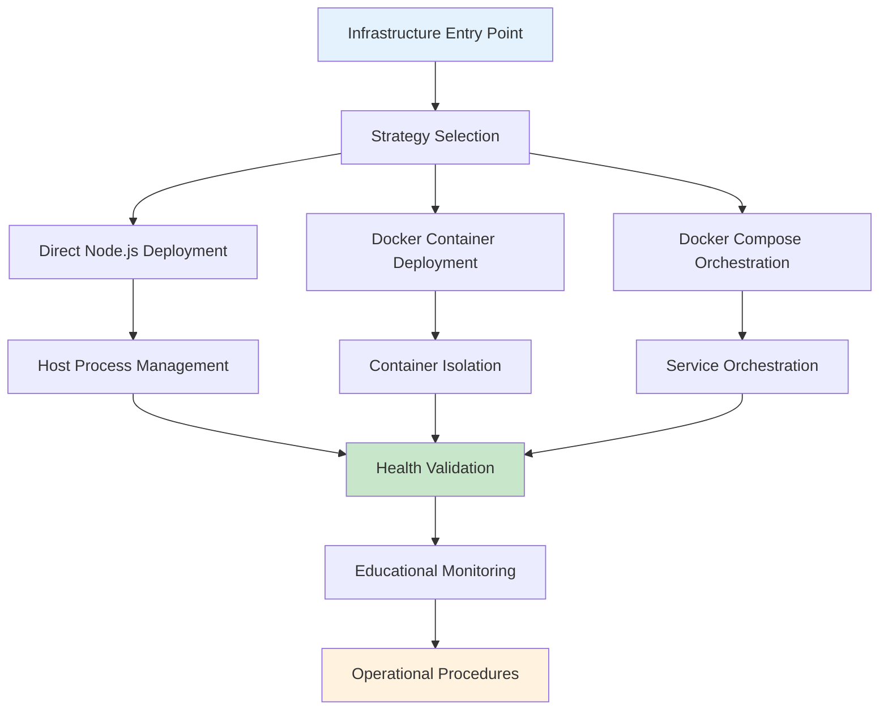

# Node.js Tutorial HTTP Server - Infrastructure Architecture Documentation

## Table of Contents

1. [Infrastructure Overview](#infrastructure-overview)
2. [Containerization Architecture](#containerization-architecture)  
3. [Orchestration Patterns](#orchestration-patterns)
4. [Deployment Automation](#deployment-automation)
5. [Monitoring Infrastructure](#monitoring-infrastructure)
6. [Educational Infrastructure Guidance](#educational-infrastructure-guidance)
7. [Operational Procedures](#operational-procedures)

## Infrastructure Overview

### Architecture Summary

The Node.js Tutorial HTTP Server features a **comprehensive three-tier infrastructure architecture** that supports multiple deployment strategies while maintaining educational focus. This infrastructure demonstrates professional deployment patterns through **direct Node.js execution**, **Docker containerization**, and **Docker Compose orchestration** with integrated health monitoring and automation.

**Key Infrastructure Components:**
- **Deployment Automation Framework**: Comprehensive shell scripting system for multi-strategy deployments
- **Containerization Platform**: Production-ready Docker containers with security and optimization
- **Orchestration Layer**: Docker Compose service management with networking and persistence  
- **Health Monitoring System**: Integrated validation with Node.js and shell-based health checking
- **Configuration Management**: Environment-specific deployment configuration and automation
- **Educational Framework**: Learning-focused infrastructure with troubleshooting guidance

### Deployment Strategy Architecture



### Infrastructure Technology Stack

| Layer | Technology | Version | Purpose |
|-------|------------|---------|---------|
| **Orchestration** | Docker Compose | v2.0+ | Multi-container service management |
| **Containerization** | Docker Engine | v20.10+ | Container isolation and deployment |
| **Runtime** | Node.js | v18+ | Application runtime environment |
| **Automation** | Bash Shell | v4.0+ | Deployment automation scripting |
| **Process Management** | npm Scripts | v8+ | Infrastructure task orchestration |
| **Health Monitoring** | curl + Node.js | v7.0+ / v18+ | Comprehensive health validation |

## Containerization Architecture

### Docker Container Strategy

The infrastructure implements **production-ready containerization** using multi-stage Docker builds with Alpine Linux base images, comprehensive security patterns, and educational optimization for learning environments.

**Container Architecture Features:**
- **Multi-stage Build Process**: Optimized image layers with development and production stages
- **Security-First Design**: Non-root user execution with minimal attack surface
- **Educational Integration**: Health check integration with Node.js application scripts
- **Resource Optimization**: Memory and CPU constraints appropriate for tutorial environments
- **Network Security**: Localhost binding for educational safety and isolation

### Dockerfile Architecture

```dockerfile
# Multi-stage build demonstrating production containerization patterns
FROM node:22-alpine AS development
# Development stage with full tooling for educational debugging

FROM node:22-alpine AS production-dependencies  
# Optimized dependency layer for production deployment

FROM node:22-alpine AS final
# Final production image with security and optimization
```

**Container Security Implementation:**
```yaml
security_features:
  user_isolation: "nodejs-tutorial:nodejs-tutorial"  # Non-root execution
  base_image: "node:22-alpine"                      # Minimal attack surface
  signal_handling: "dumb-init"                      # Proper signal management
  health_monitoring: "integrated"                   # Application health checks
  network_binding: "localhost-only"                # Educational security
```

### Container Health Monitoring

The containerization architecture includes **comprehensive health checking** integrated with the Node.js application health check script:

```yaml
healthcheck:
  test: ["CMD", "node", "scripts/health-check.js"]
  interval: 30s
  timeout: 10s  
  retries: 3
  start_period: 40s
```

**Health Check Integration:**
- **Application-Level Validation**: Uses Node.js health-check.js script for endpoint testing
- **Container Lifecycle Management**: Automatic restart on health check failures
- **Educational Monitoring**: Health status visibility for learning container management
- **Performance Metrics**: Response time and availability tracking for educational insights

## Orchestration Patterns

### Docker Compose Service Architecture  

The infrastructure implements **comprehensive service orchestration** using Docker Compose with custom networking, persistent storage, and educational service management patterns.

**Service Orchestration Features:**
- **Custom Bridge Networking**: Isolated tutorial-network for service communication
- **Persistent Volume Management**: Named volumes for log persistence across restarts
- **Resource Constraints**: Memory and CPU limits appropriate for educational environments
- **Service Discovery**: DNS-based service resolution within orchestration network
- **Educational Labeling**: Comprehensive metadata for learning and management

### Orchestration Configuration

```yaml
version: '3.8'

services:
  backend:
    build:
      context: ../..
      dockerfile: infrastructure/docker/Dockerfile.backend
      target: final
    container_name: nodejs-tutorial-backend
    ports:
      - "127.0.0.1:3000:3000"  # Localhost-only binding for educational security
    networks:
      - tutorial-network
    volumes:
      - tutorial-logs:/usr/src/app/logs
    healthcheck:
      test: ["CMD", "node", "scripts/health-check.js"]
      interval: 30s
      timeout: 10s
      retries: 3
      start_period: 40s

networks:
  tutorial-network:
    driver: bridge
    name: nodejs-tutorial-network
    ipam:
      config:
        - subnet: 172.20.0.0/16
          gateway: 172.20.0.1

volumes:
  tutorial-logs:
    driver: local
    name: nodejs-tutorial-logs
```

### Service Management Patterns

**Orchestration Management Commands:**
```bash
# Service lifecycle management
npm run compose:up          # Start orchestrated services
npm run compose:down        # Stop services with cleanup
npm run compose:logs        # View aggregated service logs
npm run compose:ps          # Check service status and health

# Educational debugging and development
npm run compose:exec        # Interactive shell access
npm run compose:restart     # Service restart for configuration changes
npm run compose:build       # Rebuild services with cache management
```

## Deployment Automation

### Comprehensive Automation Framework

The infrastructure features a **sophisticated deployment automation system** implemented through the `deploy.sh` shell script that orchestrates multiple deployment strategies with comprehensive validation, health checking, and educational guidance.

**Deployment Automation Features:**
- **Multi-Strategy Support**: Direct Node.js, Docker, and Docker Compose deployment options
- **Prerequisite Validation**: Comprehensive system and dependency checking
- **Health Check Integration**: Automated deployment verification with retry logic
- **Educational Logging**: Structured output with troubleshooting guidance
- **Rollback Procedures**: Automatic cleanup and failure recovery
- **CI/CD Integration**: Standardized exit codes for pipeline compatibility

### Deployment Script Architecture

```bash
#!/bin/bash
# Comprehensive deployment automation with educational features

# Strategy execution with validation and health checking
deploy_strategy() {
    local strategy="$1"
    
    case "$strategy" in
        "direct")
            deploy_direct "$PORT" "$ENVIRONMENT" "$HOST"
            ;;
        "docker") 
            deploy_docker "$PORT" "$ENVIRONMENT" "$HOST"
            ;;
        "docker-compose")
            deploy_docker_compose "$PORT" "$ENVIRONMENT" "$HOST"
            ;;
    esac
    
    # Integrated health validation
    perform_health_checks "$PORT" "$HOST" "$RETRIES" "$DELAY"
}
```

### Automation Command Interface

**NPM Script Integration:**
```json
{
  "scripts": {
    "deploy": "./scripts/deploy.sh",
    "deploy:dev": "./scripts/deploy.sh --strategy direct --env development",
    "deploy:docker": "./scripts/deploy.sh --strategy docker --env production",
    "deploy:compose": "./scripts/deploy.sh --strategy docker-compose --env production",
    "deploy:verbose": "./scripts/deploy.sh --verbose",
    "deploy:dry-run": "./scripts/deploy.sh --dry-run --verbose"
  }
}
```

**Advanced Deployment Options:**
```bash
# Educational deployment with comprehensive logging
./deploy.sh --strategy docker-compose --env production --verbose --cleanup

# Development deployment with custom configuration  
./deploy.sh --strategy direct --port 8080 --host 127.0.0.1 --timeout 300

# Validation and testing deployment
./deploy.sh --dry-run --strategy docker --verbose --health-retries 10
```

### Deployment Strategy Comparison

| Strategy | Use Case | Startup Time | Resource Usage | Isolation | Educational Value |
|----------|----------|-------------|----------------|-----------|-------------------|
| **Direct** | Local development, tutorials | ~15-30s | Minimal | Host process | Node.js fundamentals |
| **Docker** | Consistent environments, CI/CD | ~60-180s | Moderate | Container isolation | Containerization concepts |
| **Compose** | Service orchestration, production | ~90-300s | Higher | Service isolation | Orchestration patterns |

## Monitoring Infrastructure

### Health Monitoring System

The infrastructure implements **comprehensive health monitoring** through integrated shell-based and Node.js application health checking with educational feedback and troubleshooting guidance.

**Health Monitoring Components:**
- **Shell-Based Health Checking**: `health-check.sh` script with curl validation
- **Node.js Application Health**: Integrated `health-check.js` with endpoint validation
- **Automated Retry Logic**: Configurable retry attempts with exponential backoff
- **Educational Reporting**: Health status interpretation with troubleshooting guidance
- **Performance Metrics**: Response time tracking and availability monitoring

### Health Check Implementation

**Shell-Based Health Validation (`health-check.sh`):**
```bash
#!/bin/bash
# Comprehensive health checking with educational features

perform_health_check() {
    local target_url="$1"
    local retries="$2"
    local delay="$3"
    
    for attempt in $(seq 1 $retries); do
        if curl -sf --connect-timeout 10 "$target_url" | grep -q "Hello world"; then
            echo "✅ Health check passed on attempt $attempt"
            return 0
        fi
        
        echo "⚠️ Health check failed, attempt $attempt/$retries"
        sleep "$delay"
    done
    
    echo "❌ Health check failed after $retries attempts"
    return 1
}
```

**Node.js Application Health (`health-check.js`):**
```javascript
// Integrated application health checking with comprehensive validation
const performHealthCheck = async (endpoint, timeout) => {
    const startTime = Date.now();
    
    try {
        const response = await fetch(`http://127.0.0.1:3000${endpoint}`, {
            method: 'GET',
            timeout: timeout
        });
        
        const responseTime = Date.now() - startTime;
        const responseText = await response.text();
        
        const healthStatus = {
            status: response.ok ? 'healthy' : 'unhealthy',
            statusCode: response.status,
            responseTime: `${responseTime}ms`,
            expectedResponse: responseText === 'Hello world',
            endpoint: endpoint
        };
        
        return healthStatus;
    } catch (healthError) {
        return {
            status: 'error',
            error: healthError.message,
            responseTime: `${Date.now() - startTime}ms`
        };
    }
};
```

### Health Monitoring Commands

**NPM Script Integration:**
```json
{
  "scripts": {
    "health-check": "./scripts/health-check.sh",
    "health:dev": "./scripts/health-check.sh --host 127.0.0.1 --port 3000",
    "health:verbose": "./scripts/health-check.sh --verbose --format json",
    "health:retry": "./scripts/health-check.sh --retries 10 --retry-delay 3",
    "health:nodejs": "./scripts/health-check.sh --nodejs-fallback --verbose"
  }
}
```

### Performance and Availability Metrics

**Health Monitoring Metrics:**
- **Response Time Tracking**: Endpoint response time measurement for performance awareness
- **Availability Monitoring**: Service uptime and accessibility validation
- **Error Rate Analysis**: Failed request tracking and error pattern identification
- **Resource Usage**: Memory and CPU utilization during health check execution
- **Educational Insights**: Learning-focused metrics interpretation and guidance

## Educational Infrastructure Guidance

### Learning Objectives

The infrastructure architecture serves multiple **educational objectives** that provide hands-on experience with professional deployment patterns while maintaining focus on Node.js fundamentals:

**Primary Learning Objectives:**
- **Infrastructure as Code**: Demonstration of infrastructure automation and configuration management
- **Container Orchestration**: Hands-on experience with Docker and Docker Compose patterns
- **Deployment Automation**: Professional deployment pipeline implementation and best practices
- **Health Monitoring**: Observability and monitoring system integration for production readiness
- **Shell Scripting**: Infrastructure automation through comprehensive bash scripting
- **Configuration Management**: Environment-specific configuration and deployment strategies

### Hands-on Tutorials

**Progressive Learning Path:**

1. **Direct Deployment Tutorial**
   ```bash
   # Start with basic Node.js deployment for fundamental understanding
   npm run deploy:dev
   npm run health-check
   ```

2. **Containerization Tutorial**  
   ```bash
   # Progress to Docker containerization for isolation concepts
   npm run deploy:docker
   npm run health:verbose
   ```

3. **Orchestration Tutorial**
   ```bash
   # Advanced service orchestration with Docker Compose
   npm run deploy:compose  
   npm run infrastructure:status
   ```

### Best Practices Demonstration

**Infrastructure Best Practices:**
- **Security-First Deployment**: Localhost binding and non-root container execution
- **Resource Management**: Memory and CPU constraints appropriate for educational environments
- **Health Monitoring Integration**: Comprehensive validation with retry logic and failure handling
- **Educational Logging**: Structured output with troubleshooting guidance and learning context
- **Rollback Procedures**: Automated cleanup and failure recovery for deployment reliability
- **Configuration Management**: Environment-specific settings and deployment automation

### Troubleshooting Education

**Common Issue Resolution:**

**Port Conflicts:**
```bash
# Automated port conflict detection with resolution guidance
if lsof -ti:3000; then
    echo "⚠️ Port 3000 in use - use --port option for alternative"
    echo "Example: npm run deploy:dev -- --port 3001"
fi
```

**Docker Issues:**
```bash
# Docker daemon validation with educational guidance
if ! docker info >/dev/null 2>&1; then
    echo "❌ Docker daemon not running"
    echo "Start Docker: sudo systemctl start docker"
    echo "Educational: Docker daemon manages container lifecycle"
fi
```

**Health Check Failures:**
```bash
# Comprehensive health check troubleshooting with educational context
if ! perform_health_check; then
    echo "🔍 Health check troubleshooting:"
    echo "1. Verify server startup completion"
    echo "2. Check endpoint accessibility"  
    echo "3. Review application logs for errors"
    echo "4. Validate network connectivity"
fi
```

## Operational Procedures

### Deployment Workflows

**Standard Deployment Workflow:**

1. **Prerequisites Validation**
   ```bash
   # Automated system and dependency validation
   npm run infrastructure:validate
   ```

2. **Strategy Selection and Execution**
   ```bash
   # Choose appropriate deployment strategy
   npm run deploy:dev      # Local development
   npm run deploy:docker   # Containerized deployment  
   npm run deploy:compose  # Orchestrated services
   ```

3. **Health Validation and Monitoring**
   ```bash
   # Comprehensive deployment verification
   npm run health-check
   npm run infrastructure:status
   ```

### Health Monitoring Procedures

**Continuous Health Monitoring:**
```bash
# Educational monitoring with performance insights
npm run infrastructure:monitor

# Automated health validation with retry logic
npm run health:retry

# Verbose health checking with troubleshooting guidance
npm run health:verbose
```

**Health Status Interpretation:**
- **Status 200 + "Hello world"**: Healthy service operation
- **Connection timeout**: Server startup incomplete or network issues
- **Wrong response content**: Application logic errors or configuration issues
- **Port binding errors**: Port conflicts or permission issues

### Maintenance Guidelines

**Infrastructure Maintenance Commands:**
```bash
# Resource cleanup and optimization
npm run infrastructure:cleanup

# Complete infrastructure reset and validation
npm run infrastructure:reset

# Docker resource management and cleanup
npm run docker:clean:all
```

**Educational Maintenance Procedures:**
- **Log Rotation**: Automated log file management with educational retention policies
- **Resource Monitoring**: Memory and CPU usage tracking for educational awareness
- **Health Check Validation**: Regular endpoint availability and performance verification
- **Configuration Validation**: Environment and deployment configuration verification

### Security Configurations

**Security Implementation:**
- **Network Isolation**: Localhost-only binding for educational safety
- **Container Security**: Non-root user execution and minimal attack surface
- **Resource Constraints**: Memory and CPU limits to prevent resource exhaustion
- **Access Control**: Educational access patterns with controlled network exposure
- **Credential Management**: Environment variable configuration without hardcoded secrets

### Localized Deployment Procedures

**Environment-Specific Deployment:**

**Development Environment:**
```bash
# Local development with debugging capabilities
npm run deploy:dev
npm run health:dev
```

**Production Simulation:**
```bash
# Production-like deployment with optimization
npm run deploy:docker --env production
npm run health:verbose
```

**Educational Container Orchestration:**
```bash
# Complete service orchestration with educational monitoring
npm run deploy:compose
npm run infrastructure:status
npm run compose:logs
```

### Integrated Troubleshooting Guide

**Comprehensive Issue Resolution:**

**Deployment Failures:**
1. **Prerequisite Issues**: Verify Node.js, Docker, and system requirements
2. **Port Conflicts**: Use alternative ports or stop conflicting services
3. **Permission Errors**: Ensure proper file permissions and Docker access
4. **Configuration Issues**: Validate environment variables and configuration files

**Health Check Failures:**
1. **Server Startup**: Allow additional time for application initialization
2. **Network Connectivity**: Verify localhost accessibility and firewall settings
3. **Application Logic**: Review server logs for endpoint processing errors
4. **Resource Constraints**: Check memory and CPU availability for stable operation

**Container Issues:**
1. **Docker Daemon**: Verify Docker service status and accessibility
2. **Image Building**: Check Dockerfile syntax and build context availability
3. **Container Runtime**: Review container logs and resource allocation
4. **Network Configuration**: Validate port mapping and network isolation

---

## Infrastructure Quick Reference

### Command Reference

| Purpose | Command | Description |
|---------|---------|-------------|
| **Basic Deployment** | `npm run deploy:dev` | Direct Node.js deployment for development |
| **Container Deployment** | `npm run deploy:docker` | Docker containerized deployment |
| **Orchestration** | `npm run deploy:compose` | Docker Compose service orchestration |
| **Health Validation** | `npm run health-check` | Comprehensive health check validation |
| **Infrastructure Status** | `npm run infrastructure:status` | Complete system status overview |
| **Resource Cleanup** | `npm run infrastructure:cleanup` | Clean deployment artifacts and resources |

### Educational Resources

- **Infrastructure Automation**: Complete shell scripting automation framework
- **Container Orchestration**: Docker Compose service management patterns  
- **Health Monitoring**: Integrated application and infrastructure health checking
- **Configuration Management**: Environment-specific deployment configuration
- **Troubleshooting**: Comprehensive issue resolution and educational guidance
- **Best Practices**: Professional deployment patterns for learning and development

This comprehensive infrastructure architecture provides production-ready deployment automation while maintaining educational focus, demonstrating professional infrastructure patterns through practical hands-on experience with Node.js, Docker, and modern deployment automation techniques.