# Node.js Tutorial HTTP Server - Architecture Documentation

## Table of Contents
- [1. Executive Summary](#1-executive-summary)
- [2. System Overview](#2-system-overview)
- [3. Architectural Principles](#3-architectural-principles)
- [4. System Architecture](#4-system-architecture)
- [5. Component Architecture](#5-component-architecture)
- [6. Data Flow Architecture](#6-data-flow-architecture)
- [7. Configuration Management](#7-configuration-management)
- [8. Educational Architecture Features](#8-educational-architecture-features)
- [9. Performance Architecture](#9-performance-architecture)
- [10. Security Architecture](#10-security-architecture)
- [11. Error Handling Architecture](#11-error-handling-architecture)
- [12. Monitoring & Observability](#12-monitoring--observability)
- [13. Technical Decisions](#13-technical-decisions)
- [14. Future Architecture Considerations](#14-future-architecture-considerations)

## 1. Executive Summary

The Node.js Tutorial HTTP Server is a monolithic, educational web application designed to demonstrate fundamental HTTP server concepts using Node.js built-in modules. The architecture prioritizes educational clarity, simplicity, and learning value over production complexity, implementing a single `/hello` endpoint with comprehensive logging, monitoring, and troubleshooting guidance.

### Key Architecture Characteristics
- **Architecture Style**: Monolithic Single-Service Architecture
- **Design Philosophy**: Educational Clarity over Production Complexity
- **Communication Pattern**: Event-Driven Request-Response
- **State Management**: Stateless Design
- **Security Model**: Localhost-Only Binding
- **Educational Focus**: Comprehensive Learning Integration

## 2. System Overview

### 2.1 Purpose and Scope

The system serves as an educational platform for learning Node.js HTTP server fundamentals, providing a complete but simplified implementation that demonstrates:

- HTTP server creation using Node.js built-in modules
- Event-driven request processing patterns
- Basic routing and endpoint handling
- HTTP protocol compliance and status codes
- Error handling and recovery strategies
- Configuration management best practices
- Performance monitoring and optimization awareness

### 2.2 Educational Objectives

The architecture is designed to achieve the following learning objectives:

1. **HTTP Server Fundamentals**: Understanding Node.js HTTP server creation and lifecycle management
2. **Event-Driven Programming**: Experiencing asynchronous request processing patterns
3. **Component Architecture**: Learning modular design and separation of concerns
4. **Configuration Management**: Practicing environment-based configuration handling
5. **Error Handling**: Implementing comprehensive error recovery and user guidance
6. **Performance Awareness**: Monitoring and optimizing application performance

### 2.3 System Boundaries

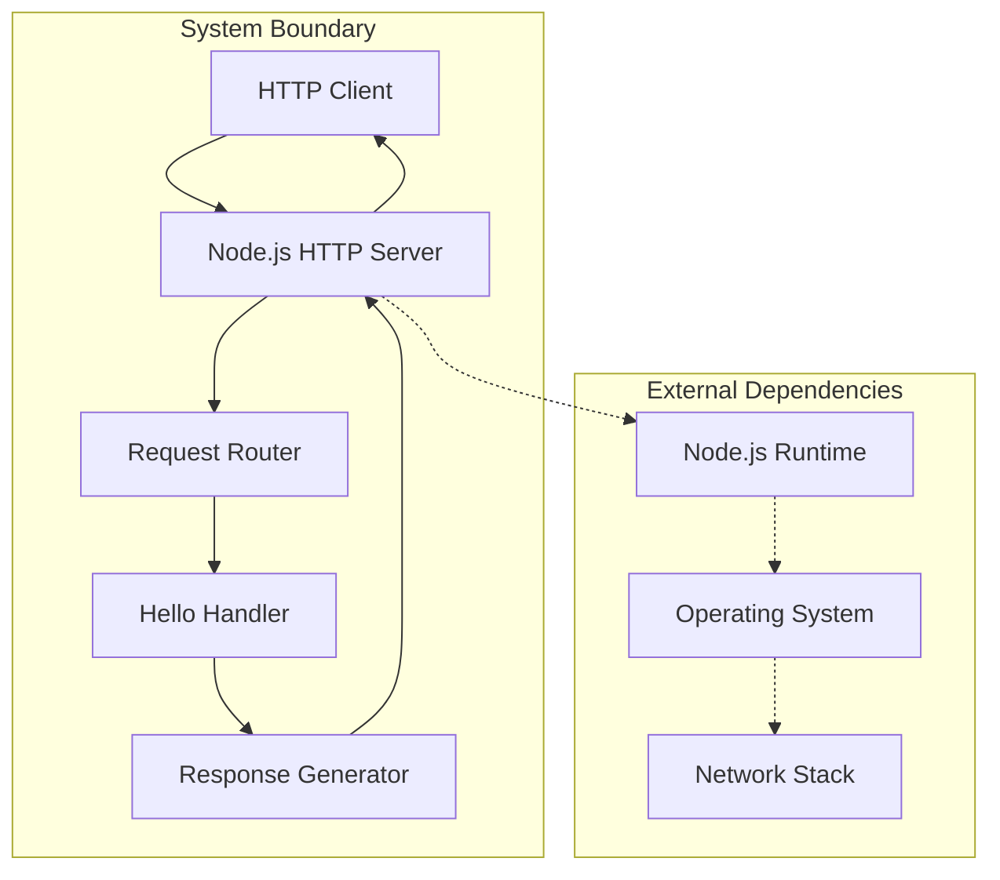

The system operates within clearly defined boundaries:

- **Network Interface**: Localhost-only binding (127.0.0.1:3000)
- **HTTP Protocol**: HTTP/1.1 compliance with standard status codes
- **Runtime Environment**: Node.js v18+ with built-in modules only
- **Operating System**: Cross-platform compatibility (Linux, macOS, Windows)
- **Educational Scope**: Single endpoint demonstrating core concepts

## 3. Architectural Principles

### 3.1 Educational Clarity First

The architecture prioritizes learning value and comprehension over production complexity:

```javascript
// Example: Educational error messages with guidance
const educationalGuidance = {
    issue: `The requested path '${requestedPath}' is not available on this server`,
    validEndpoints: VALID_ENDPOINTS,
    troubleshootingSteps: [
        'Verify the URL spelling and case sensitivity',
        'Ensure the path starts with a forward slash (/)',
        'Check that you are accessing a configured endpoint'
    ],
    httpConcept: '404 Not Found indicates the requested resource does not exist'
};
```

### 3.2 Event-Driven Processing

The architecture leverages Node.js's event-driven model for non-blocking request handling:

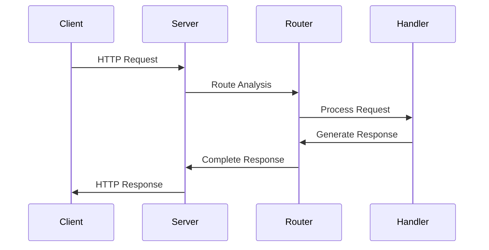

### 3.3 Stateless Design

Each HTTP request is processed independently without persistent state:

- No session management or persistent connections
- No shared state between requests
- Automatic garbage collection and memory management
- Simple restart and recovery procedures

### 3.4 Separation of Concerns

Clear component boundaries with single responsibility principle:

| Component | Responsibility | Dependencies |
|-----------|---------------|--------------|
| server.js | Application bootstrapping and lifecycle | http-server.js, app-config.js, logger.js |
| http-server.js | HTTP server creation and management | request-router.js, server-config.js |
| request-router.js | URL analysis and request routing | hello-handler.js, response-generator.js |
| hello-handler.js | Business logic for /hello endpoint | response-generator.js, validators.js |
| response-generator.js | HTTP response construction | http-status-codes.js, response-messages.js |

### 3.5 Educational Security

Localhost-only deployment ensures safe learning environment:

- Network binding restricted to 127.0.0.1
- No external network exposure
- Safe for classroom and personal learning
- Educational error messages without sensitive information disclosure

## 4. System Architecture

### 4.1 High-Level Architecture Diagram

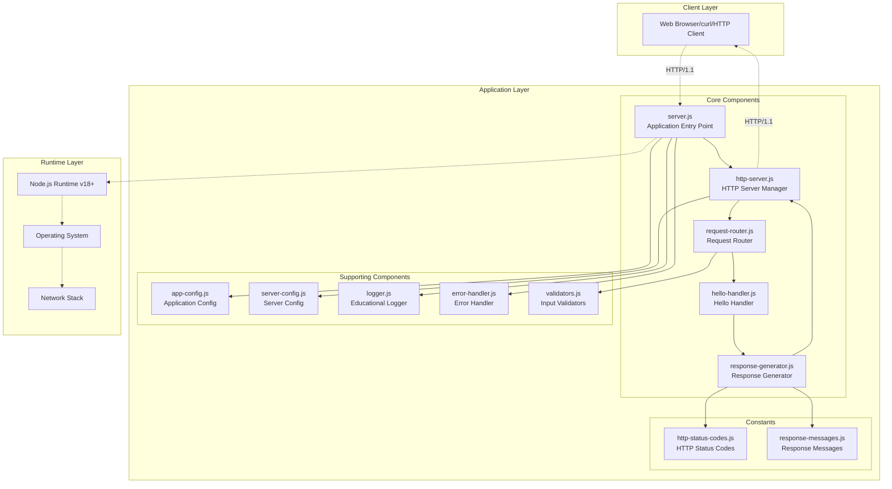

### 4.2 Request Processing Flow

The system processes HTTP requests through a linear pipeline with comprehensive educational monitoring:

1. **Request Arrival**: HTTP client sends request to localhost:3000
2. **Server Reception**: Node.js HTTP server receives and creates request/response objects
3. **Router Analysis**: Request router parses URL and validates HTTP method
4. **Route Matching**: Router matches request path against configured endpoints
5. **Handler Delegation**: Matched requests forwarded to appropriate handler
6. **Response Generation**: Handler processes request and generates HTTP response
7. **Response Transmission**: Complete response sent back to client
8. **Educational Logging**: Comprehensive logging throughout the entire process

### 4.3 Component Interaction Patterns

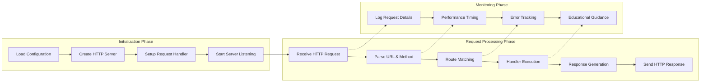

## 5. Component Architecture

### 5.1 Core Components

#### 5.1.1 Application Entry Point (server.js)

**Purpose**: Bootstrap application, initialize server, and manage process lifecycle

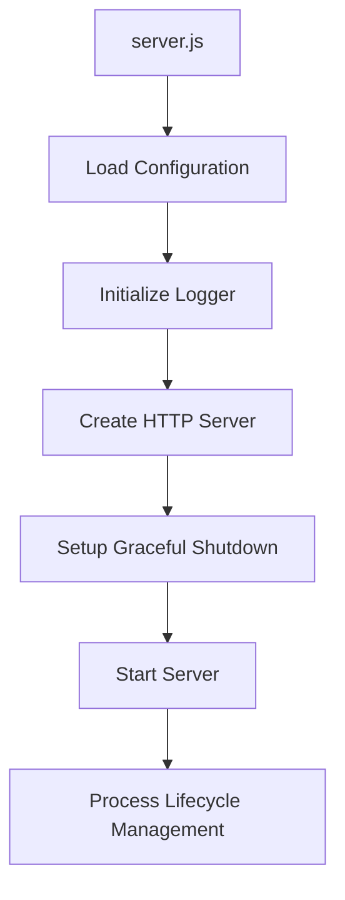

**Key Responsibilities**:
- Environment validation and configuration loading
- HTTP server instance creation and initialization
- Process signal handling (SIGINT, SIGTERM, uncaughtException)
- Graceful shutdown procedures with connection draining
- Global error handling and educational error reporting

**Educational Features**:
- Startup timing measurement and performance logging
- Environmental configuration explanation and validation
- Process lifecycle demonstration with clear state transitions
- Error recovery procedures with troubleshooting guidance

#### 5.1.2 HTTP Server Component (lib/server/http-server.js)

**Purpose**: Create and manage HTTP server instance with comprehensive lifecycle control

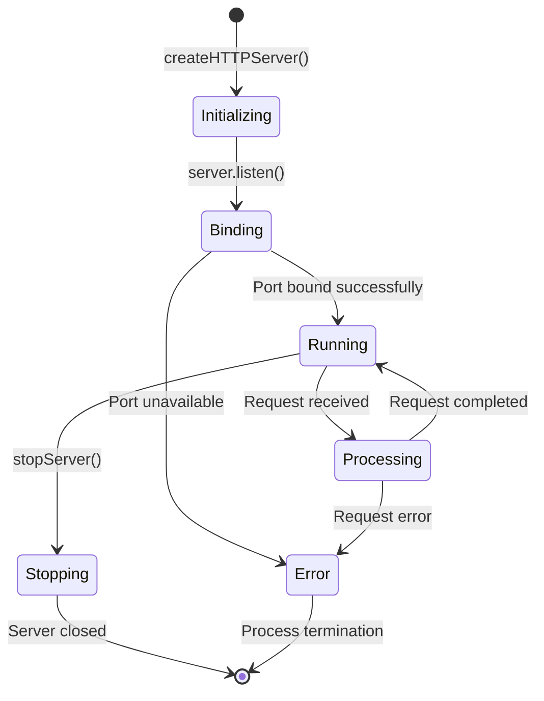

**Key Responsibilities**:
- HTTP server creation using Node.js built-in http module
- Connection management and timeout configuration
- Request handler delegation to routing system
- Server event handling (listening, error, close, connection)
- Performance monitoring and educational benchmarking

**Integration Points**:
- Request router for URL analysis and handler delegation
- Configuration system for server settings and educational options
- Logger utility for comprehensive server lifecycle logging
- Error handler for server-level error management

#### 5.1.3 Request Router Component (lib/router/request-router.js)

**Purpose**: Analyze incoming requests, validate methods, and route to appropriate handlers

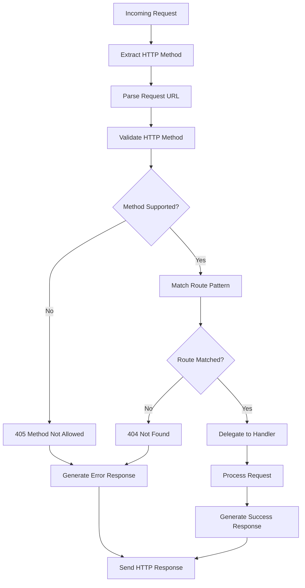

**Key Responsibilities**:
- URL parsing and component extraction using Node.js url module
- HTTP method validation against supported methods (GET only)
- Route pattern matching using exact string comparison
- Handler delegation for matched routes
- Error response generation for invalid routes or methods

**Educational Features**:
- Detailed request analysis logging with educational explanations
- URL structure breakdown for learning HTTP request components
- Route matching demonstration with clear decision logic
- Performance timing for optimization awareness

#### 5.1.4 Hello Handler Component (lib/handlers/hello-handler.js)

**Purpose**: Process `/hello` endpoint requests and generate educational responses

**Key Responsibilities**:
- Request validation for hello endpoint
- Business logic execution for tutorial demonstration
- Response data preparation and formatting
- Integration with response generator for HTTP compliance

**Educational Context**:
- Demonstrates basic endpoint implementation patterns
- Shows request processing workflow from reception to response
- Provides example of handler-response generator integration
- Illustrates HTTP 200 success response generation

#### 5.1.5 Response Generator Component (lib/response/response-generator.js)

**Purpose**: Construct HTTP-compliant responses with proper headers, status codes, and educational context

**Key Responsibilities**:
- HTTP status code management and assignment
- Response header configuration (Content-Type, Content-Length, etc.)
- Response body formatting and encoding
- Error response standardization with educational guidance

**Response Types Supported**:
- **200 OK**: Successful hello world response
- **404 Not Found**: Invalid route with troubleshooting guidance
- **405 Method Not Allowed**: Unsupported HTTP method with method education
- **500 Internal Server Error**: Server errors with debugging assistance

### 5.2 Supporting Components

#### 5.2.1 Configuration Management (lib/config/)

**Application Configuration (app-config.js)**:
- Centralized application metadata and settings
- Environment detection and configuration loading
- Educational mode settings and tutorial parameters
- Configuration validation with educational error messages

**Server Configuration (server-config.js)**:
- HTTP server specific settings (port, hostname, timeouts)
- Connection limits and performance optimizations
- Security settings for educational environment
- Network binding configuration with localhost enforcement

#### 5.2.2 Educational Logger (lib/utils/logger.js)

**Purpose**: Structured console logging with educational context and color-coded output

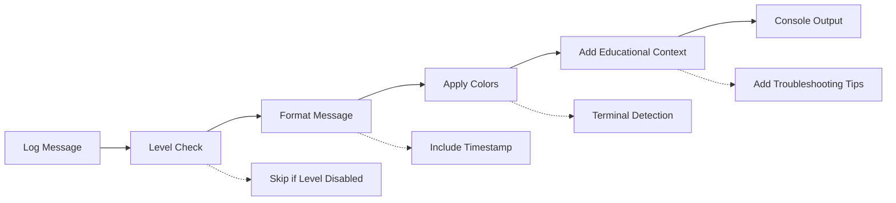

**Key Features**:
- Color-coded log levels for visual distinction
- Educational prefixes and context integration
- Performance timing utilities with benchmarks
- Request/response correlation tracking
- Troubleshooting guidance integration

**Log Levels and Usage**:
- **DEBUG**: Detailed execution flow for learning and debugging
- **INFO**: Normal operation events and educational milestones
- **WARN**: Potential issues with educational guidance
- **ERROR**: Critical errors with comprehensive troubleshooting help

#### 5.2.3 Error Handling (lib/utils/error-handler.js)

**Purpose**: Centralized error management with educational context and recovery guidance

**Error Categories**:
- **Server Errors**: HTTP server binding, configuration, lifecycle issues
- **Request Errors**: Invalid requests, processing failures, timeout errors
- **Validation Errors**: Input validation failures with specific guidance
- **System Errors**: Process-level errors, resource exhaustion, critical failures

## 6. Data Flow Architecture

### 6.1 Primary Request Flow

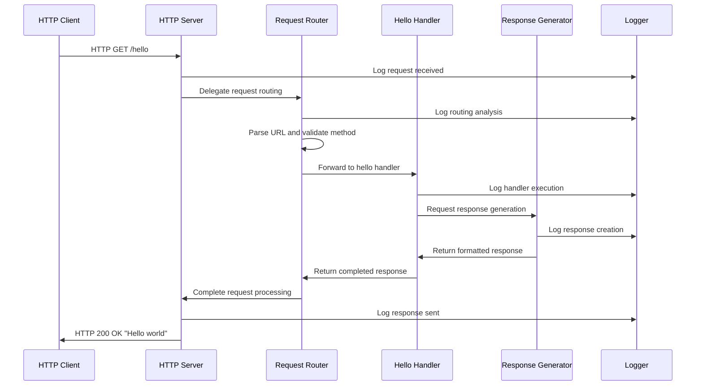

### 6.2 Error Handling Flow

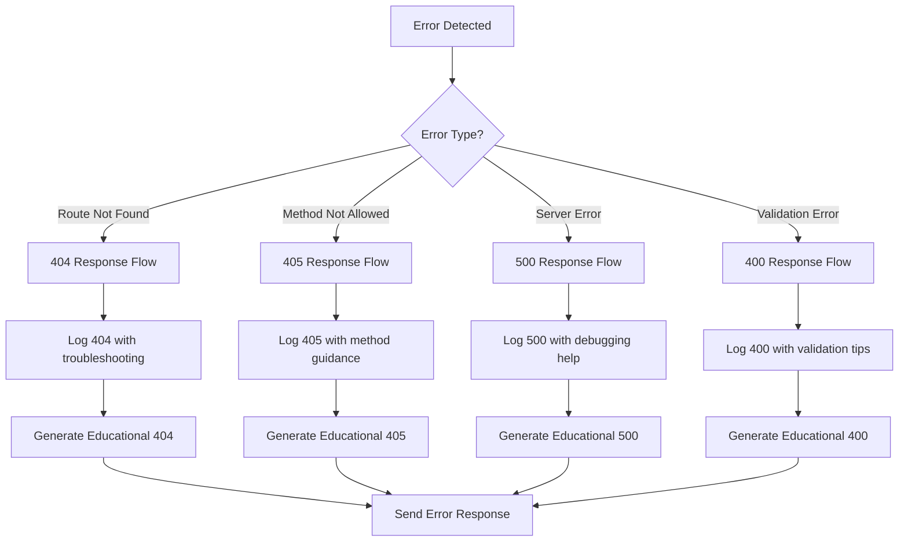

### 6.3 Configuration Flow

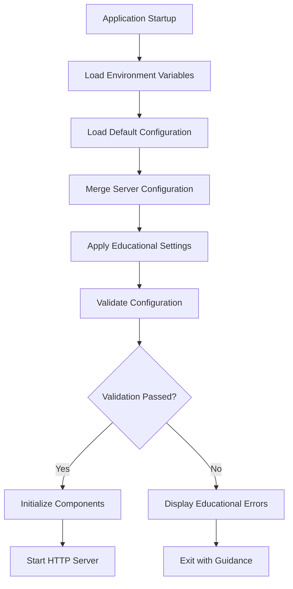

## 7. Configuration Management

### 7.1 Configuration Architecture

The configuration system implements a hierarchical approach with educational transparency:

```javascript
// Configuration precedence (highest to lowest):
// 1. Environment variables (runtime overrides)
// 2. Educational mode settings (tutorial-specific)
// 3. Environment-based defaults (development/educational)
// 4. Application defaults (safe fallbacks)

const configurationHierarchy = {
    environmentVariables: {
        PORT: process.env.PORT || DEFAULT_PORT,
        NODE_ENV: process.env.NODE_ENV || 'development',
        LOG_LEVEL: process.env.LOG_LEVEL || 'info'
    },
    educationalSettings: {
        mode: true,
        showStartupGuidance: environment === 'educational',
        verboseLogging: environment === 'educational',
        includeTroubleshootingTips: true
    },
    applicationDefaults: {
        hostname: '127.0.0.1',  // Localhost-only for security
        timeout: 60000,         // 60 seconds for educational use
        maxConnections: 100     // Suitable for tutorial environment
    }
};
```

### 7.2 Educational Configuration Features

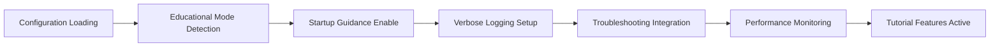

**Educational Configuration Options**:

- **Tutorial Mode**: Enhanced logging and educational features
- **Startup Guidance**: Interactive banner with learning objectives
- **Troubleshooting Tips**: Integrated error recovery guidance
- **Performance Monitoring**: Timing benchmarks and optimization tips
- **Verbose Logging**: Detailed execution flow for learning visibility

## 8. Educational Architecture Features

### 8.1 Learning-Centered Design

The architecture incorporates educational elements throughout:

```javascript
// Example: Educational logging with learning context
logger.info('Request routing completed', {
    educational: true,
    learningObjective: 'Understanding HTTP request processing flow',
    concept: 'Route matching determines handler selection',
    nextStep: 'Handler will process business logic and generate response'
});
```

### 8.2 Progressive Complexity

The system is designed to introduce concepts gradually:

1. **Basic HTTP Server**: Simple server creation and request handling
2. **Routing Concepts**: URL parsing and endpoint matching
3. **Response Generation**: HTTP protocol compliance and status codes
4. **Error Handling**: Proper error management and user feedback
5. **Configuration Management**: Environment-based settings and validation
6. **Performance Monitoring**: Timing awareness and optimization concepts

### 8.3 Interactive Learning Elements

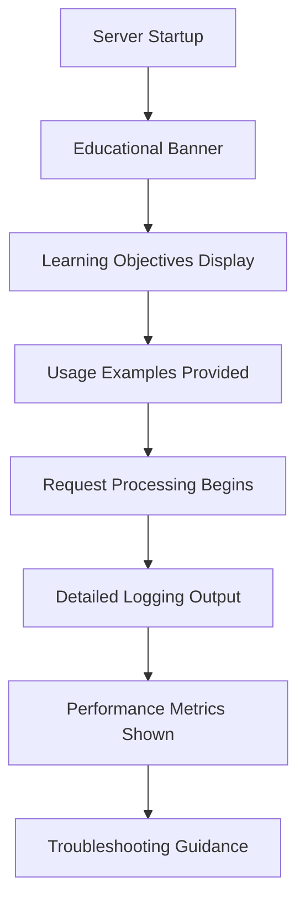

**Interactive Features**:
- Startup banner with learning objectives and usage examples
- Real-time request/response cycle logging with explanations
- Performance timing with educational benchmarks
- Error messages with specific troubleshooting steps
- Graceful shutdown demonstration with lifecycle explanation

## 9. Performance Architecture

### 9.1 Performance Design Principles

The architecture balances educational clarity with performance awareness:

```javascript
// Performance monitoring example
const performanceMetrics = {
    startupTime: 'Target: < 1000ms, Excellent: < 500ms',
    requestProcessing: 'Target: < 100ms, Excellent: < 50ms',
    memoryUsage: 'Target: < 50MB RSS, Excellent: < 25MB',
    responseTime: 'Target: < 100ms end-to-end'
};
```

### 9.2 Educational Performance Monitoring


**Performance Monitoring Features**:
- High-resolution timing for accurate measurements
- Educational benchmarks with optimization guidance
- Memory usage tracking for resource awareness
- Request/response timing correlation
- Performance degradation detection with learning tips

### 9.3 Optimization Strategies

The architecture implements performance optimizations suitable for educational environments:

- **Event-Driven Processing**: Non-blocking I/O for concurrent request handling
- **Efficient Routing**: O(n) linear route matching with small route sets
- **Memory Management**: Stateless design with automatic garbage collection
- **Connection Pooling**: Node.js default keep-alive and connection reuse
- **Minimal Dependencies**: Built-in modules only for reduced overhead

## 10. Security Architecture

### 10.1 Educational Security Model

The security architecture prioritizes safe learning over production complexity:

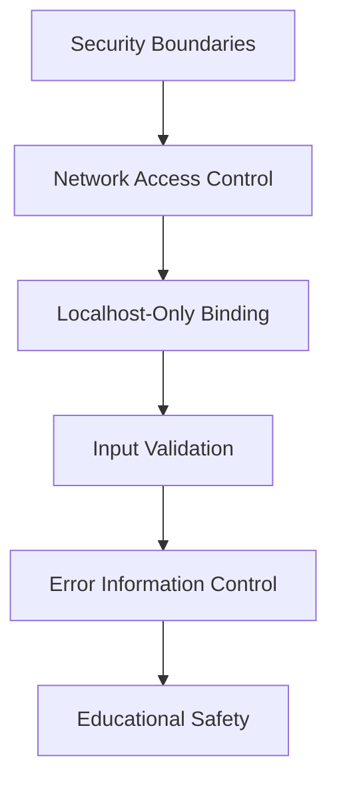

### 10.2 Security Layers

**Network Security**:
- Exclusive localhost binding (127.0.0.1) prevents external access
- Port restriction to educational ranges (3000-8000)
- No external service dependencies or network calls

**Input Security**:
- HTTP method validation (GET only)
- URL path validation and sanitization
- Request size limitations suitable for tutorial use

**Information Security**:
- Error messages provide educational value without sensitive information disclosure
- Logging includes learning context without exposing system internals
- Graceful degradation for security-related errors

### 10.3 Educational Security Learning

```javascript
// Example: Security-conscious error handling
const handleSecurityError = (error, context) => {
    // Log security event for educational awareness
    logger.warn('Security boundary enforcement', {
        educational: true,
        securityConcept: 'Input validation prevents malicious requests',
        guidance: 'Always validate and sanitize user input',
        example: 'HTTP method restriction prevents unwanted operations'
    });
    
    // Provide educational response without sensitive details
    return generateSecureErrorResponse(error, context);
};
```

## 11. Error Handling Architecture

### 11.1 Comprehensive Error Strategy

The error handling architecture provides educational value while maintaining robustness:

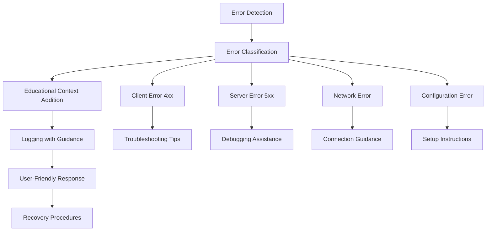

### 11.2 Error Categories and Handling

**Client Errors (4xx)**:
- **404 Not Found**: Invalid routes with valid endpoint suggestions
- **405 Method Not Allowed**: HTTP method education and correct usage

**Server Errors (5xx)**:
- **500 Internal Server Error**: General server errors with debugging help
- **503 Service Unavailable**: Server overload or startup issues

**Educational Error Features**:
- Clear error descriptions with technical context
- Specific troubleshooting steps for common issues
- Learning opportunities embedded in error messages
- Recovery guidance with educational value

### 11.3 Error Recovery Patterns

```javascript
// Example: Educational error recovery
const educationalErrorRecovery = {
    detectError: (error) => classifyErrorType(error),
    addEducationalContext: (error) => enhanceWithLearningValue(error),
    provideGuidance: (error) => generateTroubleshootingSteps(error),
    facilitateRecovery: (error) => suggestCorrectionActions(error),
    preventRecurrence: (error) => recommendBestPractices(error)
};
```

## 12. Monitoring & Observability

### 12.1 Educational Observability

The monitoring architecture emphasizes learning and operational visibility:

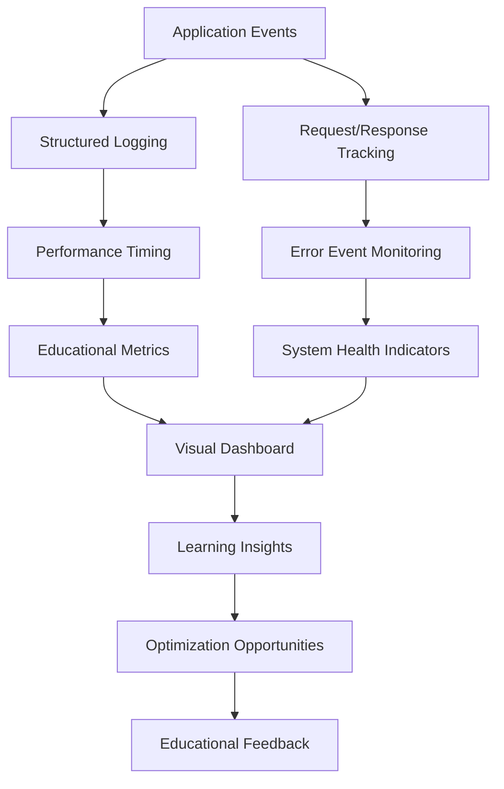

### 12.2 Observability Components

**Request/Response Monitoring**:
- Complete request lifecycle tracking with timing
- HTTP method, URL, and status code logging
- Client information and connection details
- Performance benchmarks with educational context

**System Health Monitoring**:
- Memory usage patterns with optimization guidance
- Process uptime and stability metrics
- Connection handling and concurrency measurements
- Educational performance thresholds and alerts

**Educational Metrics**:
- Learning objective progress tracking
- Concept demonstration frequency
- Error pattern analysis for teaching improvements
- Student engagement measurement through interaction logs

### 12.3 Observability Tools Integration

```javascript
// Educational monitoring example
const educationalMonitoring = {
    requestLifecycle: {
        start: (req) => trackRequestStart(req),
        process: (req, res) => monitorProcessing(req, res),
        complete: (req, res, timing) => logCompletionMetrics(req, res, timing)
    },
    systemHealth: {
        memory: () => trackMemoryUsage(),
        performance: () => measureSystemPerformance(),
        connections: () => monitorConnectionHealth()
    },
    educationalValue: {
        conceptDemonstration: (concept) => trackLearningObjective(concept),
        errorLearning: (error) => recordEducationalValue(error),
        progressTracking: (milestone) => updateLearningProgress(milestone)
    }
};
```

## 13. Technical Decisions

### 13.1 Architecture Style Decision

**Monolithic vs. Microservices**

| Factor | Monolithic (Chosen) | Microservices (Alternative) | Rationale |
|--------|-------------------|---------------------------|-----------|
| Educational Clarity | Single codebase, simple debugging | Complex service orchestration | Tutorial focus requires minimal complexity |
| Resource Requirements | Minimal overhead | Higher resource consumption | Educational environment constraints |
| Deployment Simplicity | Single process deployment | Multiple service coordination | Beginner-friendly operation |
| Learning Curve | Straightforward architecture | Distributed systems complexity | Appropriate for Node.js fundamentals |

**Decision**: Monolithic architecture chosen for educational clarity and simplicity.

### 13.2 Communication Pattern Decision

**Synchronous vs. Asynchronous Processing**

| Aspect | Event-Driven (Chosen) | Synchronous Alternative | Justification |
|--------|---------------------|------------------------|---------------|
| Node.js Alignment | Native event-driven model | Blocking operations | Leverages Node.js strengths |
| Concurrency | High concurrent capacity | Limited by thread blocking | Educational scalability demonstration |
| Learning Value | Demonstrates async patterns | Simpler but less realistic | Real-world applicability |
| Performance | Non-blocking I/O benefits | Potential bottlenecks | Educational performance awareness |

**Decision**: Event-driven architecture chosen to demonstrate Node.js core strengths.

### 13.3 Dependency Management Decision

**Built-in Modules vs. External Libraries**

| Category | Built-in Modules (Chosen) | External Libraries (Alternative) | Rationale |
|----------|-------------------------|--------------------------------|-----------|
| Complexity | Minimal dependency management | Package management complexity | Educational focus on fundamentals |
| Security | No third-party vulnerabilities | Potential security risks | Safe learning environment |
| Learning Focus | Node.js core capabilities | Library-specific knowledge | Transferable core skills |
| Installation | No additional dependencies | npm install requirements | Simple setup process |

**Decision**: Built-in modules only for educational purity and simplicity.

### 13.4 Security Model Decision

**Open Network vs. Localhost-Only**

| Security Aspect | Localhost-Only (Chosen) | Open Network (Alternative) | Justification |
|-----------------|------------------------|---------------------------|---------------|
| Educational Safety | No external exposure risk | Potential security vulnerabilities | Safe learning environment |
| Setup Complexity | Simple local testing | Network configuration required | Beginner-friendly setup |
| Learning Focus | HTTP concepts without security complexity | Network security considerations | Appropriate scope for tutorial |
| Classroom Suitability | Ideal for shared environments | Potential network conflicts | Educational environment optimization |

**Decision**: Localhost-only binding for educational safety and simplicity.

## 14. Future Architecture Considerations

### 14.1 Extensibility Patterns

The current architecture provides foundations for future educational enhancements:

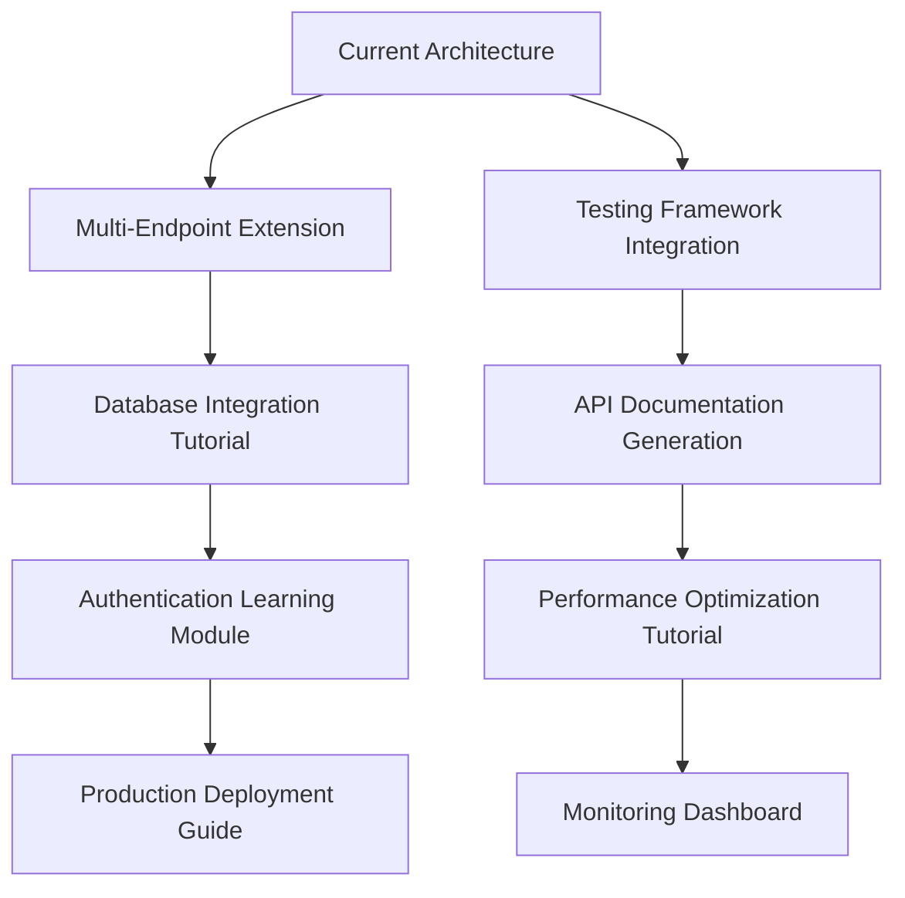

### 14.2 Evolution Pathways

**Phase 1: Enhanced Routing**
- Multiple endpoint support (`/hello`, `/api/status`, `/health`)
- Dynamic route parameters for advanced routing concepts
- Query parameter handling and validation

**Phase 2: Data Integration**
- File-based data storage tutorial
- Database connectivity patterns
- Data validation and sanitization learning

**Phase 3: Production Readiness**
- Security middleware implementation
- Production configuration management
- Deployment automation and Docker integration

**Phase 4: Advanced Concepts**
- WebSocket integration for real-time communication
- Clustering and load balancing demonstration
- Microservices decomposition tutorial

### 14.3 Architectural Flexibility

The modular design enables educational progression without breaking existing patterns:

```javascript
// Future extensibility example
const architecturalExtension = {
    // Current stable interface
    currentInterface: {
        routeRequest: (req, res) => { /* existing implementation */ },
        generateResponse: (status, data) => { /* current logic */ }
    },
    
    // Future enhancement points
    extensionPoints: {
        authenticationMiddleware: (req, res, next) => { /* future auth */ },
        databaseIntegration: (query) => { /* future data access */ },
        advancedRouting: (pattern) => { /* dynamic routing */ }
    },
    
    // Backward compatibility preservation
    compatibilityLayer: {
        maintainCurrentAPI: true,
        deprecationWarnings: true,
        educationalUpgradePath: 'guided-migration'
    }
};
```

---

## Conclusion

The Node.js Tutorial HTTP Server architecture successfully balances educational clarity with technical sophistication, providing a comprehensive learning platform for HTTP server fundamentals. The monolithic, event-driven design demonstrates core Node.js concepts while maintaining simplicity appropriate for educational environments.

The architecture's educational features, comprehensive monitoring, and thoughtful error handling create an optimal learning experience that prepares students for real-world Node.js development while maintaining a safe, controlled educational environment.

Future enhancements can build upon the solid architectural foundation to provide progressive complexity and advanced concept demonstration, ensuring the tutorial remains valuable as students advance their Node.js expertise.

---

**Document Version**: 1.0.0  
**Created**: 2024  
**Audience**: Node.js Learning Students and Educational Instructors  
**Scope**: Comprehensive Technical Architecture Documentation